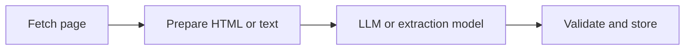

## AI Data Collection Starts Long Before the Model Sees the Page
When people talk about AI data collection from the web, they often jump straight to LLM prompts, extraction schemas, or agent behavior. But the real pipeline starts much earlier. Before the model can interpret anything, the system has to fetch the right page, at the right time, through a reliable transport layer.
That is why AI data collection is not only an LLM problem. It is a pipeline problem.
This guide explains how AI data collection from the web works across fetching, proxy infrastructure, extraction, validation, and agent-driven planning. It also shows when AI is the right choice over traditional scraping and how to design a system that stays useful beyond small experiments. It pairs naturally with [AI web scraping explained](https://bytesflows.com/blog/ai-web-scraping-explained), [AI web scraping with agents](https://bytesflows.com/blog/ai-web-scraping-agents), and [using LLMs to extract web data](https://bytesflows.com/blog/using-llms-extract-web-data).
## What AI Data Collection from the Web Actually Means
AI data collection usually means combining web fetching with model-based interpretation.
In practice, that often includes:
- retrieving pages through HTTP or a real browser
- converting the content into a clean representation
- asking a model to extract or classify information
- validating the output against a schema
- storing the result for search, analytics, RAG, or automation
The value comes from flexibility. Instead of hand-building selectors for every variation, the system can interpret meaning across messy or inconsistent layouts.
## Why Teams Use AI for Web Data Collection
The main appeal is not that AI makes scraping “easier” in every sense. It is that AI makes certain kinds of extraction more adaptable.
This is especially useful when:
- layouts vary across sites
- the data is embedded in long text
- the output needs semantic interpretation
- new sources are added frequently
- the workflow includes classification, summarization, or normalization
A traditional scraper might know exactly where a price lives on one known site. An AI extraction layer can sometimes find the main offer, availability, sentiment, or category even when the exact layout changes.
## The Pipeline, Step by Step
A practical AI data collection pipeline usually contains four layers.

Each layer matters.
### 1. Fetch
The system retrieves the page through an HTTP client or browser automation.
### 2. Prepare
The content is cleaned, reduced, chunked, or normalized into something the model can use.
### 3. Extract
The model returns structured output, summaries, labels, or entities.
### 4. Validate
The result is checked before it enters downstream systems.
This layered view is important because it shows why AI data collection is not just “send HTML to an LLM.” The surrounding engineering determines whether the output is trustworthy and scalable.
## The Fetch Layer Still Matters Just as Much as the Model
One of the most common mistakes is assuming the model is the hardest part. In reality, the fetch layer is often where the pipeline fails first.
If the system cannot reliably access the target pages, the best extraction logic in the world does not help. That is why serious AI data collection often depends on:
- browser automation for JavaScript-heavy sites
- [residential proxies](https://bytesflows.com/blog/residential-proxies) for stricter targets
- [best proxies for web scraping](https://bytesflows.com/blog/best-proxies-for-web-scraping) when scale matters
- [proxy rotation strategies](https://bytesflows.com/blog/proxy-rotation-strategies) to reduce repeated IP pressure
This is especially important when the same pipeline feeds a RAG system, agent workflow, or continuous refresh job.
## Extraction with LLMs and Structured Prompts
Once the content is fetched, the model can be used to turn messy input into structured output.
Common examples include:
- extracting titles, prices, ratings, and availability
- classifying pages by type or intent
- summarizing long articles or documents
- identifying named entities or company attributes
- normalizing inconsistent formats into standard values
The strength of this approach is flexibility. One schema or prompt can sometimes cover many page layouts.
The weakness is that the output is not automatically reliable. LLMs can:
- hallucinate missing values
- misread ambiguous content
- return invalid structure
- introduce formatting drift over time
That is why schema validation and post-processing are essential.
## Agents Add a Planning Layer
In more advanced systems, the workflow also includes agents.
An agent can decide:
- which URL to visit next
- whether a browser is required
- whether extraction quality is acceptable
- whether to retry or switch strategy
- how to combine browsing, extraction, and summarization
This is why AI data collection increasingly overlaps with agent-based workflows rather than just extraction prompts. Once the system can plan navigation and react to results, it becomes a data collection workflow engine rather than a simple parser.
That connection is why [AI web scraping with agents](https://bytesflows.com/blog/ai-web-scraping-agents), [OpenClaw for web scraping and data extraction](https://bytesflows.com/blog/openclaw-web-scraping), and [AI web scraping explained](https://bytesflows.com/blog/ai-web-scraping-explained) form a natural cluster around this topic.
## AI Data Collection for RAG and Knowledge Systems
One of the strongest use cases is feeding RAG and retrieval systems.
In that context, AI data collection helps by:
- refreshing web content regularly
- normalizing it before indexing
- turning messy pages into cleaner structured records
- extracting summaries, entities, or tags
- supporting live knowledge bases and internal assistants
But this also raises the bar for reliability. If the collection layer fails, the knowledge system becomes stale. If the extraction layer drifts, the retrieval layer becomes noisy. This is why AI data collection for RAG should be treated as an ingestion system, not just a scrape-and-save script.
## When AI Is Better Than Traditional Scraping
AI-based collection is often the better fit when:
- page layouts are inconsistent
- the data is semi-structured or text-heavy
- the output needs interpretation rather than direct parsing
- sources change frequently
- manual selector maintenance is too costly
For example, if the task is extracting company descriptions, sentiment, or category labels from many unrelated sites, AI often creates more leverage than a selector-only approach.
## When Traditional Scraping Is Still Better
Traditional scraping remains the better fit when:
- the target layout is stable
- the schema is fixed and well known
- the volume is high
- cost and latency must stay low
- deterministic output is more important than flexible interpretation
That is why many strong systems are hybrid. They use classic scraping where the structure is stable, then apply AI only where interpretation or normalization is necessary.
## Common Mistakes in AI Data Collection Pipelines
### Treating extraction as the only hard part
Fetch quality, proxy quality, and validation matter just as much.
### Sending too much content to the model
Large raw pages increase cost and reduce control. Preparation matters.
### Skipping validation
If the output feeds analytics, RAG, or automation, structure must be checked.
### Ignoring block risk
AI collection still depends on web access. Anti-bot systems do not disappear because the extractor uses an LLM.
### Overusing AI where rules would be simpler
Not every page needs model-based extraction. Hybrid design is usually stronger.
## Best Practices
### Design the fetch layer first
Make sure the pipeline can actually reach the target content reliably.
### Use AI where interpretation creates leverage
Apply it to messy extraction, classification, and normalization—not everything by default.
### Validate model output aggressively
Schema checks, retries, and fallback rules improve production quality.
### Control cost early
Reduce input size, cache when appropriate, and avoid expensive models on trivial tasks.
### Build for a hybrid future
Many pipelines work best when deterministic scraping and AI extraction coexist.
## A Useful Mental Model
A simple way to think about AI data collection is this:
- scraping gets the page
- AI interprets the page
- validation protects the pipeline
- storage makes the result reusable
That mental model is much more accurate than imagining one model call somehow replaces the entire system.
## Conclusion
AI data collection from the web is most powerful when it is treated as a full pipeline rather than a single extraction trick. The fetch layer, proxy strategy, browser behavior, model extraction, and validation logic all work together.
The reason teams adopt AI here is not only to collect data, but to collect more adaptable, semantically useful data from messy and changing sources. When done well, this supports better RAG pipelines, stronger analytics, more useful agents, and more flexible web intelligence systems.
If you want the strongest next reading path from here, continue with [AI web scraping explained](https://bytesflows.com/blog/ai-web-scraping-explained), [AI web scraping with agents](https://bytesflows.com/blog/ai-web-scraping-agents), [using LLMs to extract web data](https://bytesflows.com/blog/using-llms-extract-web-data), and [best proxies for web scraping](https://bytesflows.com/blog/best-proxies-for-web-scraping).
## Further reading
- [AI web scraping explained](https://bytesflows.com/blog/ai-web-scraping-explained)
- [AI web scraping with agents](https://bytesflows.com/blog/ai-web-scraping-agents)
- [Using LLMs to extract web data](https://bytesflows.com/blog/using-llms-extract-web-data)
- [AI data extraction vs traditional scraping](https://bytesflows.com/blog/ai-data-extraction-vs-traditional-scraping)
- [Best proxies for web scraping](https://bytesflows.com/blog/best-proxies-for-web-scraping)
- [Residential proxies](https://bytesflows.com/blog/residential-proxies)
- [OpenClaw for web scraping and data extraction](https://bytesflows.com/blog/openclaw-web-scraping)
