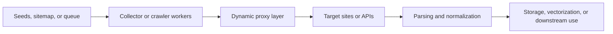

## Dynamic Proxies Matter in AI Data Pipelines Because Large-Scale Collection Fails First at the Network Layer
AI data pipelines increasingly depend on large-scale external collection. Training data gathering, RAG refresh jobs, market-intelligence feeds, and real-time ingestion systems all rely on repeated access to web pages or APIs across many domains and regions. At that scale, collection failures are often caused less by parser logic and more by traffic concentration. Too many requests from one route lead to blocks, degraded responses, or rising retry cost.
That is why dynamic proxies matter in AI pipelines. They give the collection layer a controllable identity model instead of forcing the entire system through a fixed network path.
This guide explains why AI pipelines need dynamic proxies, where rotating and sticky behavior fit, and how to integrate a proxy-aware collection layer into a production pipeline without entangling the rest of the system. It pairs naturally with [proxy rotation strategies](https://bytesflows.com/blog/proxy-rotation-strategies), [building proxy infrastructure for crawlers](https://bytesflows.com/blog/building-proxy-infrastructure-crawlers), and [proxy management for large scrapers](https://bytesflows.com/blog/proxy-management-large-scrapers).
## Why AI Pipelines Hit Different Collection Problems
AI collection workloads often share a few traits:
- high request volume across many URLs
- repeated refresh cycles instead of one-time scraping
- multi-region or multi-language source diversity
- downstream dependency on freshness and stability
These traits make fixed-IP collection fragile. Once one route becomes the bottleneck, the whole ingestion chain slows down or becomes noisy.
## What a Dynamic Proxy Adds to the Pipeline
A dynamic proxy layer usually gives the collection system control over:
- **rotating identity** for broad distribution
- **sticky sessions** when continuity matters
- **geo-aware egress** for localized sources
- **route observability** for debugging and capacity planning
The important point is that the proxy layer changes the network identity model without forcing changes to parsing, chunking, vectorization, or storage logic.
## Where the Proxy Layer Actually Sits
A practical pipeline usually looks like this:

The proxy layer belongs between the collector and the target. It should not leak unnecessary complexity into downstream processing.
## Rotating vs Sticky in AI Collection
### Rotating identity
Best when:
- requests are mostly independent
- you want broad distribution across many pages
- the workload is batch-style corpus collection
- you want to reduce per-route concentration quickly
### Sticky identity
Best when:
- login state matters
- a session spans multiple dependent requests
- a target expects continuity over time
- the collector is working through stateful flows
Most AI ingestion jobs lean toward rotating identity, but some knowledge-source workflows still need sticky behavior.
## Why Observability Matters as Much as Rotation
Adding dynamic proxies without observability creates a black box.
A good proxy-aware AI pipeline should record:
- status code patterns by domain
- latency by route or provider
- retry count and retry outcome
- block or challenge frequency
- success rate by target and geo
Without that feedback loop, the system cannot tell whether proxy behavior is actually improving the workload.
## Retry Logic Must Respect Proxy Logic
Retries are often where proxy integrations fail.
Better design asks:
- should the next attempt keep the same route or rotate?
- was the failure likely route-related or target-related?
- should the target be cooled down before retrying?
- is the task stateful enough that continuity still matters?
Dynamic proxies help most when retry behavior is designed around the same identity logic rather than bolted on afterward.
## A Practical Python Integration Model
The implementation details vary, but the architecture is consistent:
1. the worker pulls a URL or task from a queue
1. the request is sent through a proxy gateway
1. rotation or session behavior is chosen by policy
1. failures are retried according to route-aware rules
1. successful content moves into parsing and downstream storage
This keeps the proxy as an infrastructure concern while preserving clear separation between collection and downstream AI processing.
## Common Mistakes
### Treating dynamic proxies as only a scraping concern, not a pipeline concern
The whole ingestion system depends on route stability.
### Rotating blindly on workflows that need continuity
Session-dependent sources can break.
### Adding proxies without route-level monitoring
You lose the ability to debug the collection layer.
### Retrying failed requests without changing identity strategy
The same failure pattern can repeat unnecessarily.
### Coupling proxy logic too tightly to parsing or vectorization code
The routing layer should stay modular.
## Best Practices
### Keep proxy logic at the collection edge
It should support the pipeline, not invade every layer.
### Choose rotating or sticky identity from the task shape
Batch crawling and session flows need different models.
### Measure route behavior with the same seriousness as parser quality
Collection stability is part of data quality.
### Design retries, cooldowns, and concurrency around target behavior
Proxy quality alone is not enough.
### Treat proxy configuration as infrastructure that evolves with workload scale
What works for a prototype may fail for a production corpus job.
Helpful companion reading includes [proxy rotation strategies](https://bytesflows.com/blog/proxy-rotation-strategies), [proxy management for large scrapers](https://bytesflows.com/blog/proxy-management-large-scrapers), and [building proxy infrastructure for crawlers](https://bytesflows.com/blog/building-proxy-infrastructure-crawlers).
## Conclusion
Dynamic proxies matter in AI data pipelines because large-scale collection systems are judged by how they present identity to external sources. A fixed route can turn a healthy parser and ingestion stack into a brittle system. A well-designed proxy layer restores flexibility by giving the collector controlled rotation, continuity, geo behavior, and observability.
The practical lesson is simple: if your AI pipeline depends on external data at scale, proxy strategy is part of the pipeline architecture. Once the routing layer is designed deliberately, the rest of the collection stack becomes easier to stabilize, monitor, and scale.
## Further reading
- [Proxy rotation strategies](https://bytesflows.com/blog/proxy-rotation-strategies)
- [Building proxy infrastructure for crawlers](https://bytesflows.com/blog/building-proxy-infrastructure-crawlers)
- [Proxy management for large scrapers](https://bytesflows.com/blog/proxy-management-large-scrapers)
- [Proxy pools for web scraping](https://bytesflows.com/blog/proxy-pools-web-scraping)
- [Residential proxies](https://bytesflows.com/proxies)
- [How residential proxies improve scraping success](https://bytesflows.com/blog/residential-proxies-improve-scraping)
- [The ultimate guide to web scraping in 2026](https://bytesflows.com/blog/ultimate-guide-web-scraping-2026)
