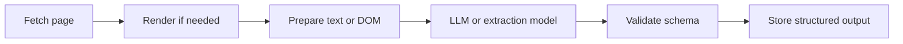

## AI Web Scraping Is Not Magic—It Is a Different Layer in the Stack
AI web scraping is often described as if it replaces traditional scraping completely. That framing is misleading. In real production systems, AI does not remove the need for crawlers, browsers, proxies, or validation. It changes how extraction and decision-making happen inside the pipeline.
Traditional scrapers rely on fixed selectors, rules, and known page structures. AI-powered scraping adds semantic interpretation. It can help a system understand messy layouts, extract meaning from semi-structured content, and decide how to adapt when the page is less predictable. That makes it useful for modern websites, especially when HTML is inconsistent or the data is mixed into long-form content.
This guide explains what AI web scraping actually is, how LLMs and agents fit into the stack, when AI performs better than traditional methods, and where proxy and browser infrastructure still matter. For a practical companion, it pairs naturally with [AI web scraping with agents](https://bytesflows.com/en/blog/ai-web-scraping-agents), [AI data extraction vs traditional scraping](https://bytesflows.com/en/blog/ai-data-extraction-vs-traditional-scraping), and [future of AI web scraping](https://bytesflows.com/en/blog/future-of-ai-web-scraping).
## What AI Web Scraping Actually Means
At its core, AI web scraping means using machine intelligence—most commonly LLMs, structured extraction prompts, or agent-style workflows—to help collect, interpret, and normalize web data.
That can include several different capabilities:
- extracting structured fields from inconsistent layouts
- summarizing long pages into usable outputs
- classifying pages, products, companies, or entities
- deciding which links to follow next
- adapting extraction logic without hand-writing a selector for every variation
This is why AI scraping is often misunderstood. It is not one single technique. It is a set of techniques layered on top of a fetch and parsing system.
## The Simplest Way to Understand the Difference
Traditional scraping asks:
- which selector contains the price?
- which HTML node contains the title?
- which page path contains the product grid?
AI scraping asks:
- where on this page is the price information?
- what part of this content describes the main offer?
- which fields can be extracted even if the layout changes?
The second approach is more flexible, but it is also more expensive and less deterministic. That is why the strongest systems usually combine both approaches rather than forcing one method to do everything.
## AI Scraping vs Traditional Scraping
| Aspect | Traditional scraping | AI-powered scraping |
| --- | --- | --- |
| Extraction method | Selectors, rules, regex, known schemas | Model-based interpretation and structured output |
| Best fit | Stable layouts and high-volume collection | Variable layouts and semi-structured content |
| Operational cost | Lower compute, higher selector maintenance | Higher compute or API cost, lower manual rule-writing |
| Main failure mode | Layout changes break selectors | Output drift, formatting errors, hallucination risk |
Traditional scraping is still the better choice for high-volume fixed-schema targets. AI becomes more valuable when the page structure varies, the data is buried in text, or the workflow requires semantic interpretation rather than direct extraction.
## What the Real Pipeline Looks Like
Even AI scraping usually follows a familiar architecture.

This matters because many teams assume AI starts at the beginning of the workflow. In reality, it usually starts after the content has already been fetched. That means browser choice, proxy quality, and anti-block strategy still matter just as much as before.
If the fetch layer is weak, the AI layer never gets the right content to interpret. This is why articles such as [best proxies for web scraping](https://bytesflows.com/en/blog/best-proxies-for-web-scraping), [residential proxies](https://bytesflows.com/en/blog/residential-proxies), and [web scraping architecture explained](https://bytesflows.com/en/blog/web-scraping-architecture-explained) remain relevant even in AI-native workflows.
## How LLMs Are Used in Web Scraping
LLMs are useful because they can interpret meaning rather than just match patterns.
Common uses include:
- extracting entities such as title, price, rating, or company name
- converting messy text into structured JSON
- classifying content into categories or intent groups
- summarizing documents, listings, or articles
- normalizing inconsistent representations of the same field
For example, an LLM can often recognize that “Only 3 left in stock,” “Ships tomorrow,” and “Available now” all signal availability, even if the page does not expose that information in a standard place.
But LLMs also introduce real constraints:
- context windows are limited
- cost rises with volume
- output may need schema validation
- hallucinations and formatting errors can occur
So AI helps with ambiguity, but it does not remove the need for engineering discipline.
## What AI Agents Add Beyond LLM Extraction
An LLM can extract from a page. An agent can decide what to do next.
That is the difference.
AI scraping agents are useful when the workflow includes decisions such as:
- which page to visit next
- whether browser automation is needed
- whether the current output is good enough
- whether to retry with a different approach
- how to combine browsing, extraction, and summarization
This is why the term “AI web scraping” increasingly overlaps with agent-based systems. Once you allow the system to plan navigation, handle retries, or switch strategy, the scraper becomes more than a parser. It becomes a workflow engine. Related pieces such as [AI web scraping with agents](https://bytesflows.com/en/blog/ai-web-scraping-agents) and [OpenClaw for web scraping and data extraction](https://bytesflows.com/en/blog/openclaw-web-scraping) extend this idea in more practical directions.
## Where Browser Automation Still Matters
AI does not eliminate the need for browsers.
If a site depends on JavaScript rendering, challenge pages, logged-in workflows, or dynamic content loading, you still need a reliable fetch layer. That usually means browser automation through tools like Playwright.
A practical split looks like this:
- use HTTP fetching for simpler, stable targets
- use browser automation for JS-heavy or challenge-heavy targets
- use AI on top of the fetched output when semantic interpretation is needed
This is also why [playwright web scraping tutorial](https://bytesflows.com/en/blog/playwright-web-scraping-tutorial), [browser automation for web scraping](https://bytesflows.com/en/blog/browser-automation-web-scraping), and [headless browser scraping guide](https://bytesflows.com/en/blog/headless-browser-scraping-guide) are not separate from AI scraping—they are part of the same operational system.
## Proxies and Anti-Block Strategy Do Not Go Away
One of the most common misunderstandings is that AI somehow makes websites easier to scrape. It does not.
The fetch layer still has to survive:
- rate limits
- IP reputation checks
- browser fingerprinting
- JavaScript challenges
- CAPTCHA flows
That means serious AI scraping still depends on proxy quality, session management, and request pacing. In practice, that usually means [proxy rotation strategies](https://bytesflows.com/en/blog/proxy-rotation-strategies), [avoid IP bans in web scraping](https://bytesflows.com/en/blog/avoid-ip-bans-web-scraping), and when necessary, residential IP infrastructure.
The important point is simple: AI improves interpretation. It does not replace traffic hygiene.
## When AI Web Scraping Is the Right Fit
AI web scraping is especially useful when:
- page layouts vary across sites or even within one site
- the data is embedded in long or messy text
- you need semantic fields, not just raw HTML fragments
- the workflow includes summarization, classification, or normalization
- the system benefits from adaptive navigation or retry decisions
Examples include:
- extracting company details from inconsistent profile pages
- summarizing competitor product pages into comparable data
- collecting market intelligence from mixed content formats
- preparing web data for downstream RAG or automation pipelines
## When Traditional Scraping Is Still Better
Traditional scraping still wins when:
- the page schema is stable
- the scale is high and costs must stay low
- the target fields are clearly available in the DOM
- deterministic extraction matters more than flexible interpretation
This is why many strong pipelines are hybrid by design. They fetch and parse known elements traditionally, then use AI only where variability or ambiguity justifies the extra cost.
## Best Practices for AI Web Scraping
### 1. Keep the fetch layer strong
Do not treat AI as a fix for weak crawling, weak proxies, or weak browser behavior.
### 2. Use AI where it creates leverage
Apply it to messy extraction, classification, summarization, and semi-structured normalization—not everything by default.
### 3. Validate model output
Use schemas, retry logic, and downstream checks. Never assume model output is production-safe by default.
### 4. Control cost early
Limit unnecessary context, cache when possible, and avoid running expensive models where traditional parsing would work better.
### 5. Design for hybrid workflows
The strongest real-world systems usually mix classic scraping, browser automation, and AI interpretation rather than choosing one in isolation.
## A Practical Mental Model
A useful way to think about AI scraping is this:
- traditional scraping is pattern-matching
- AI scraping is interpretation
- agent-based scraping is interpretation plus decision-making
Once you see those as separate layers, the architecture becomes easier to design. You stop asking whether AI replaces scraping and start asking where AI adds the most value inside a scraping system.
## Conclusion
AI web scraping is not a replacement for traditional scraping so much as an expansion of it. It makes modern extraction pipelines more flexible by adding semantic understanding, structured interpretation, and in some cases agent-style decision-making.
But the foundations stay the same: you still need reliable fetching, browser execution where necessary, proxy support, validation, and operational discipline. The strongest systems combine traditional methods for stable data, AI for ambiguous content, and agent workflows where adaptive behavior matters.
If you want a strong internal reading path after this, start with [AI data collection from the web](https://bytesflows.com/en/blog/ai-data-collection-web), [AI web scraping with agents](https://bytesflows.com/en/blog/ai-web-scraping-agents), [AI data extraction vs traditional scraping](https://bytesflows.com/en/blog/ai-data-extraction-vs-traditional-scraping), and [using LLMs to extract web data](https://bytesflows.com/en/blog/using-llms-extract-web-data).
## Further reading
- [AI data collection from the web](https://bytesflows.com/en/blog/ai-data-collection-web)
- [AI web scraping with agents](https://bytesflows.com/en/blog/ai-web-scraping-agents)
- [AI data extraction vs traditional scraping](https://bytesflows.com/en/blog/ai-data-extraction-vs-traditional-scraping)
- [Using LLMs to extract web data](https://bytesflows.com/en/blog/using-llms-extract-web-data)
- [Future of AI web scraping](https://bytesflows.com/en/blog/future-of-ai-web-scraping)
- [Best proxies for web scraping](https://bytesflows.com/en/blog/best-proxies-for-web-scraping)
- [Web scraping architecture explained](https://bytesflows.com/en/blog/web-scraping-architecture-explained)
