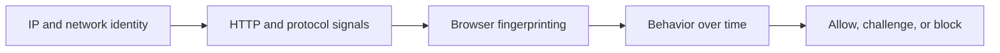

## Anti-Bot Systems Work by Judging the Whole Session, Not Just One Request
Anti-bot systems often feel mysterious because the target does not always tell you exactly why it blocked or challenged the traffic. One request may work, the next may fail, and the same scraper may behave differently in development and production. That happens because modern anti-bot systems usually do not rely on one simple rule. They evaluate many signals together and decide whether the session looks trustworthy enough to allow.
That is why understanding anti-bot systems is less about memorizing one vendor feature and more about understanding how the scoring layers combine.
This guide explains the main layers used by anti-bot systems, why websites deploy them, how those layers interact, and what practical changes reduce the likelihood that scraping traffic gets challenged or blocked. It pairs naturally with [how websites detect web scrapers](https://bytesflows.com/blog/how-websites-detect-scrapers), [how bot detection systems work](https://bytesflows.com/blog/how-bot-detection-systems-work), and [bypass Cloudflare for web scraping](https://bytesflows.com/blog/bypass-cloudflare-web-scraping).
## Why Websites Deploy Anti-Bot Systems
Websites deploy anti-bot systems because repeated automated traffic can create business, security, and operational risk.
Common motivations include:
- protecting inventory or pricing data
- preventing account abuse and credential attacks
- reducing infrastructure load from aggressive crawlers
- controlling spam, fake signups, or abusive automation
- enforcing product, content, or market restrictions
For scraping, this means the site is not only deciding whether your request is valid. It is deciding whether your traffic pattern is acceptable.
## Anti-Bot Systems Usually Evaluate Several Layers at Once
Most anti-bot platforms combine multiple layers rather than relying on one detection point.
Those layers often include:
- network and IP reputation
- HTTP and protocol-level signals
- browser fingerprinting
- session and behavioral analysis
- interactive challenge or verification layers
The result is usually a broader risk score, not a simple yes-or-no check.
## Layer 1: IP and Network Identity
The first visible signal is often where the request comes from.
Anti-bot systems can inspect:
- IP reputation
- ASN or hosting type
- geography
- how much traffic one IP is generating
- whether the route looks like ordinary consumer traffic or server-origin traffic
This is why datacenter traffic often starts from a weaker position than residential traffic on stricter sites.
## Layer 2: HTTP and Protocol Signals
The site may also evaluate the request profile itself.
That can include:
- user-agent
- header completeness and consistency
- language and compression hints
- header order patterns
- TLS or JA3-like connection characteristics
This is one reason simple HTTP clients often fail on stricter targets even when their visible headers look partly correct.
## Layer 3: Browser Fingerprinting
On browser-sensitive targets, the anti-bot system can collect information from the runtime environment itself.
That may include:
- canvas or graphics behavior
- exposed browser properties
- viewport and screen characteristics
- hardware-related values
- automation leaks in headless or scripted environments
This means that even strong IPs can still fail if the browser environment does not look coherent.
## Layer 4: Behavioral Analysis
Anti-bot systems also evaluate how the session behaves over time.
That can include:
- how fast actions happen
- whether timing is perfectly regular
- scrolling or navigation rhythm
- request burstiness
- repeated session patterns across traffic
This is why a technically valid request flow can still look suspicious if the behavior is too concentrated or mechanical.
## Layer 5: Challenges and Verification
When the system is uncertain or the risk score crosses a threshold, it may apply visible defenses such as:
- CAPTCHA
- JavaScript challenges
- challenge pages
- temporary throttling or soft blocks
These are usually not the first layer. They are often what appears after the earlier scoring layers have already marked the session as suspicious.
## The Most Important Idea: The Layers Combine
Anti-bot systems usually tolerate some weak signals in isolation. Problems appear when several weak signals align.
For example:
- datacenter IP
- request-only client
- weak browser realism
- fast repetitive timing
can combine into a much stronger suspicion score than any one issue alone.
This is why anti-bot evasion is rarely solved by one tweak.
## A Practical Anti-Bot Model
A useful mental model looks like this:

This helps explain why scraping reliability depends on the whole access pattern rather than one isolated request detail.
## Common Mistakes
### Assuming anti-bot systems only care about request count
Identity, browser, and behavior all matter too.
### Treating CAPTCHA as the main problem
It is often only the visible result of earlier scoring.
### Fixing headers while ignoring route quality
The weak network layer still gets judged.
### Using a real browser but moving too aggressively
Behavior still exposes automation.
### Assuming one passed request proves the system is healthy
Anti-bot pressure often appears only under repetition.
## Best Practices for Working Against Anti-Bot Systems
### Improve identity quality first on stricter targets
Route quality often shapes everything else.
### Use browser automation when browser runtime clearly matters
Do not expect simple HTTP clients to pass browser-sensitive checks reliably.
### Keep browser context coherent
Locale, viewport, route, and session behavior should fit together.
### Control pacing and concurrency
A good session can still fail under bad traffic rhythm.
### Diagnose blocks as multi-layer problems
The cause is often combined weakness, not one missing header.
Helpful support tools include [Proxy Checker](https://bytesflows.com/blog/proxy-checker), [HTTP Header Checker](https://bytesflows.com/blog/http-header-checker), and [Scraping Test](https://bytesflows.com/blog/scraping-test-tool-detect-blocks).
## Conclusion
Anti-bot systems work by evaluating the whole session: where the traffic comes from, how the request looks, what the browser environment exposes, and how the session behaves over time. That is why blocking often feels unpredictable from the scraper side. The site is not only judging one request. It is judging whether the total pattern looks believable.
The practical lesson is to stop treating anti-bot resistance as one technical trick. It is a systems problem. Stronger identity, better browser realism, coherent session design, and disciplined pacing all work together to lower the score that anti-bot platforms assign to your traffic. That is what makes the difference between occasional lucky access and a stable scraping workflow.
If you want the strongest next reading path from here, continue with [how websites detect web scrapers](https://bytesflows.com/blog/how-websites-detect-scrapers), [how bot detection systems work](https://bytesflows.com/blog/how-bot-detection-systems-work), [bypass Cloudflare for web scraping](https://bytesflows.com/blog/bypass-cloudflare-web-scraping), and [how to scrape websites without getting blocked](https://bytesflows.com/blog/scrape-websites-without-getting-blocked).
## Further reading
- [How websites detect web scrapers](https://bytesflows.com/blog/how-websites-detect-scrapers)
- [How bot detection systems work](https://bytesflows.com/blog/how-bot-detection-systems-work)
- [Bypass Cloudflare for web scraping](https://bytesflows.com/blog/bypass-cloudflare-web-scraping)
- [How to scrape websites without getting blocked](https://bytesflows.com/blog/scrape-websites-without-getting-blocked)
- [Browser fingerprinting explained](https://bytesflows.com/blog/browser-fingerprinting-explained)
- [Best proxies for web scraping](https://bytesflows.com/blog/best-proxies-for-web-scraping)
- [Handling CAPTCHAs in scraping](https://bytesflows.com/blog/handling-captchas-in-scraping)
