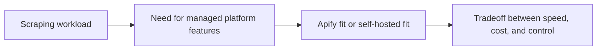

## Apify Is Most Useful When You Want Managed Scraping Infrastructure More Than Full Operational Control
A lot of scraping teams eventually face the same question: should we keep building and hosting our own scraping stack, or should we use a platform that gives us scheduling, proxy support, storage, and execution out of the box? Apify is one of the best-known answers to that second option. Its value is not just that it can run scrapers. Its value is that it turns many scraping infrastructure concerns into platform features.
That is why evaluating Apify is really about understanding where managed convenience beats self-hosted flexibility.
This guide gives a practical overview of Apify as a scraping platform in 2026, including what it provides, when it fits well, where self-hosting still makes more sense, and how to think about the tradeoff between speed of deployment and system control. It pairs naturally with [building a Python scraping API](https://bytesflows.com/en/blog/building-python-scraping-api), [building scrapers with Crawlee](https://bytesflows.com/en/blog/building-scrapers-crawlee), and [the ultimate guide to web scraping in 2026](https://bytesflows.com/en/blog/ultimate-guide-web-scraping-2026).
## What Apify Actually Provides
Apify is not only a place to run code. It is a managed scraping platform that usually bundles together:
- execution environments
- task scheduling
- storage and datasets
- proxy integration
- deployable scraping apps or actors
- APIs for control and result access
The appeal is that many of the surrounding infrastructure tasks are already built into the platform.
## Why Managed Platforms Appeal to Scraping Teams
For many teams, the hard part of scraping is not writing extraction logic. It is building the surrounding system.
That can include:
- scheduling recurring runs
- managing workers
- storing results reliably
- handling browser infrastructure
- keeping proxy usage organized
- exposing runs and results through APIs
Managed platforms appeal because they reduce how much of that system a team has to build itself.
## Actors and Reusable Scraping Units
A central part of Apify’s model is the idea of reusable scraping applications or “actors.”
This matters because it encourages:
- repeatable scraping jobs
- packaged workflows
- easier redeployment
- platform-native execution and scheduling
For some teams, that speeds up deployment significantly, especially when the use case resembles existing patterns the platform already supports well.
## Proxy and Infrastructure Convenience
One practical advantage of Apify is that infrastructure concerns such as proxy usage and execution scaling are often easier to access than in a fully self-built environment.
That does not mean the underlying problems disappear. It means the platform handles more of the wiring for you.
This can be useful when:
- the team wants faster deployment
- internal ops bandwidth is limited
- the workload is recurring and standardized
- browser-based automation needs an easier home than self-managed clusters
## When Apify Is a Strong Fit
Apify is often a strong fit when:
- you want managed infrastructure quickly
- the scraping workflow maps well to platform-style execution
- scheduling and storage are needed immediately
- the team wants to avoid running its own browser fleet or scraping platform
- recurring jobs matter more than custom infrastructure ownership
It is especially attractive when the alternative would be building a lot of infrastructure before proving the workflow.
## When Self-Hosting Still Wins
Self-hosted scraping often makes more sense when:
- you need fine-grained infrastructure control
- the workflow is highly custom
- compliance or data residency requirements are strict
- long-run cost at scale favors in-house systems
- you want to control every layer of routing, storage, and execution
Managed platforms save time, but they do not remove tradeoffs around flexibility and cost.
## Cost Should Be Evaluated as Convenience vs Control
Platform pricing is not only about raw compute or proxy cost. It is also pricing the infrastructure that you do not need to build yourself.
That means the real comparison is often:
- platform cost plus speed of deployment
vs.
- lower-level infrastructure control plus engineering time
Teams often make better decisions when they compare total operational effort rather than only line-item compute cost.
## A Practical Evaluation Model
A useful mental model looks like this:

This shows why platform choice is really a systems decision, not just a feature checklist.
## Common Mistakes
### Comparing only actor features and ignoring operational needs
Infrastructure fit matters more than a demo feature list.
### Assuming managed means universally cheaper
The convenience has a price.
### Self-hosting too early when the workflow is not yet proven
That can create unnecessary engineering drag.
### Choosing a platform when the workflow needs deep custom control
Abstraction can become friction.
### Evaluating only compute cost and not engineering time
Total cost includes the team’s effort.
## Best Practices for Evaluating Apify
### Use Apify when infrastructure speed matters more than low-level ownership
That is where it usually creates the most value.
### Choose self-hosting when the workflow is highly custom or tightly controlled
Do not fight a platform model that does not fit.
### Compare platform cost against real engineering and ops effort
Not just against server pricing.
### Consider whether the workload is recurring and standardized enough to benefit from platform structure
That often predicts fit well.
### Treat the decision as an architecture choice, not only a tooling choice
Because it affects how the whole scraping system evolves.
Helpful support tools include [Scraping Test](https://bytesflows.com/en/blog/scraping-test-tool-detect-blocks), [Proxy Checker](https://bytesflows.com/en/blog/proxy-checker), and [HTTP Header Checker](https://bytesflows.com/en/blog/http-header-checker).
## Conclusion
Apify is useful because it offers managed scraping infrastructure for teams that want to run recurring scraping and automation workloads without building the entire surrounding platform themselves. Its value comes from packaging execution, storage, scheduling, and proxy-aware workflows into one managed environment.
The practical question is not whether Apify is “good.” It is whether managed platform convenience is more valuable for your workload than the control of self-hosting. When speed, recurring jobs, and reduced ops burden matter most, Apify can be a strong fit. When low-level customization, strict control, or long-term in-house ownership matter more, a self-hosted approach may still be the better architecture.
If you want the strongest next reading path from here, continue with [building a Python scraping API](https://bytesflows.com/en/blog/building-python-scraping-api), [building scrapers with Crawlee](https://bytesflows.com/en/blog/building-scrapers-crawlee), [the ultimate guide to web scraping in 2026](https://bytesflows.com/en/blog/ultimate-guide-web-scraping-2026), and [proxy management for large scrapers](https://bytesflows.com/en/blog/proxy-management-large-scrapers).
## Further reading
- [Building a Python scraping API](https://bytesflows.com/en/blog/building-python-scraping-api)
- [Building scrapers with Crawlee](https://bytesflows.com/en/blog/building-scrapers-crawlee)
- [The ultimate guide to web scraping in 2026](https://bytesflows.com/en/blog/ultimate-guide-web-scraping-2026)
- [Proxy management for large scrapers](https://bytesflows.com/en/blog/proxy-management-large-scrapers)
- [Best web scraping tools in 2026](https://bytesflows.com/en/blog/best-web-scraping-tools)
- [Best proxies for web scraping](https://bytesflows.com/en/blog/best-proxies-for-web-scraping)
- [Playwright web scraping tutorial](https://bytesflows.com/en/blog/playwright-web-scraping-tutorial)
