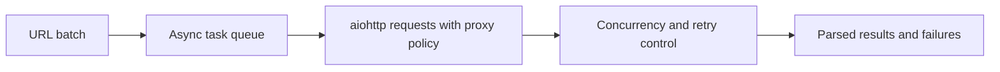

## aiohttp Is Best When the Scraping Problem Is Network Latency, Not Browser Complexity
A lot of Python scraping bottlenecks come from waiting. One request blocks, then the next begins, and total throughput becomes dominated by network latency instead of CPU work. That is where async HTTP clients such as `aiohttp` become valuable. They let one process manage many in-flight requests efficiently when the pages are simple enough to fetch without a real browser.
That is why aiohttp is powerful for the right class of scraping problems and a poor fit for the wrong ones.
This guide explains when aiohttp is the right tool, how async concurrency changes scraping behavior, where proxies and concurrency controls fit, and why browser-based tools are still necessary on stricter or JavaScript-heavy targets. It pairs naturally with [building a Python scraping API](https://bytesflows.com/blog/building-python-scraping-api), [python scraping proxy guide](https://bytesflows.com/blog/python-scraping-proxy-guide), and [playwright web scraping tutorial](https://bytesflows.com/blog/playwright-web-scraping-tutorial).
## What aiohttp Actually Solves
`aiohttp` helps when the bottleneck is many independent HTTP requests waiting on network responses.
That makes it useful for:
- static or lightly dynamic pages
- large batches of independent URLs
- situations where browser rendering is unnecessary
- workflows where high concurrency matters more than browser realism
It is not a browser. It is a fast async HTTP client.
## When aiohttp Beats requests
The difference is usually not feature depth but concurrency model.
`requests` is often fine when:
- the number of URLs is small
- simplicity matters more than throughput
- blocking execution is acceptable
`aiohttp` tends to win when:
- you have many URLs in parallel
- network wait dominates runtime
- you want high throughput from one Python process
This is why async adds real value when the workload is latency-bound.
## When aiohttp Is the Wrong Tool
`aiohttp` is a poor fit when the target:
- requires JavaScript execution
- inspects browser runtime heavily
- uses strong anti-bot systems that care about browser-like TLS and behavior
- depends on full browser interaction flows
In those cases, the problem is no longer “many HTTP requests.” It is “this target expects a browser.”
## Concurrency Is the Main Power and the Main Risk
The biggest advantage of aiohttp is also its biggest danger.
High async concurrency can:
- dramatically improve throughput
- reduce idle time
- make one process very efficient
But it can also:
- overload the target
- trigger rate limits or bans faster
- concentrate too much pressure through one route
- create instability when retries stack on top of concurrency
This is why async scraping needs disciplined concurrency control, not just maximum parallelism.
## Semaphores and Batching Matter
In practice, effective aiohttp scraping usually depends on limiting concurrency deliberately.
That means deciding:
- how many in-flight requests one domain should see
- how much batch pacing is appropriate
- whether retries should happen immediately or later
- whether domains should have different concurrency ceilings
Without that control, async speed can turn into faster blocking rather than better scraping.
## Proxy Use Still Needs Design
`aiohttp` can use proxies, but the same identity questions still apply.
You still need to decide:
- whether one route is being overused
- whether rotation should happen per request or per batch
- whether the target is too strict for request-only scraping at all
- whether residential routing is needed to keep success rate acceptable
A fast async client on a weak route is still a weak session.
## Error Handling Matters More in Async Systems
Async scraping often fails at scale in ways that look noisy and intermittent.
Good aiohttp workflows usually need:
- structured exception handling
- timeout policy
- retry backoff
- distinction between target blocks and transient transport failures
Async systems multiply both throughput and failure volume, so error logic has to be deliberate.
## A Practical aiohttp Model
A useful mental model looks like this:

This shows why aiohttp scraping is as much about coordination as about HTTP speed.
## Common Mistakes
### Using aiohttp on targets that really need a browser
The client model is simply too weak there.
### Launching huge concurrency without domain controls
This often creates faster bans, not faster success.
### Treating async throughput as automatically efficient
Retries and proxy failures can erase the gains.
### Ignoring route quality because the client is fast
Weak identity still weakens outcomes.
### Assuming async code is the hard part and rate control is secondary
Operational control is usually where success is decided.
## Best Practices for Async Python Scraping with aiohttp
### Use aiohttp for static or lightly protected, latency-bound workloads
That is where it delivers the most leverage.
### Limit concurrency explicitly with semaphores or batching policy
Do not let throughput become uncontrolled pressure.
### Pair async requests with a real proxy strategy
Speed and identity still need to work together.
### Handle timeouts, retries, and failures as first-class concerns
Async systems amplify bad error policy quickly.
### Switch to a real browser when the target clearly expects one
Do not force aiohttp into browser-shaped problems.
Helpful support tools include [HTTP Header Checker](https://bytesflows.com/blog/http-header-checker), [Proxy Checker](https://bytesflows.com/blog/proxy-checker), and [Scraping Test](https://bytesflows.com/blog/scraping-test-tool-detect-blocks).
## Conclusion
Async Python scraping with aiohttp is powerful because it lets one process keep many network-bound requests moving at once. For static or lightly protected targets, that can create major throughput gains over simple synchronous loops.
The practical lesson is that aiohttp works best when the problem is really about HTTP concurrency, not browser realism. Once the target needs JavaScript, stronger client identity, or full browser behavior, async HTTP alone stops being enough. Used in the right place—with disciplined concurrency, proxy-aware routing, and good failure handling—aiohttp is one of the most efficient tools in the Python scraping stack.
If you want the strongest next reading path from here, continue with [building a Python scraping API](https://bytesflows.com/blog/building-python-scraping-api), [python scraping proxy guide](https://bytesflows.com/blog/python-scraping-proxy-guide), [playwright web scraping tutorial](https://bytesflows.com/blog/playwright-web-scraping-tutorial), and [the ultimate guide to web scraping in 2026](https://bytesflows.com/blog/ultimate-guide-web-scraping-2026).
## Further reading
- [Building a Python scraping API](https://bytesflows.com/blog/building-python-scraping-api)
- [Python scraping proxy guide](https://bytesflows.com/blog/python-scraping-proxy-guide)
- [Playwright web scraping tutorial](https://bytesflows.com/blog/playwright-web-scraping-tutorial)
- [The ultimate guide to web scraping in 2026](https://bytesflows.com/blog/ultimate-guide-web-scraping-2026)
- [Best proxies for web scraping](https://bytesflows.com/blog/best-proxies-for-web-scraping)
- [How proxy rotation works](https://bytesflows.com/blog/how-proxy-rotation-works)
- [How to scrape websites without getting blocked](https://bytesflows.com/blog/scrape-websites-without-getting-blocked)
