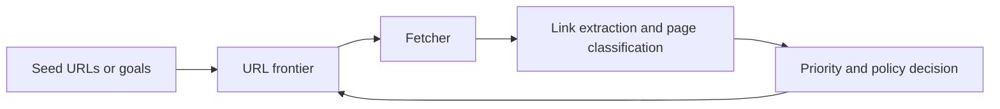

## Autonomous Web Crawlers Matter When URL Discovery Becomes Part of the Problem, Not Just the Starting Point
Many scraping projects begin with a fixed list of URLs. That works when you already know what pages matter. But some data collection tasks are broader: discover product pages, map category structures, follow new content automatically, or adapt to changing site layouts without hand-maintained URL lists. That is where autonomous crawlers become useful.
An autonomous crawler is not just a scraper that follows links. It is a system that decides what to discover next, what to prioritize, and what to ignore.
This guide explains how autonomous web crawlers work, what components they need, how autonomy levels differ, and why queues, policies, and proxy-aware scaling matter as much as link extraction. It pairs naturally with [web scraping architecture explained](https://bytesflows.com/blog/web-scraping-architecture-explained), [distributed crawlers with Scrapy](https://bytesflows.com/blog/distributed-crawlers-scrapy), and [building scrapers with Crawlee](https://bytesflows.com/blog/building-scrapers-crawlee).
## What Makes a Crawler “Autonomous”
A basic crawler can follow links from a seed set. An autonomous crawler adds more decision-making around:
- where to go next
- which discovered URLs matter
- which branches are low value or out of scope
- how to adapt when site structure changes
The higher the autonomy, the less human-maintained URL curation the system needs.
## The Core Components of an Autonomous Crawler
A practical autonomous crawler usually includes:
- a URL frontier or queue
- a fetch layer using HTTP or browser tools
- link extraction
- prioritization logic
- scope and policy controls
- storage for pages, links, or extracted entities
The crawler becomes “autonomous” when these components work together to make ongoing discovery decisions instead of just consuming a static list.
## Discovery Is Easy; Good Discovery Is Hard
Almost any crawler can discover many URLs. The real challenge is discovering useful URLs without drowning in noise.
That means deciding:
- which URL patterns are relevant
- whether breadth or depth matters more
- how much crawl budget one section deserves
- when a path is likely to produce low-value pages
This is why prioritization is often more important than raw discovery ability.
## Common Discovery Strategies
Autonomous crawlers often combine several strategies.
### Breadth-first exploration
Useful when mapping site structure or discovering categories broadly.
### Depth-first exploration
Useful when deeper traversal is likely to lead to target pages quickly.
### Priority queues
Useful when certain patterns, freshness signals, or entity types deserve earlier crawl budget.
### Sitemap and structured hints
Useful when the target exposes machine-readable discovery paths.
### AI-assisted classification
Useful when page type must be inferred before deciding whether to continue down that branch.
The best strategy depends on what “useful discovery” means for the project.
## Autonomy Levels Differ a Lot
Not all autonomous crawlers are equally autonomous.
### Seed-led discovery
You provide seed URLs and the crawler expands from them.
### Pattern-constrained autonomy
You provide domains, scopes, or path rules and the crawler explores within them.
### Goal-oriented autonomy
You provide a high-level goal such as “find product pages” or “discover listing pages,” and the system classifies and prioritizes accordingly.
More autonomy can reduce manual work, but it also increases the need for good policies and validation.
## Policy Control Prevents Autonomous Waste
A crawler that discovers aggressively without strong policy controls can waste bandwidth, storage, and proxy budget quickly.
Good policy usually defines:
- allowed domains and path families
- crawl depth rules
- rate and concurrency limits
- duplication and canonicalization rules
- robots and compliance boundaries where relevant
Autonomy without policy often becomes uncontrolled exploration.
## Proxy and Identity Still Matter for Crawlers
Even autonomous crawlers are still judged as traffic by the target.
That means the same anti-block constraints apply:
- one route can be overloaded
- repeated requests on one domain can trigger defenses
- browser-based branches may need stronger identity than simple HTTP crawling
This is why proxy-aware crawling matters, especially when the crawler operates across many pages and long runs.
Related foundations include [proxy pools for web scraping](https://bytesflows.com/blog/proxy-pools-web-scraping), [proxy management for large scrapers](https://bytesflows.com/blog/proxy-management-large-scrapers), and [how proxy rotation works](https://bytesflows.com/blog/how-proxy-rotation-works).
## AI Can Help, but It Is Not Required
Some autonomous crawlers use AI for:
- classifying page type
- scoring relevance
- deciding whether a branch is worth following
- extracting structured meaning from semi-structured pages
That can be useful, but it also adds cost and ambiguity. Many autonomous crawlers still work well with deterministic heuristics when the site structure is regular enough.
## A Practical Architecture Model
A useful mental model looks like this:

This loop is what turns crawling into a discovery system rather than a fixed scrape list.
## Common Mistakes
### Confusing more URLs with more value
Discovery quality matters more than raw volume.
### Letting the crawler run without clear policy boundaries
That creates waste and risk.
### Ignoring duplication and canonicalization
The crawler may keep rediscovering the same content in different forms.
### Assuming autonomy removes the need for proxy and rate control
The target still sees ordinary crawl pressure.
### Adding AI before deterministic prioritization is understood
That can make the system harder to debug than it needs to be.
## Best Practices for Autonomous Crawlers
### Define what counts as a useful discovered page before you scale
Autonomy needs a target, not just motion.
### Treat prioritization as a first-class design problem
The frontier determines crawler value.
### Keep policy controls explicit and enforceable
Do not let autonomy mean “unbounded.”
### Match proxy and rate strategy to crawl pressure
Discovery systems can create a lot of hidden load.
### Validate whether autonomy is actually outperforming a simpler crawl plan
More intelligence should create more value, not just more complexity.
Helpful support tools include [Proxy Checker](https://bytesflows.com/blog/proxy-checker), [Scraping Test](https://bytesflows.com/blog/scraping-test-tool-detect-blocks), and [Proxy Rotator Playground](https://bytesflows.com/blog/proxy-rotator).
## Conclusion
Autonomous web crawlers are useful when discovering the right URLs is part of the challenge, not just the starting point. The real work is not merely following links. It is deciding what to prioritize, what to ignore, and how to keep discovery aligned with the actual data goal.
The best autonomous crawlers combine a strong URL frontier, clear policy rules, practical prioritization, and proxy-aware crawling discipline. Once those pieces work together, the crawler stops being a simple spider and becomes a controlled discovery system for web data collection.
If you want the strongest next reading path from here, continue with [distributed crawlers with Scrapy](https://bytesflows.com/blog/distributed-crawlers-scrapy), [building scrapers with Crawlee](https://bytesflows.com/blog/building-scrapers-crawlee), [web scraping architecture explained](https://bytesflows.com/blog/web-scraping-architecture-explained), and [proxy management for large scrapers](https://bytesflows.com/blog/proxy-management-large-scrapers).
## Further reading
- [Distributed crawlers with Scrapy](https://bytesflows.com/blog/distributed-crawlers-scrapy)
- [Building scrapers with Crawlee](https://bytesflows.com/blog/building-scrapers-crawlee)
- [Web scraping architecture explained](https://bytesflows.com/blog/web-scraping-architecture-explained)
- [Proxy management for large scrapers](https://bytesflows.com/blog/proxy-management-large-scrapers)
- [Proxy pools for web scraping](https://bytesflows.com/blog/proxy-pools-web-scraping)
- [How proxy rotation works](https://bytesflows.com/blog/how-proxy-rotation-works)
- [The ultimate guide to web scraping in 2026](https://bytesflows.com/blog/ultimate-guide-web-scraping-2026)
