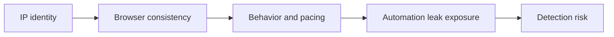

## Avoiding Detection in Playwright Scraping Is About Reducing Suspicion Across the Whole Session
Playwright already gives you a real browser, which is a major advantage over request-only scraping. But a real browser is not the same thing as an undetectable session. Sites can still detect automation through weak IP identity, browser inconsistencies, mechanical behavior, and session patterns that do not look credible over time.
That is why avoiding detection in Playwright scraping is less about one stealth tweak and more about making the full session look coherent.
This guide explains the main layers that influence Playwright detection risk, what usually matters most in practice, and how to reduce avoidable signals without overcomplicating the workflow. It pairs naturally with [playwright proxy configuration guide](https://bytesflows.com/en/blog/playwright-proxy-configuration-guide), [playwright web scraping tutorial](https://bytesflows.com/en/blog/playwright-web-scraping-tutorial), and [how websites detect web scrapers](https://bytesflows.com/en/blog/how-websites-detect-scrapers).
## Why Playwright Still Gets Detected
A Playwright browser can still look suspicious if other parts of the session are weak.
Common causes include:
- datacenter or low-trust IP identity
- unrealistic locale or timezone settings
- session behavior that looks too mechanical
- automation leaks that stricter targets inspect
- retries and concurrency patterns that create obvious pressure
So while Playwright solves the “not a browser” problem, it does not automatically solve the “not a suspicious session” problem.
## Browser Consistency Matters More Than Randomness
One common mistake is trying to randomize everything in the hope of appearing more human.
In reality, stronger Playwright sessions often come from consistency:
- stable viewport per session
- coherent user-agent and browser context
- locale and timezone aligned with route geography
- session continuity that fits the browsing task
A believable session is not chaos. It is internally consistent behavior.
## IP Identity Is Still One of the Strongest Signals
Even with Playwright, weak traffic identity can cause early challenges.
That is why protected targets often behave better when Playwright is paired with:
- residential proxies
- sensible rotation strategy
- geo-consistent routing
The browser layer helps a lot, but a strong browser on a bad route still starts from a weak position.
## Locale, Timezone, and Viewport Should Make Sense Together
Websites may compare multiple pieces of session context.
For example:
- a US route paired with an unrelated locale
- browser settings that do not fit the expected geography
- highly unusual or obviously synthetic viewport choices
These mismatches are often avoidable and can create unnecessary suspicion. The simplest improvement is usually coherence, not endless customization.
## Pacing Still Reveals Automation
A real browser moving through the site at impossible speed can still look automated.
Typical problems include:
- instant repeated navigation across many pages
- perfectly regular delays
- overly aggressive scrolling or interactions
- too many parallel browser contexts on one domain
This is why pacing is still part of detection reduction. The browser needs believable timing, not just believable APIs.
## When Stealth Plugins Matter
Stealth patches can be useful on stricter targets, but they are often overemphasized.
They help most when:
- the target is clearly inspecting browser automation leaks
- a solid proxy and pacing setup still triggers challenge
- the runtime itself appears to be the weak point
They help much less if the real problem is poor IP trust, bad pacing, or incoherent session design. In those cases, stealth becomes a distraction rather than a fix.
## Session Design and Context Usage
Playwright gives you browser contexts for a reason.
Good context design helps detection reduction by:
- isolating sessions cleanly
- preserving cookies where continuity matters
- avoiding unnecessary full-browser churn
- separating unrelated tasks into separate session containers
This is another reason Playwright works well in scraping: the session model is flexible enough to support more believable task boundaries.
## Retries Can Expose Automation Too
If a page fails or gets challenged, repeating the same sequence instantly may reinforce the suspicious pattern.
A better retry model often means:
- waiting before retry
- changing identity when the issue looks route-related
- keeping session continuity only when it is still useful
- avoiding high-frequency repeated attempts on the same target path
Detection reduction is partly about knowing when not to push harder.
## A Practical Detection-Reduction Model
A useful mental model looks like this:

This helps show why good Playwright scraping is multi-layered rather than dependent on one plugin or one flag.
## Common Mistakes
### Treating stealth plugins as the main solution
They help only when the runtime is the real weakness.
### Randomizing too many browser settings
Inconsistency can be more suspicious than stability.
### Ignoring route quality because Playwright is a real browser
Weak IP trust still matters a lot.
### Moving too fast through the site
Automation rhythm is still visible.
### Assuming one successful request means the session design is good
Detection issues often emerge only under repeated use.
## Best Practices for Avoiding Detection in Playwright
### Start with strong route quality
Residential routing often makes the biggest early difference.
### Keep browser context internally coherent
Locale, timezone, viewport, and session type should make sense together.
### Use Playwright contexts deliberately
They help isolate and manage realistic session boundaries.
### Control pacing and concurrency
A real browser can still behave too mechanically.
### Add stealth only when the browser runtime itself is the likely issue
Do not use it as a substitute for better design.
Helpful support tools include [Proxy Checker](https://bytesflows.com/en/blog/proxy-checker), [Scraping Test](https://bytesflows.com/en/blog/scraping-test-tool-detect-blocks), and [Proxy Rotator Playground](https://bytesflows.com/en/blog/proxy-rotator).
## Conclusion
Avoiding detection in Playwright scraping is about lowering suspicion across the whole session: stronger IP identity, more coherent browser context, better pacing, cleaner session design, and only then optional stealth hardening where it is truly needed.
The most important shift is to stop thinking of Playwright as inherently stealthy. It is simply a much better browser foundation than a raw HTTP client. To make it reliable on stricter targets, the rest of the session still has to look believable. Once those layers align, Playwright becomes much harder to flag and much more stable under real scraping workloads.
If you want the strongest next reading path from here, continue with [playwright proxy configuration guide](https://bytesflows.com/en/blog/playwright-proxy-configuration-guide), [playwright web scraping tutorial](https://bytesflows.com/en/blog/playwright-web-scraping-tutorial), [how websites detect web scrapers](https://bytesflows.com/en/blog/how-websites-detect-scrapers), and [bypass Cloudflare with Playwright](https://bytesflows.com/en/blog/bypass-cloudflare-playwright).
## Further reading
- [Playwright proxy configuration guide](https://bytesflows.com/en/blog/playwright-proxy-configuration-guide)
- [Playwright web scraping tutorial](https://bytesflows.com/en/blog/playwright-web-scraping-tutorial)
- [How websites detect web scrapers](https://bytesflows.com/en/blog/how-websites-detect-scrapers)
- [Bypass Cloudflare with Playwright](https://bytesflows.com/en/blog/bypass-cloudflare-playwright)
- [Best proxies for web scraping](https://bytesflows.com/en/blog/best-proxies-for-web-scraping)
- [Residential proxies](https://bytesflows.com/en/blog/residential-proxies)
- [Common web scraping challenges](https://bytesflows.com/en/blog/common-web-scraping-challenges)
