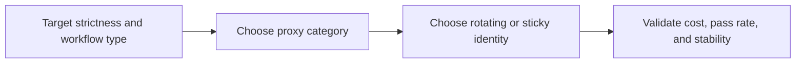

## The Best Proxies for Web Scraping in 2026 Depend on the Target, the Session Model, and the Cost of Failure
A lot of proxy comparisons try to name one universal winner. That is not how scraping infrastructure works. The best proxy for web scraping depends on what the target checks, how much trust the route needs, whether the workflow requires continuity, and how expensive failure becomes at scale.
A cheap route that gets blocked immediately is not really cheap. A premium route that adds trust you do not need is not really efficient. The right choice is the one whose trust, speed, geo behavior, and session model match the real workload.
This guide compares the main proxy types used in web scraping in 2026: datacenter, residential, mobile, and ISP-style routes. It also explains when rotating versus sticky behavior matters and how to choose the right proxy from the target backward. It pairs naturally with [datacenter vs residential proxies](https://bytesflows.com/en/blog/datacenter-vs-residential-proxies), [Proxy Checker](https://bytesflows.com/en/blog/proxy-checker), and [proxy management for large scrapers](https://bytesflows.com/en/blog/proxy-management-large-scrapers).
## What Makes One Proxy Better Than Another
For scraping, proxy quality is usually judged by a combination of:
- trust and block resistance
- speed and latency
- geo coverage and consistency
- session behavior
- operational cost under repeated use
- how well the route fits the target’s anti-bot profile
The best proxy is not the most expensive option. It is the one that gives enough trust for the job without paying for unnecessary characteristics.
## Side-by-Side Proxy Comparison
| Proxy type | Main strength | Main weakness | Best fit |
| --- | --- | --- | --- |
| **Datacenter** | Fast and low cost | Often distrusted on protected targets | Low-friction sites, development, lighter HTTP work |
| **Residential** | Strong overall trust and flexibility | Costs more than datacenter routes | Most serious scraping workloads and protected targets |
| **Mobile** | Very high trust profile | Expensive and often unnecessary for ordinary jobs | Highly sensitive targets, social or app-like environments |
| **ISP or static residential-style** | Stable identity with stronger trust than datacenter | Less variety than broad rotating pools | Sticky sessions, account workflows, continuity-heavy tasks |
## Datacenter Proxies
Datacenter proxies are usually strongest when speed and cost matter more than identity trust.
They are often a good fit for:
- lower-protection targets
- testing and development
- large volumes of simpler HTTP work
- targets that care more about request rate than route reputation
Their biggest weakness is that many stricter websites already distrust datacenter traffic heavily.
## Residential Proxies
Residential proxies are often the best default for serious scraping because they provide stronger trust on more protected targets.
They are especially useful when:
- the target evaluates IP reputation aggressively
- geo realism matters
- the site is consumer-facing and suspicious of cloud traffic
- the workload needs broad identity distribution with lower block rates
This is why residential routing is often the practical standard for production scraping.
## Mobile Proxies
Mobile proxies usually offer the strongest trust profile, but they are also among the most expensive options.
They are most useful when:
- the target is highly sensitive
- app-like or social environments are involved
- ordinary residential routes still are not strong enough
- trust matters more than cost efficiency
They are powerful, but not always the best first choice for ordinary web scraping.
## ISP or Static Residential-Style Proxies
ISP-style proxies sit between datacenter speed and residential trust.
They are especially useful when:
- the workflow depends on stable identity
- long-lived sessions matter
- you want more trust than pure datacenter traffic
- the task benefits from sticky continuity rather than broad rotation
This makes them valuable for account-based or continuity-heavy workflows.
## Cost and Trust Usually Move in Opposite Directions
One of the most useful practical rules is that stronger trust often costs more.
A simple way to think about it is:
- datacenter often wins on price and speed
- residential often wins on general pass rate
- mobile often wins on maximum trust
- ISP-style routes often win when continuity matters most
That is why proxy selection should start from target difficulty and workflow shape, not from price alone.
## Rotation and Session Model Matter as Much as Proxy Type
Even the right proxy category can fail if the identity model is wrong.
For example:
- broad rotation usually works best for stateless scraping
- sticky identity works better for login or multi-step flows
- premium high-trust routes can still fail when traffic behavior is unrealistic
Proxy type and session model need to reinforce the same task.
## A Practical Selection Model
A useful way to decide looks like this:

This is why the best proxy is really a workflow-fit decision.
## Best Proxy Choices by Use Case
### Use datacenter proxies for low-friction, speed-sensitive work
They are efficient when trust is not the main challenge.
### Use residential proxies for most serious protected scraping workloads
They offer the best general balance of trust, flexibility, and pass rate.
### Use mobile proxies when the target is extremely sensitive and residential is still not enough
They are premium routes for premium difficulty.
### Use ISP-style proxies when stable session identity matters more than broad rotation
Continuity can be more important than diversity.
### Always choose from the target’s real anti-bot behavior
The site decides what “best” means.
Helpful support pages include [Proxy Checker](https://bytesflows.com/en/blog/proxy-checker), [Proxy Rotator Playground](https://bytesflows.com/en/blog/proxy-rotator), [Scraping Test](https://bytesflows.com/en/blog/scraping-test), and [why residential proxies are best for scraping](https://bytesflows.com/en/blog/why-residential-proxies-best-scraping).
## Common Mistakes
### Choosing the cheapest proxy and expecting it to work everywhere
Low cost often comes with low trust.
### Paying for premium routes on targets that do not need them
High trust is useful only when the workload benefits from it.
### Ignoring session continuity while comparing only proxy category
Identity behavior still matters.
### Assuming the best proxy is the same for every site
Different targets punish different weaknesses.
### Trusting provider claims instead of observed pass rate
Real behavior matters more than labels.
## Conclusion
The best proxies for web scraping in 2026 are not defined by a single universal category. They are defined by how well their trust, speed, geo behavior, cost, and session model match the target you are trying to reach. Datacenter, residential, mobile, and ISP-style routes each make sense in the right context and become the wrong choice in the wrong one.
The practical lesson is simple: choose proxies from the target backward. Start with how strict the site is, how much continuity the workflow needs, and how expensive failure becomes. Once those constraints are clear, the right proxy type becomes much easier to choose and much easier to justify.
## Further reading
- [Datacenter vs residential proxies](https://bytesflows.com/en/blog/datacenter-vs-residential-proxies)
- [Proxy Checker](https://bytesflows.com/en/blog/proxy-checker)
- [Proxy Rotator Playground](https://bytesflows.com/en/blog/proxy-rotator)
- [Proxy management for large scrapers](https://bytesflows.com/en/blog/proxy-management-large-scrapers)
- [Why residential proxies are best for scraping](https://bytesflows.com/en/blog/why-residential-proxies-best-scraping)
- [How to scrape websites without getting blocked](https://bytesflows.com/en/blog/scrape-websites-without-getting-blocked)
- [Residential proxies](https://bytesflows.com/en/proxies)
