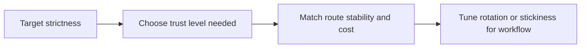

## Proxy Choice Determines What the Web Lets You Reach
In modern scraping, code is only part of the equation. The route you use often determines whether the target serves data, a challenge page, or a block.
That is why choosing the right proxy type matters so much. The best proxy is not the one with the highest advertised speed. It is the one whose trust, stability, and cost match the target and the workflow.
This guide pairs well with [Residential Proxies for Web Scraping | Rotating Residential IPs](https://bytesflows.com/en/blog/residential-proxies), [Why Residential Proxies Are Best for Scraping (2026)](https://bytesflows.com/en/blog/why-residential-proxies-best-scraping), and [Proxy Rotation Strategies: Why Your Scraper Lives or Dies by the IP](https://bytesflows.com/en/blog/proxy-rotation-strategies).
## The Four Main Proxy Types
### Datacenter proxies
Fast and usually cheap, but easier for defended sites to identify and penalize.
### Residential proxies
Route through ISP-assigned consumer IPs and are generally the most useful default for protected public sites.
### Mobile proxies
Highest trust in many scenarios, but typically the most expensive and operationally limited.
### Static ISP proxies
A hybrid option that keeps a stable IP identity with stronger trust than ordinary datacenter routes.
## What Actually Matters in Proxy Selection
| Factor | Why it matters |
| --- | --- |
| Trust profile | Determines how quickly the route is challenged or blocked |
| Stability | Important for long-lived sessions and sensitive flows |
| Speed and latency | Affects throughput and browser performance |
| Pool size | Matters when scaling across many requests |
| Cost model | Changes what is sustainable in production |
## When Datacenter Proxies Still Make Sense
Datacenter routes can work well when:
- targets are lightly defended
- pages are relatively static
- cost efficiency matters more than stealth
- the workflow is internal testing or low-risk validation
They are often a poor fit for strict commercial targets, but still useful in the right conditions.
## Why Residential Proxies Are the Default for Many Teams
Residential routes are usually the best baseline when you need:
- lower block rates
- broad geo coverage
- repeated public-site access
- realistic browsing across defended targets
They are not magic, but they usually offer the strongest balance of trust and scale for modern scraping workloads.
## When Mobile or Static ISP Routes Are Worth It
### Mobile proxies
Useful when trust is the top priority and the workflow can justify the higher cost.
### Static ISP proxies
Useful when you need a stable identity for sessions, logins, or long-lived flows while still avoiding the weakest datacenter reputation patterns.
These are usually specialized tools rather than universal defaults.
## A Better Way to Choose
Choose proxies based on the workflow:
- use datacenter routes for low-friction targets and cost-sensitive experiments
- use residential routes for defended public sites and scalable collection
- use mobile routes when extreme trust is necessary
- use static ISP routes when stability matters more than rotation

## Common Mistakes
- buying the fastest proxy instead of the most suitable one
- using datacenter routes on highly defended commercial sites
- using rotating routes for flows that need session stability
- choosing expensive routes before validating the target's actual strictness
- evaluating proxies only by price instead of successful usable output
## Conclusion
The best proxies for web scraping in 2026 are the ones that match the target's defenses, the workflow's session needs, and the team's cost tolerance. In many real-world cases, residential proxies are the strongest general-purpose answer, while datacenter, mobile, and static ISP routes each play more specialized roles.
Once proxy choice is treated as part of system design rather than an afterthought, scraping workflows become much more reliable.
## Further reading
- [Residential Proxies for Web Scraping | Rotating Residential IPs](https://bytesflows.com/en/blog/residential-proxies)
- [Why Residential Proxies Are Best for Scraping (2026)](https://bytesflows.com/en/blog/why-residential-proxies-best-scraping)
- [Proxy Rotation Strategies: Why Your Scraper Lives or Dies by the IP](https://bytesflows.com/en/blog/proxy-rotation-strategies)
- [Playwright Proxy Setup Guide (2026)](https://bytesflows.com/en/blog/playwright-proxy-setup)
- [Avoid IP Bans in Web Scraping: The Ultimate Survival Guide](https://bytesflows.com/en/blog/avoid-ip-bans-web-scraping)
