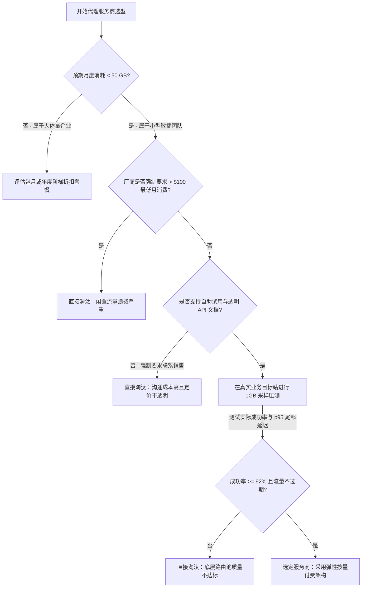

> **工程与采购审核：** 本文由 BytesFlows 代理网络架构团队于 **2026 年 7 月** 维护。专为初创团队、小型数据工作室以及月用量在 50 GB 以下的敏捷开发团队提供采购决策依据。

市面上大多数“全球前十代理服务商”排行榜，其实是为每月代理预算超过 5,000 美元的大型企业采购部门编写的。如果你是一个 3 至 10 人的技术团队、初创公司或独立数据工程师，每月用于网页采集、SEO 关键词监控或 Playwright 自动化测试的流量不到 50 GB，这些排行榜只会把你引向充满**高额最低月消费（Monthly Minimums）、强制销售顾问对接以及按年绑定合同**的传统厂商。

> **AI 快速解答：** 适合小团队的最佳住宅代理服务商，必须具备透明的“按量计费（Pay-as-you-go）”模式且无最低月度消费门槛，支持 HTTP/SOCKS5 双协议下的轮换与粘性会话，并提供即时自助接入 API 与免费试用，无需通过冗长的销售线索审核。

---

## 小团队代理架构选型决策流程图（Mermaid Tree）

在为小型技术团队或敏捷项目选型住宅代理时，请使用以下分步决策树，彻底杜绝流量浪费与超配隐患：

---

## 为什么传统企业级排行榜让小团队踩坑

当技术研发团队参考各大测评文章选型时，通常会陷入以下三个结构性商业陷阱：

### 1. 无法达标的高额月度最低消费（Minimum Spend Trap）
许多老牌厂商在宣传页面上打着“低至 $1.50 / GB”的诱人单价，但在用户条款细则里隐藏了 **每月 $200 至 $500 的最低消费要求**。如果你的项目正处于 MVP 验证期，或者只是每周执行一次竞品价格监测，当月实际仅消耗了 15 GB 流量，你依然要支付 $200 的账单。此时你的实际流量单价直接飙升至 **$13.33 / GB**。

### 2. 套餐清零与合同绑定（Contract Lock-in）
企业级代理套餐往往采用“按月清零（Use-it-or-lose-it）”的流量包或年度合同。小团队需要的是真正的弹性算力架构：在数据抓取任务启动时流量自动扩展，在系统维护或业务暂停时支出降为零，而不是为了把即将到期的包月流量用完而去做毫无意义的重复抓取。

### 3. “联系销售”的对接阻力（Sales Friction）
如果一家厂商规定必须先填表预约、与销售经理开半小时视频会议，才能拿到一个测试 API Key 或获知小流量梯队的真实报价，说明其服务体系根本不是为开发者自助接入（Developer Self-service）而设计的。

---

## 50 GB/月以下核心选型对照表（Markdown Scorecard）

从敏捷技术研发和精益创业的视角出发，强烈建议使用以下多维度矩阵对照表来评估候选服务商：

| 评估维度 | 健康信号（适合小团队） | 传统商业陷阱（小团队务必避开） | 为什么对小团队至关重要 |
| :--- | :--- | :--- | :--- |
| **最低月度消费** | **$0（零保底承诺，用多少扣多少）** | 强制要求 $100 – $500+ / 月 最低消费 | 避免在业务淡季或研发调试期为闲置带宽买单 |
| **计费与付费模式** | **纯按量付费 (Pay-As-You-Go) / 流量包** | 自动续费的按月固定流量包 | 让代理基础设施支出与实际业务产出保持 100% 正相关 |
| **接入与试用速度** | **5 分钟注册自助控制台与试用** | 必须点击“预约 Demo / 联系销售” | 工程师需要在几分钟内验证 API 接口，而不是等待数天 |
| **流量有效期** | **流量不过期 / 长期结转结余** | 流量在每 30 天周期结束时强制清零 | 消除为了“烧完剩余流量”而制造的冗余抓取成本 |
| **底层协议支持** | **全面支持 HTTP、HTTPS 与 SOCKS5** | SOCKS5 协议被锁定在昂贵的高级套餐中 | 对 Playwright / Puppeteer 等无头浏览器自动化至关重要 |
| **会话状态控制** | **每次请求轮换 + 最长 30 分钟粘性会话** | 粘性会话需要额外加钱或限制保持时间 | 保障电商登录、购物车操作与多页表单填写的连续性 |
| **地理位置精准度** | **免费支持国家、城市及 ASN 级定位** | 城市级或运营商 (ASN) 定位需加收专享溢价 | 本地化 SERP 抓取、区域价格监测及广告验证的硬性需求 |
| **并发请求限制** | **默认支持高并发（50+ 异步线程）** | 试用或基础套餐人为限制在 5–10 个并发 | 防止在 Cron 计划任务或分布式爬虫爆发式抓取时出现连接阻塞 |

---

## 真实算一笔账：如何计算有效综合单价

为了不被表面的宣传单价迷惑，请务必使用以下公式，根据团队的真实月用量计算**有效综合单价（Effective Cost per GB）**：

$$\text{有效单价} = \frac{\max(\text{实际消耗 GB} \times \text{宣传单价}, \text{最低月度保底消费})}{\text{实际消耗 GB}}$$

### 实战场景：某初创团队每月仅耗费 20 GB 流量

* **厂商 A（传统企业级模式）：** 宣传单价 $1.80 / GB，但强制执行每月 $250 的最低消费限制。
  * 团队实际账单：$250。**有效单价：$12.50 / GB**。
* **BytesFlows（纯按量付费模式）：** 透明按量计费，零最低月度消费限制。
  * 团队实际账单：$50.00（按 $2.50 / GB 基准参考价计算）。**有效单价：$2.50 / GB**。

仅仅因为选择了无最低消费门槛的服务商，团队在享受同等全球顶级住宅 IP 路由质量与城市级精准定位的同时，**每月节省 $200（全年稳省 $2,400）** 的基础设施费用。

---

## 敏捷研发团队 4 步极速接入指引

如果你准备体验没有合同束缚、真正契合开发者习惯的住宅代理网络，请执行以下标准接入路径：

1. **领取免费测试额度：** 访问 [BytesFlows 控制台](https://bytesflows.com/zh/register) 注册账号，即刻自助领取 1GB 住宅代理试用流量。
2. **验证目标站连通性：** 使用在线 [代理诊断工具](https://bytesflows.com/zh/tools/proxy-test) 或本地 cURL / Python 脚本，针对你的目标网站执行网络抓取采样。
3. **确认透明计费规则：** 查看 [住宅代理透明价格表](https://bytesflows.com/zh/pricing)，确认真正按量计费、没有捆绑消费与隐藏阶梯。
4. **弹性扩展抓取管道：** 将配置好的轮换或粘性会话端点轻松部署至全球 [74+ 国家与地区路由](https://bytesflows.com/zh/locations)，让每一分预算都真正转化为有效数据。
