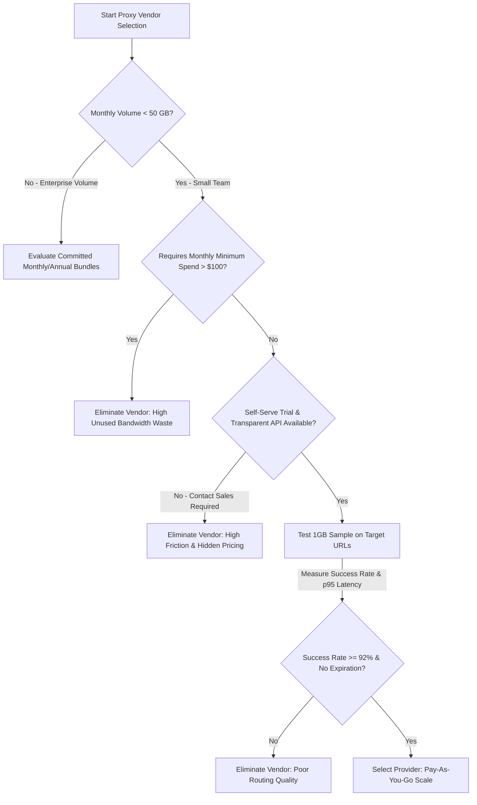

> **Engineering Review & Market Analysis:** Last updated in **July 2026** by the BytesFlows Proxy Architecture Team. Designed specifically for startups, boutique agencies, and data engineering teams scaling sub-50 GB/month workloads.

Enterprise proxy rankings are built for procurement departments spending $5,000+ per month. If you are a 3–10 person technical team using under 50 GB/month for public data extraction, SERP monitoring, or Playwright automation, standard industry leaderboards will point you toward vendors with high monthly minimums, sales calls, and annual contract lock-in that you do not need.

> **Direct answer:** The best residential proxy provider for a small team is one that offers transparent pay-as-you-go pricing without monthly minimum commitments, supports both rotating and sticky sessions over HTTP/SOCKS5, and provides an immediate self-serve API and free trial without requiring a sales call.

---

## Small Team Proxy Selection Workflow (Decision Tree)

When evaluating proxy providers for a small technical team, use this step-by-step decision framework to avoid pricing traps and over-provisioning:

---

## Why Enterprise Proxy Rankings Fail Small Teams

When small engineering teams pick proxy vendors from top-10 listicles, they routinely run into three structural traps:

### 1. Monthly Minimum Commitments You Never Hit
Many legacy providers advertise attractive per-GB rates (e.g., "$1.50/GB"), but bury a **$200 to $500 monthly minimum commitment** in their terms. If your product-market fit validation or periodic competitor monitoring only consumes 15 GB in a given month, you are still billed the full $200 minimum. Your effective price jumps from $1.50/GB to **$13.33/GB**.

### 2. Contract Lock-In & Expiration Dates
Enterprise tiers rely on annual subscriptions or monthly "use-it-or-lose-it" bandwidth bundles. Small teams and agile startups need elastic infrastructure: bandwidth should scale up when an extraction pipeline runs, and scale down to zero during development or maintenance without burning expired credits.

### 3. "Contact Sales" Friction
If a provider requires you to book a 30-minute discovery call with a sales representative just to get a trial API key or learn sub-100GB pricing, their support model is not optimized for developer self-service.

---

## Sub-50 GB/Month Evaluation Matrix (Markdown Scorecard)

Use the following scorecard to evaluate residential proxy providers from the perspective of an agile technical team:

| Evaluation Criteria | Healthy Signal (Small Team Fit) | Enterprise Trap (Avoid for Sub-50GB) | Why It Matters for Small Teams |
| :--- | :--- | :--- | :--- |
| **Monthly Minimum Spend** | **$0 (Zero minimum commitment)** | $100 – $500+ / month required | Prevents paying for idle, unused bandwidth during slow months |
| **Pricing Model** | **Pure Pay-As-You-Go / Prepaid credits** | Monthly recurring subscription bundles | Keeps infrastructure costs directly tied to revenue or scraping output |
| **Onboarding Speed** | **Instant self-serve dashboard & trial** | "Book a Demo / Contact Sales" mandatory | Developers need to test API endpoints in minutes, not days |
| **Credit Expiration** | **Never expires / Long-term rollover** | Credits reset at the end of every 30 days | Eliminates artificial pressure to burn traffic on redundant scrapes |
| **Protocol Support** | **Full HTTP, HTTPS, and SOCKS5** | SOCKS5 locked behind enterprise tiers | Crucial for headless browser automation (Playwright/Puppeteer) |
| **Session Control** | **Per-request rotation & up to 30m sticky** | Limited sticky duration or extra fee | Required for multi-step checkout checks, carts, and login flows |
| **Geo-Targeting** | **Free Country, City, and ASN targeting** | Premium upcharge for city/ASN precision | Essential for localized SERP tracking and e-commerce ad verification |
| **Concurrency Limit** | **High default concurrency (50+ workers)** | Capped at 5–10 concurrent threads | Prevents bottlenecks during scheduled lambda or cron scraping bursts |

---

## How to Calculate Your Effective Price per GB

To see through marketing sticker prices, always calculate your **Effective Cost per GB** using your realistic monthly volume estimate:

$$\text{Effective Rate} = \frac{\max(\text{Actual GB Used} \times \text{Sticker Rate}, \text{Monthly Minimum Spend})}{\text{Actual GB Used}}$$

### Real-World Scenario: 20 GB Monthly Consumption

* **Provider A (Enterprise Model):** Advertises $1.80/GB, but enforces a $250/month minimum spend.
  * Spend: $250. Effective Rate: **$12.50 / GB**.
* **BytesFlows (Pay-As-You-Go Model):** Transparent pay-as-you-go rate with zero minimum spend.
  * Spend: $50.00 (at $2.50/GB reference rate). Effective Rate: **$2.50 / GB**.

By choosing a provider without monthly minimums, the team saves **$200/month ($2,400/year)** while receiving the exact same residential IP routing quality and geo-targeting precision.

---

## Practical Setup for Agile Teams

If you are ready to evaluate a developer-friendly residential proxy pool without subscription lock-in, follow this streamlined onboarding path:

1. **Claim Your Free Test Credit:** Register at the [BytesFlows Console](https://bytesflows.com/register) to access a self-serve 1GB residential proxy trial.
2. **Verify Target Routing:** Run a diagnostic test against your target domain using our [Proxy Test Tool](https://bytesflows.com/tools/proxy-test) or cURL command line probes.
3. **Check Transparent Pricing:** Review our [Residential Proxy Pricing](https://bytesflows.com/pricing) to verify pay-as-you-go rates without recurring commitments.
4. **Scale Elastic Pipelines:** Deploy your rotating or sticky endpoints across [74+ country locations](https://bytesflows.com/locations) knowing your bandwidth credits never expire prematurely.
