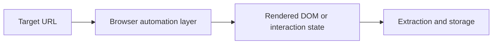

## Browser Automation Exists Because Modern Websites Are No Longer Plain HTML Targets
A simple HTTP request used to be enough for many scraping tasks. On modern sites, that is often no longer true. Content may render after JavaScript runs, key elements may load only after interaction, and challenge flows may depend on browser state in ways a raw HTTP client cannot satisfy.
That is why browser automation has become a core part of modern scraping architecture. It is not always the cheapest option, but it is often the most realistic one.
This guide explains when browser automation is actually necessary, how tools like Playwright fit into a scraping stack, and why proxies, pacing, and browser realism matter just as much as simply “using a browser.” It pairs naturally with [playwright web scraping tutorial](https://bytesflows.com/blog/playwright-web-scraping-tutorial), [headless browser scraping guide](https://bytesflows.com/blog/headless-browser-scraping-guide), and [web scraping architecture explained](https://bytesflows.com/blog/web-scraping-architecture-explained).
## When HTTP Is Not Enough
Browser automation becomes necessary when the page depends on behavior that an HTTP client does not reproduce.
Typical cases include:
- JavaScript-rendered content
- infinite scroll or lazy loading
- interaction-dependent page states
- browser-aware anti-bot systems
- login flows or multi-step forms
- pages that are mostly empty in the initial response
In those situations, scraping with `requests`, `axios`, or similar tools often gives you only a partial or misleading page representation.
## When a Browser Is Worth the Cost
A browser is heavier than HTTP fetching. It uses more memory, more CPU, and more time per page. So the right question is not “Can I use a browser?” but “Do I need a browser badly enough to justify the extra cost?”
The answer is usually yes when:
- the content is not reliably present in raw HTML
- the target behaves differently for real browsers
- the page must be interacted with before data appears
- the site uses stronger anti-bot systems
- the extraction depends on rendered state, not just source markup
## How Browser Automation Fits into a Scraping Pipeline
A useful mental model looks like this:

In more advanced setups, this browser layer sits alongside queues, proxy infrastructure, and monitoring systems rather than replacing them. That is why browser automation is better understood as one component in a scraping architecture, not the whole architecture by itself.
## Why Playwright Has Become a Common Choice
Playwright is popular because it gives developers a practical way to control modern browsers with strong automation primitives.
It is especially useful for:
- page navigation and waiting logic
- interacting with forms, buttons, and filters
- managing browser contexts and isolated sessions
- handling rendered DOM after JavaScript execution
- supporting Chrome/Chromium-style workflows at scale
That is why Playwright often appears as the default browser layer in serious scraping systems, especially when reliability matters more than minimal runtime cost.
## Headless vs Headed: What Actually Matters
Headless mode runs without a visible window, while headed mode runs with a visible browser interface.
In practice:
- **headed mode** is useful for debugging
- **headless mode** is usually preferred in production
The more important point is not the visibility of the browser window. It is whether the browser session behaves consistently, loads the right content, and remains stable under repetition.
## Browser Contexts and Session Isolation
Browser contexts are one of the most useful concepts in browser automation.
They let you:
- separate cookies and storage between tasks
- run multiple workflows without total session crossover
- test different session identities more safely
- isolate failures more cleanly inside one browser instance
This matters because scraping reliability is often about session quality just as much as page rendering.
## Why Proxies Matter for Browser Automation
A browser makes the request more realistic, but the site still sees where that browser traffic comes from.
Without proxies, the target often sees:
- one server IP
- one cloud or datacenter identity
- repeated browser sessions from the same origin
- growing request density on one address
That is why browser automation and proxy strategy belong together. Residential proxies often improve browser-based scraping because they reduce obvious datacenter exposure and support more realistic geographic and identity behavior.
Related foundations include [best proxies for web scraping](https://bytesflows.com/blog/best-proxies-for-web-scraping), [residential proxies](https://bytesflows.com/blog/residential-proxies), and [playwright proxy configuration guide](https://bytesflows.com/blog/playwright-proxy-configuration-guide).
## Pacing Still Matters
A browser is not a free pass.
Even browser-based scraping still needs:
- delays between actions
- controlled concurrency
- careful retry behavior
- sensible session strategy
- validation on the actual target pages
This is important because browser automation can fail in a deceptively expensive way: you may spend far more compute than an HTTP client while still getting blocked if the surrounding traffic design is poor.
## Common Use Cases
### JavaScript-heavy ecommerce pages
Where price, stock, or reviews load after rendering.
### Search and discovery workflows
Where result pages depend on browser behavior and interaction.
### Login or account-based collection
Where the workflow depends on cookies, forms, and navigation state.
### Challenge-heavy targets
Where HTTP-only clients fail before the useful page is ever reached.
### Multi-step automation
Where scraping includes not just reading, but controlled browsing actions.
## Common Mistakes
### Using a browser for everything by default
This raises cost quickly and is often unnecessary on simpler targets.
### Treating browser automation as enough without proxy planning
A real browser still gets blocked if traffic identity is poor.
### Waiting with fixed sleeps only
It is usually better to wait for specific elements or conditions.
### Scaling tabs and contexts too aggressively
This often creates instability before it creates useful throughput.
### Ignoring monitoring
Browser tasks are expensive enough that failure visibility matters even more.
## Best Practices for Browser Automation in Scraping
### Use browsers only when they clearly add value
Save them for targets that actually require rendering or interaction.
### Pair browser automation with the right proxy strategy
Traffic identity matters as much as browser realism.
### Prefer explicit waits to blind timing
Let the workflow react to the page rather than guessing blindly.
### Track memory, success rate, and block rate
Browser automation costs more, so wasted runs hurt more.
### Scale by validation, not optimism
A workflow that succeeds locally may still fail under production repetition.
Helpful support tools include [Proxy Checker](https://bytesflows.com/blog/proxy-checker), [Scraping Test](https://bytesflows.com/blog/scraping-test-tool-detect-blocks), and broader browser-automation guides in the same topic cluster.
## Conclusion
Browser automation for web scraping exists because modern websites increasingly require rendering, interaction, and browser-aware behavior before the useful content becomes accessible. In those cases, a tool like Playwright provides the realism and control that simple HTTP clients cannot.
But the browser is only one layer of the solution. The strongest systems also manage proxies, pacing, session design, and monitoring carefully. When those layers work together, browser automation becomes a practical part of a reliable scraping architecture rather than just a heavy debugging tool.
If you want the strongest next reading path from here, continue with [playwright web scraping tutorial](https://bytesflows.com/blog/playwright-web-scraping-tutorial), [headless browser scraping guide](https://bytesflows.com/blog/headless-browser-scraping-guide), [web scraping architecture explained](https://bytesflows.com/blog/web-scraping-architecture-explained), and [playwright proxy configuration guide](https://bytesflows.com/blog/playwright-proxy-configuration-guide).
## Further reading
- [Playwright web scraping tutorial](https://bytesflows.com/blog/playwright-web-scraping-tutorial)
- [Headless browser scraping guide](https://bytesflows.com/blog/headless-browser-scraping-guide)
- [Web scraping architecture explained](https://bytesflows.com/blog/web-scraping-architecture-explained)
- [Playwright proxy configuration guide](https://bytesflows.com/blog/playwright-proxy-configuration-guide)
- [Best proxies for web scraping](https://bytesflows.com/blog/best-proxies-for-web-scraping)
- [Residential proxies](https://bytesflows.com/blog/residential-proxies)
- [Using LLMs to extract web data](https://bytesflows.com/blog/using-llms-extract-web-data)
