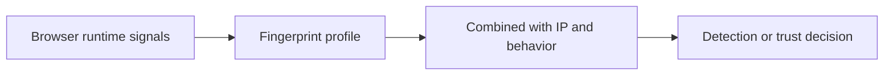

## Browser Fingerprinting Matters Because Websites Can Identify a Session Without Relying Only on IP Address
A lot of developers assume that changing IPs is enough to change identity on the web. Modern anti-bot systems and tracking systems often do much more than that. They use browser fingerprinting to build a profile of the environment itself, sometimes strongly enough to recognize suspicious or repeat patterns even when the IP changes.
That is why browser fingerprinting is important to understand for scraping. It changes the question from “What IP am I using?” to “What kind of browser environment does the site think this session is?”
This guide explains what browser fingerprinting is, what kinds of signals contribute to it, why consistency matters more than randomization in many cases, and how browser fingerprinting fits into broader scraping detection. It pairs naturally with [how websites detect web scrapers](https://bytesflows.com/blog/how-websites-detect-scrapers), [how to avoid detection in Playwright scraping](https://bytesflows.com/blog/avoid-detection-playwright-scraping), and [bypass Cloudflare for web scraping](https://bytesflows.com/blog/bypass-cloudflare-web-scraping).
## What Browser Fingerprinting Actually Means
Browser fingerprinting is the process of collecting multiple browser and device-exposed signals to estimate a unique or highly characteristic identity for the session.
Those signals may include:
- graphics and rendering behavior
- browser properties and capabilities
- viewport and screen information
- language and locale settings
- hardware-related values exposed through the browser
- networking-related browser behaviors
No single value needs to be unique by itself. The combination is what becomes useful for tracking or detection.
## Why Fingerprinting Matters for Scraping
For scraping, fingerprinting matters because a site does not only care whether the request succeeded. It cares whether the browser environment looks plausible.
This can affect:
- challenge frequency
- anti-bot scoring
- how quickly a session is distrusted
- whether a browser automation setup survives repeated use
That is why a browser session can still be flagged even when the IP route is good.
## Common Fingerprint Components
A fingerprint is often built from many browser-visible signals.
Typical examples include:
- canvas rendering characteristics
- WebGL or graphics details
- audio-processing behavior
- hardware concurrency or memory values
- screen and viewport dimensions
- automation-revealing properties in the runtime
The important point is not memorizing every signal. It is understanding that the site is scoring the environment as a whole.
## Why Simple HTTP Clients Fail Here
A tool like `requests` does not really present a browser environment at all.
That means it cannot satisfy:
- JavaScript-based fingerprint collection
- browser runtime expectations
- client-side challenge flows
This is one reason browser automation frameworks behave differently from request-only clients on stricter targets.
## Why Consistency Matters More Than Randomness
A common instinct is to randomize as much as possible. But in fingerprint-sensitive workflows, excessive randomization can create a more suspicious session.
For example, it is often safer to keep:
- a stable viewport per session
- locale aligned with the route
- browser settings internally coherent
- one believable session profile across the task
A coherent fingerprint is often more credible than a constantly shifting one.
## Why Browser Automation Still Needs Care
A real browser framework helps because it produces a fuller environment, but browser automation can still expose:
- automation flags
- unrealistic runtime traits
- mismatched browser context settings
- inconsistency between route and browser environment
That is why browser fingerprinting is not “solved” merely by using Playwright or Puppeteer. The surrounding session design still matters.
## Fingerprinting and IP Identity Work Together
Fingerprinting does not replace IP-based detection. The two often reinforce each other.
A weak session may combine:
- datacenter or low-trust route
- suspicious browser traits
- mechanical pacing
- repeated challenge failures
That combination is usually more damaging than any one weak layer alone.
## A Practical Fingerprint Model
A useful mental model looks like this:

This helps show why browser fingerprinting is part of a broader system, not an isolated trick.
## Common Mistakes
### Assuming IP rotation is enough
The browser environment may still be characteristic or suspicious.
### Randomizing every visible signal
Too much inconsistency can create a stranger session, not a more human one.
### Ignoring route and locale mismatch
A fingerprint should make sense in context.
### Treating fingerprinting as only a privacy topic
For scraping, it is also a detection and trust topic.
### Assuming a real browser automatically looks perfect
Runtime coherence still matters.
## Best Practices for Fingerprint-Sensitive Scraping
### Use a real browser environment when the target clearly inspects browser runtime
That is often foundational.
### Keep session identity coherent
Viewport, locale, timezone, and route should fit together.
### Use stronger route quality on stricter targets
A cleaner fingerprint is still weakened by poor IP trust.
### Diagnose challenge behavior as multi-layered
Fingerprinting rarely acts alone.
### Prefer controlled consistency over random chaos
Believability often depends on stability.
Helpful support tools include [Proxy Checker](https://bytesflows.com/blog/proxy-checker), [Scraping Test](https://bytesflows.com/blog/scraping-test-tool-detect-blocks), and [Proxy Rotator Playground](https://bytesflows.com/blog/proxy-rotator).
## Conclusion
Browser fingerprinting matters because it lets websites judge a browser session by what the environment looks like, not only by the IP address that delivered it. For scraping, that means identity is broader than network routing: the browser runtime itself becomes part of the trust decision.
The practical lesson is that good scraping sessions are not just proxied—they are coherent. A believable browser environment, stronger route quality, and sane pacing work together to reduce the chance that fingerprinting becomes one more reason the site decides your session does not belong.
If you want the strongest next reading path from here, continue with [how websites detect web scrapers](https://bytesflows.com/blog/how-websites-detect-scrapers), [how to avoid detection in Playwright scraping](https://bytesflows.com/blog/avoid-detection-playwright-scraping), [bypass Cloudflare for web scraping](https://bytesflows.com/blog/bypass-cloudflare-web-scraping), and [best proxies for web scraping](https://bytesflows.com/blog/best-proxies-for-web-scraping).
## Further reading
- [How websites detect web scrapers](https://bytesflows.com/blog/how-websites-detect-scrapers)
- [How to avoid detection in Playwright scraping](https://bytesflows.com/blog/avoid-detection-playwright-scraping)
- [Bypass Cloudflare for web scraping](https://bytesflows.com/blog/bypass-cloudflare-web-scraping)
- [Best proxies for web scraping](https://bytesflows.com/blog/best-proxies-for-web-scraping)
- [Residential proxies](https://bytesflows.com/blog/residential-proxies)
- [Common web scraping challenges](https://bytesflows.com/blog/common-web-scraping-challenges)
- [Browser automation for web scraping](https://bytesflows.com/blog/browser-automation-web-scraping)
