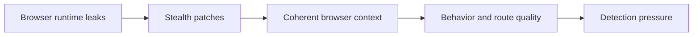

## Browser Stealth Techniques Matter Most When the Browser Looks Almost Real, but Not Quite Real Enough
A browser automation framework such as Playwright or Puppeteer already gets you much closer to a real user session than a simple HTTP client. But “closer” is not the same thing as “safe.” Many targets do not need to prove that you are a bot with certainty. They only need enough suspicious signals to justify a challenge or block. Browser stealth techniques exist to reduce those signals.
That is why stealth is best understood as a way to remove avoidable browser-side suspicion, not as a magic invisibility layer.
This guide explains what browser stealth techniques actually do, when they help, where they are overused, and how they fit into the larger problems of route quality, browser coherence, and behavioral realism. It pairs naturally with [how to avoid detection in Playwright scraping](https://bytesflows.com/en/blog/avoid-detection-playwright-scraping), [browser fingerprinting explained](https://bytesflows.com/en/blog/browser-fingerprinting-explained), and [preventing scraper fingerprinting](https://bytesflows.com/en/blog/preventing-scraper-fingerprinting).
## What “Stealth” Usually Means in Scraping
In practice, browser stealth usually means reducing visible signs that the browser is automated.
That can involve:
- patching automation-revealing runtime properties
- making browser context look more coherent
- reducing browser-side inconsistencies
- avoiding obvious headless or scripted fingerprints
The goal is not to fake everything. The goal is to avoid looking unnecessarily synthetic.
## Why Browsers Still Get Detected
A real browser can still get flagged when the session exposes:
- automation properties
- inconsistent viewport or locale
- odd browser context values
- unrealistic timing patterns
- weak traffic identity from the network layer
This is why stealth techniques help only part of the problem. Detection often comes from several layers working together.
## What Stealth Plugins Usually Help With
Stealth tooling is often useful for reducing common browser-runtime leaks such as:
- `navigator.webdriver` exposure
- permissions or plugin inconsistencies
- other obvious automation fingerprints that stricter sites inspect
These patches can help when the target clearly inspects browser runtime behavior and the default automated browser is too easy to classify.
## What Stealth Plugins Do Not Solve
A stealth plugin usually does not solve:
- poor IP reputation
- aggressive concurrency
- weak retry logic
- broken locale and route consistency
- highly mechanical browsing rhythm
This is why teams often overestimate stealth. If the real weakness is route quality or pacing, stealth may change very little.
## Consistency Matters More Than Endless Randomization
One of the biggest stealth mistakes is trying to randomize everything.
A more believable session often comes from:
- stable viewport during the session
- locale and timezone aligned with the route
- one coherent browser identity story
- behavior that is varied but not chaotic
In other words, good stealth is usually about coherence rather than constant novelty.
## Locale, Timezone, and Viewport Should Support the Same Story
Websites compare multiple browser-side hints.
That means problems can come from combinations like:
- US route with mismatched locale
- obviously unusual viewport choices
- browser context that does not match the claimed device or region
Stealth is not only about patching leaks. It is also about making the browser session internally believable.
## Behavior Still Matters Even with Stealth
A patched browser that moves through the site with perfect machine rhythm can still get challenged.
That includes:
- fixed delays
- instant navigation across many pages
- too many sessions hitting the same domain
- repeated retries with no adjustment
This is why stealth should always be paired with pacing and concurrency control.
## Route Quality Still Shapes Outcomes
Even the best stealth setup can fail on a weak route.
Residential proxies often matter because they:
- improve starting trust on stricter sites
- reduce obvious datacenter-origin suspicion
- make browser realism more useful rather than wasted
A stealthy browser on a bad route is still starting from a weak position.
## A Practical Stealth Model
A useful mental model looks like this:

This helps show that stealth is one component of a larger anti-detection design.
## Common Mistakes
### Treating stealth as the whole anti-bot solution
It only addresses part of the visible session.
### Randomizing too many browser properties
Inconsistency can look stranger than stability.
### Ignoring route quality because the browser looks cleaner
The network layer still matters a lot.
### Adding stealth before diagnosing the actual detection layer
This can waste time on the wrong fix.
### Moving too fast after patching automation leaks
Behavior still exposes the session.
## Best Practices for Browser Stealth
### Use stealth when the target clearly inspects browser automation leaks
That is where it tends to help most.
### Keep browser context coherent within the session
Do not confuse randomness with realism.
### Pair stealth with strong route quality and sane pacing
Stealth works best when the rest of the session is healthy.
### Validate on repeated runs, not one lucky pass
Stealth value should be measured over time.
### Treat stealth as a supporting layer, not a replacement for browser and proxy design
The system still needs broader coherence.
Helpful support tools include [HTTP Header Checker](https://bytesflows.com/en/blog/http-header-checker), [Scraping Test](https://bytesflows.com/en/blog/scraping-test-tool-detect-blocks), and [Proxy Checker](https://bytesflows.com/en/blog/proxy-checker).
## Conclusion
Browser stealth techniques are useful because they remove obvious browser-side signs of automation that stricter websites may inspect early. But stealth is not the same thing as undetectability. It works best when it supports an already coherent session: strong route quality, believable browser context, and disciplined behavior.
The practical lesson is simple: use stealth to reduce avoidable leaks, not to compensate for deeper design problems. When stealth is paired with good proxies, realistic browser settings, and sane pacing, it becomes a meaningful part of a stable scraping workflow instead of a cargo-cult checkbox.
If you want the strongest next reading path from here, continue with [how to avoid detection in Playwright scraping](https://bytesflows.com/en/blog/avoid-detection-playwright-scraping), [browser fingerprinting explained](https://bytesflows.com/en/blog/browser-fingerprinting-explained), [preventing scraper fingerprinting](https://bytesflows.com/en/blog/preventing-scraper-fingerprinting), and [bypass Cloudflare for web scraping](https://bytesflows.com/en/blog/bypass-cloudflare-web-scraping).
## Further reading
- [How to avoid detection in Playwright scraping](https://bytesflows.com/en/blog/avoid-detection-playwright-scraping)
- [Browser fingerprinting explained](https://bytesflows.com/en/blog/browser-fingerprinting-explained)
- [Preventing scraper fingerprinting](https://bytesflows.com/en/blog/preventing-scraper-fingerprinting)
- [Bypass Cloudflare for web scraping](https://bytesflows.com/en/blog/bypass-cloudflare-web-scraping)
- [Best proxies for web scraping](https://bytesflows.com/en/blog/best-proxies-for-web-scraping)
- [Residential proxies](https://bytesflows.com/en/blog/residential-proxies)
- [How to scrape websites without getting blocked](https://bytesflows.com/en/blog/scrape-websites-without-getting-blocked)
