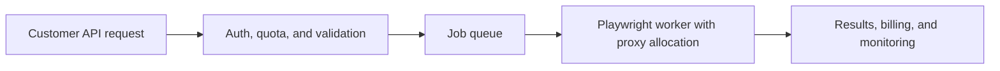

## Building a Proxy SaaS with Playwright Means Selling Managed Browser Execution, Not Just Raw Proxy Access
A proxy SaaS built around Playwright is not simply a proxy reseller with a browser attached. The real product is managed automation: customers submit jobs, your platform decides how to execute them, which browser and route to use, how to handle failure, and how to return usable results without exposing all the complexity underneath.
That is why building a proxy SaaS with Playwright is really a systems-design problem. The browser, the queue, the proxy layer, the worker model, billing, and abuse control all have to support each other.
This guide explains what a Playwright-based proxy SaaS actually provides, what the core architecture looks like, how proxy allocation affects product behavior, and what operational safeguards make the difference between a demo and a durable service. It pairs naturally with [proxy management for large scrapers](https://bytesflows.com/blog/proxy-management-large-scrapers), [playwright proxy setup guide](https://bytesflows.com/blog/playwright-proxy-setup), and [building proxy infrastructure for crawlers](https://bytesflows.com/blog/building-proxy-infrastructure-crawlers).
## What the Product Actually Is
At a high level, a proxy SaaS with Playwright gives customers a way to request web automation or extraction without operating the browser and routing stack themselves.
That usually means the platform is responsible for:
- receiving jobs or crawl requests
- validating inputs and quotas
- scheduling work to workers
- assigning browser and proxy identity
- running the task
- storing or returning results
The value is not only raw connectivity. It is managed execution with policy and reliability.
## Why Playwright Fits This Model
Playwright is useful in this kind of product because it provides:
- real browser execution
- session and context control
- support for dynamic websites
- browser-based handling of JavaScript-heavy targets
That makes it a strong execution layer for products where simple HTTP scraping would be too limited.
## The Core Architecture
A practical Playwright-based proxy SaaS often includes:
- an API or gateway layer
- authentication and quota controls
- a job queue
- browser workers
- proxy allocation logic
- result storage or delivery
- monitoring and billing systems
This is what turns scraping capability into an actual service rather than a script exposed over HTTP.
## Worker Design Matters More Than the API Surface
Many teams overfocus on the public API and underfocus on worker behavior.
But the workers determine:
- how browsers are launched and reused
- how routes are assigned
- how failures are retried
- how expensive each job becomes
- how safely tenants are isolated from each other
The API is what customers see. The worker system is what determines whether the product survives real usage.
## Proxy Allocation Is a Product Decision
Proxy assignment is not only a technical detail. It changes the product you are selling.
Common allocation models include:
- shared pool across customers
- quota-based or tier-based capacity
- region-specific routing
- sticky identity for continuity-heavy tasks
- rotating identity for stateless jobs
Each model changes cost, fairness, reliability, and abuse risk.
## Retries and Failure Handling Need Product Semantics
A platform should not retry blindly just because a request failed.
A better design asks:
- was the failure route-related?
- should the next attempt use fresh identity?
- is the domain in a degraded state?
- should the customer receive a partial result, a delay, or a hard failure?
A SaaS product needs retry logic that preserves service quality, not only technical persistence.
## Billing and Quotas Should Match Real Cost Drivers
In this kind of service, costs often come from:
- browser runtime
- proxy usage
- bandwidth
- challenge and retry inflation
- queue and storage overhead
This is why billing models usually need to reflect real consumption rather than only counting raw API calls. Otherwise, noisy workloads can destroy margin quickly.
## Abuse and Isolation Matter Early
Any shared scraping platform can be damaged by misuse.
Important concerns include:
- one tenant consuming disproportionate browser or proxy capacity
- risky target patterns harming pool health
- runaway retry loops
- poor isolation between customer workloads
This is why quota control, domain policies, and circuit-breaking behavior are important product features, not just defensive extras.
## Monitoring Must Track Business Health, Not Only Service Uptime
A proxy SaaS can look “up” while delivering poor customer outcomes.
Useful metrics often include:
- job success rate
- cost per successful job
- retry inflation
- block or challenge rate by target class
- queue depth and worker saturation
- proxy utilization by region or pool
These metrics tell you whether the product is operationally healthy, not just technically reachable.
## A Practical SaaS Model
A useful mental model looks like this:

This shows that the service is a managed workflow, not merely a browser wrapper.
## Common Mistakes
### Treating the product like raw proxy resale with a browser add-on
The real complexity is execution orchestration.
### Underdesigning worker behavior and overdesigning the API
The workers decide cost and reliability.
### Using one proxy allocation model for every customer and task
Different job types need different identity logic.
### Retrying everything aggressively
That can destroy cost control and target health.
### Ignoring tenant isolation until after scale begins
Shared abuse problems become expensive quickly.
## Best Practices for Building a Proxy SaaS with Playwright
### Design the worker and routing model before polishing the public API
Execution architecture is the real product core.
### Align proxy allocation with job semantics and customer tiers
Routing is both a cost and experience decision.
### Build retries and circuit breakers with product logic, not only technical logic
A stable platform needs controlled failure behavior.
### Track usage in terms that match real infrastructure cost
Browser time and proxy cost matter more than vanity request counts.
### Treat abuse controls and observability as first-class platform features
They protect both customers and margins.
Helpful support tools include [Proxy Checker](https://bytesflows.com/blog/proxy-checker), [Proxy Rotator Playground](https://bytesflows.com/blog/proxy-rotator), and [Scraping Test](https://bytesflows.com/blog/scraping-test-tool-detect-blocks).
## Conclusion
Building a proxy SaaS with Playwright means building a managed browser-execution platform where routing, browser control, retries, quotas, and billing all work together. The value comes from taking complexity away from the customer while still delivering reliable browser-based access under real-world constraints.
The strongest platforms are not the ones with the fanciest marketing API. They are the ones whose worker model, routing policy, and observability are solid enough to survive messy targets, noisy customers, and growing volume. Once those pieces align, Playwright becomes more than a browser library—it becomes the execution engine of a real SaaS product.
If you want the strongest next reading path from here, continue with [proxy management for large scrapers](https://bytesflows.com/blog/proxy-management-large-scrapers), [playwright proxy setup guide](https://bytesflows.com/blog/playwright-proxy-setup), [building proxy infrastructure for crawlers](https://bytesflows.com/blog/building-proxy-infrastructure-crawlers), and [how many proxies do you need](https://bytesflows.com/blog/how-many-proxies-need-scraping).
## Further reading
- [Proxy management for large scrapers](https://bytesflows.com/blog/proxy-management-large-scrapers)
- [Playwright proxy setup guide](https://bytesflows.com/blog/playwright-proxy-setup)
- [Building proxy infrastructure for crawlers](https://bytesflows.com/blog/building-proxy-infrastructure-crawlers)
- [How many proxies do you need](https://bytesflows.com/blog/how-many-proxies-need-scraping)
- [Best proxies for web scraping](https://bytesflows.com/blog/best-proxies-for-web-scraping)
- [Residential proxies](https://bytesflows.com/blog/residential-proxies)
- [The ultimate guide to web scraping in 2026](https://bytesflows.com/blog/ultimate-guide-web-scraping-2026)
