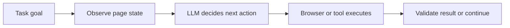

## Building an AI Scraping Agent Means Turning Scraping Into a Reasoning Loop, Not Just a Selector Script
Traditional scrapers are good at repeatable extraction from stable layouts. They become fragile when a site changes structure, hides useful content behind interaction, or requires decisions that are hard to encode with fixed rules. AI scraping agents try to solve that by adding a reasoning layer on top of browser or page interaction.
That is why building an AI scraping agent is not just “use an LLM for scraping.” It is designing a loop that observes the page, decides what to do next, acts through a browser or tool layer, and knows when the task is complete.
This guide explains what an AI scraping agent actually is, when it is useful, how the architecture works, and why browser execution, proxy routing, and output validation still matter even when the agent is intelligent. It pairs naturally with [AI web scraping explained](https://bytesflows.com/en/blog/ai-web-scraping-explained), [AI browser agents with Playwright](https://bytesflows.com/en/blog/ai-browser-agents-playwright), and [using LLMs to extract web data](https://bytesflows.com/en/blog/using-llms-extract-web-data).
## What Makes an AI Scraping Agent Different from a Normal Scraper
A normal scraper usually follows a fixed path:
- request a page
- parse with known selectors
- extract fields
An AI scraping agent adds a decision layer. Instead of assuming the next step is always known, it:
- inspects the current state
- decides what action would move the task forward
- performs that action
- reevaluates the result
This makes agents more useful on workflows where the path is not perfectly predictable.
## The Core Agent Loop
Most AI scraping agents follow a loop like this:
- observe the page or structured state
- decide the next action
- execute the action
- evaluate the new state
- repeat until complete or failed
The model is not the browser. It is the planner or interpreter deciding what the browser should do next.
## When Agents Are Actually Worth Using
AI scraping agents are most useful when:
- layouts vary a lot
- the page requires multi-step reasoning
- extraction targets are semi-structured or fuzzy
- the scraper must decide among several possible next actions
- rigid selectors would be expensive to maintain
They are less useful when the page is stable, the fields are well-known, and volume is high. In those cases, traditional extraction is often faster, cheaper, and easier to validate.
## The Main Architecture Components
A practical AI scraping agent usually includes:
- a browser or page execution layer
- a model or reasoning layer
- a prompt or decision interface
- a task-state loop
- output validation
The browser exposes the page. The model interprets the state and suggests next actions. The system keeps repeating until the task reaches a usable endpoint.
## Why Browser Automation Often Sits Under the Agent
Many AI scraping agents depend on browser automation tools such as Playwright because:
- websites are dynamic
- interaction is required
- content may only appear after rendering
- multi-step flows need a real session state
This is why many “AI agents” for scraping are actually LLM-driven systems sitting on top of browser automation, not replacing it.
## Proxies Still Matter Even When the Agent Is Smart
The agent may be adaptive, but the target website still judges the session as traffic.
That means the same issues still apply:
- IP trust
- rate and concurrency
- session continuity
- browser realism
- retry behavior
Residential proxies often help when the target is strict or when the agent runs repeated browser tasks that would otherwise overload one visible identity.
Related background from [best proxies for web scraping](https://bytesflows.com/en/blog/best-proxies-for-web-scraping), [how proxy rotation works](https://bytesflows.com/en/blog/how-proxy-rotation-works), and [how residential proxies improve scraping success](https://bytesflows.com/en/blog/residential-proxies-improve-scraping) fits directly here.
## Why Output Validation Is Critical
One of the biggest differences between an agent and a fixed scraper is that the agent may take different paths on different runs.
That means you need validation for:
- whether the extracted fields are complete
- whether the agent misinterpreted the page
- whether the task actually finished
- whether the result format is usable downstream
Without validation, the agent may look flexible while quietly producing unreliable data.
## A Practical Decision Framework
Use a traditional scraper when:
- layout is stable
- extraction rules are known
- scale and cost matter most
Use an AI scraping agent when:
- the site changes often
- the path is decision-heavy
- strict rule-based logic would be brittle
- the agent’s flexibility is worth the extra cost and latency
The right question is not “Is AI better?” It is “Does this workflow need reasoning badly enough to justify the complexity?”
## A Practical Agent Architecture
A useful mental model looks like this:

This is what turns scraping into an agent workflow rather than a fixed script.
## Common Mistakes
### Using an agent on problems that do not need reasoning
That increases cost without increasing reliability.
### Treating the LLM as if it replaces browser or proxy infrastructure
The target still sees ordinary traffic patterns.
### Skipping output validation because the agent feels intelligent
Flexible does not mean correct.
### Letting the loop run without clear stop conditions
That creates cost and unstable behavior.
### Ignoring task-specific session design
Multi-step agent tasks still need coherent identity and browser state.
## Best Practices for Building an AI Scraping Agent
### Use agents where uncertainty and variation are the real bottlenecks
Do not add intelligence where static logic is already enough.
### Keep the execution layer stable and observable
Let the agent reason, but keep browser control disciplined.
### Validate extracted results explicitly
Do not trust free-form success.
### Treat proxy and browser design as part of the agent system
The model cannot compensate for weak traffic identity alone.
### Define stopping rules and fallback behavior early
This keeps the loop practical in production.
Helpful support tools include [Proxy Checker](https://bytesflows.com/en/blog/proxy-checker), [Scraping Test](https://bytesflows.com/en/blog/scraping-test-tool-detect-blocks), and [Proxy Rotator Playground](https://bytesflows.com/en/blog/proxy-rotator).
## Conclusion
Building an AI scraping agent means designing a system that can observe, reason, act, and validate rather than just parse fixed HTML with selectors. That flexibility can be powerful on variable or multi-step targets, but it comes with cost, latency, and the need for stronger execution discipline.
The best AI scraping agents are not just smart prompts. They are well-structured workflows with stable browser execution, sensible proxy routing, clear stop conditions, and strong validation. Once those pieces align, the agent becomes useful not because it is “AI,” but because it can handle uncertainty that rigid scrapers handle badly.
If you want the strongest next reading path from here, continue with [AI web scraping explained](https://bytesflows.com/en/blog/ai-web-scraping-explained), [AI browser agents with Playwright](https://bytesflows.com/en/blog/ai-browser-agents-playwright), [using LLMs to extract web data](https://bytesflows.com/en/blog/using-llms-extract-web-data), and [browser automation for web scraping](https://bytesflows.com/en/blog/browser-automation-web-scraping).
## Further reading
- [AI web scraping explained](https://bytesflows.com/en/blog/ai-web-scraping-explained)
- [AI browser agents with Playwright](https://bytesflows.com/en/blog/ai-browser-agents-playwright)
- [Using LLMs to extract web data](https://bytesflows.com/en/blog/using-llms-extract-web-data)
- [Browser automation for web scraping](https://bytesflows.com/en/blog/browser-automation-web-scraping)
- [Playwright web scraping tutorial](https://bytesflows.com/en/blog/playwright-web-scraping-tutorial)
- [Best proxies for web scraping](https://bytesflows.com/en/blog/best-proxies-for-web-scraping)
- [How proxy rotation works](https://bytesflows.com/en/blog/how-proxy-rotation-works)
