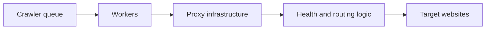

## Proxy Infrastructure for Crawlers Is About Routing Reliability, Not Just Access to More IPs
Large crawlers do not need proxies only because websites block them. They need proxy infrastructure because repeated crawling becomes a routing problem: which identity should handle which request, how failures should be detected, and how the system keeps working when volume rises or routes degrade.
That is why proxy infrastructure is not just “a proxy list” or “a gateway URL.” It is the layer that decides how crawler traffic moves through the network.
This guide explains how to think about proxy infrastructure for crawlers, including gateway vs list-based designs, health checks, routing logic, capacity planning, and the operational tradeoffs between simplicity and control. It pairs naturally with [proxy pools for web scraping](https://bytesflows.com/blog/proxy-pools-web-scraping), [web scraping proxy architecture](https://bytesflows.com/blog/web-scraping-proxy-architecture), and [proxy management for large scrapers](https://bytesflows.com/blog/proxy-management-large-scrapers).
## Why Crawlers Need More Than One Proxy Setting
A crawler is not just one browser or one script. It is usually a repeated request system that runs across many URLs, workers, or domains.
That means proxy infrastructure needs to account for:
- how identities are distributed
- how workers acquire routes
- what happens when a route starts failing
- how per-domain pressure is limited
- how retries avoid repeating the same failure path
This is why a crawler’s proxy layer must be treated as infrastructure, not as a one-time configuration field.
## Gateway vs List-Based Infrastructure
These are the two main design patterns.
### Gateway-based infrastructure
Workers point to one endpoint and the provider handles rotation behind the scenes.
This is often best when:
- operational simplicity matters most
- residential rotation quality is already strong
- the crawler does not need deep per-route customization
### List-based infrastructure
The crawler or middleware chooses from explicit proxies and manages assignment itself.
This is often best when:
- you want multi-provider routing
- different workers need different pools
- you want custom health-aware selection
- the crawler needs granular routing control
The tradeoff is clear: gateways reduce complexity, while lists increase control.
## Why Health Logic Matters
Proxy infrastructure fails in subtle ways.
A route may:
- still respond, but too slowly
- work on one domain, but fail on another
- authenticate correctly, but return low-quality IPs
- look healthy in isolation, but collapse under concurrency
That is why crawler proxy infrastructure should measure more than “does the proxy connect?” It should measure whether the route is useful for the workload.
## Worker Design and Proxy Assignment
One of the most important design choices is how workers receive proxy identity.
Common models include:
- one gateway shared by all workers
- per-worker sticky identity or sub-pool
- task-level routing decisions
- domain-sensitive routing rules
The right model depends on whether the crawler needs broad distribution, sticky session continuity, or target-specific segmentation.
## Capacity Planning Is More Than IP Count
Teams often ask how many proxies or routes they need. But good capacity planning depends on:
- concurrent workers
- per-domain concurrency
- retry rate
- sticky-session duration
- target strictness
- browser vs plain HTTP workload cost
A crawler can overload a strong proxy layer if the routing design ignores how volume is actually distributed.
## Why Simple Gateways Often Win Early
For many teams, a rotating residential gateway is the best first infrastructure choice.
Why?
- fewer moving parts
- less route-management code
- simpler worker configuration
- fast path to real production testing
This is often the right answer until the crawler becomes complex enough that custom routing logic creates more value than the operational simplicity of the gateway model.
## When Custom List-Based Infrastructure Is Worth It
Custom-managed proxy infrastructure becomes more valuable when:
- you need multiple proxy providers
- you want health-based routing control
- one target needs different behavior from another
- one worker class should not share the same identity model as another
- cost optimization requires more selective route use
This is a more advanced infrastructure layer and should usually be built only when the crawler genuinely needs it.
## A Practical Infrastructure Model
A useful mental model looks like this:

This shows the key point: proxy infrastructure is part of crawler control flow, not just a network afterthought.
## Common Mistakes
### Treating a proxy gateway as the whole infrastructure design
It may be enough, but only if the workload is simple enough.
### Building custom list logic too early
Control is expensive if the crawler does not yet need it.
### Ignoring health quality beyond connectivity
A usable route is more than a responsive route.
### Letting retries reuse weak paths blindly
That amplifies failure instead of containing it.
### Forgetting domain-specific routing behavior
Different targets often justify different proxy assumptions.
## Best Practices for Crawler Proxy Infrastructure
### Start with the simplest model that supports the workload
Do not over-engineer before the crawler proves it needs more.
### Measure route quality against the real targets
Synthetic checks are not enough.
### Keep worker routing explicit
Know how identities are assigned and reused.
### Build health logic around usefulness, not only connectivity
That is what prevents hidden degradation.
### Revisit the architecture as scale and domain diversity increase
Proxy infrastructure should evolve with the crawler, not stay frozen.
Helpful support tools include [Proxy Checker](https://bytesflows.com/blog/proxy-checker), [Proxy Rotator Playground](https://bytesflows.com/blog/proxy-rotator), and [Scraping Test](https://bytesflows.com/blog/scraping-test-tool-detect-blocks).
## Conclusion
Building proxy infrastructure for crawlers is about making repeated network access reliable under real workload conditions. The key questions are not only how many IPs you have, but how routes are assigned, how failure is detected, how worker traffic is segmented, and how the crawler avoids turning weak routing into repeated downtime.
For many teams, a gateway-based model is the right first answer. For more complex systems, list-based or multi-provider routing becomes valuable. The right infrastructure is the one that fits the crawler’s real shape—its concurrency, domain mix, retry behavior, and target sensitivity—not the one with the most theoretical control.
If you want the strongest next reading path from here, continue with [proxy pools for web scraping](https://bytesflows.com/blog/proxy-pools-web-scraping), [web scraping proxy architecture](https://bytesflows.com/blog/web-scraping-proxy-architecture), [proxy management for large scrapers](https://bytesflows.com/blog/proxy-management-large-scrapers), and [how proxy rotation works](https://bytesflows.com/blog/how-proxy-rotation-works).
## Further reading
- [Proxy pools for web scraping](https://bytesflows.com/blog/proxy-pools-web-scraping)
- [Web scraping proxy architecture](https://bytesflows.com/blog/web-scraping-proxy-architecture)
- [Proxy management for large scrapers](https://bytesflows.com/blog/proxy-management-large-scrapers)
- [How proxy rotation works](https://bytesflows.com/blog/how-proxy-rotation-works)
- [Best proxies for web scraping](https://bytesflows.com/blog/best-proxies-for-web-scraping)
- [Residential proxies](https://bytesflows.com/blog/residential-proxies)
- [Playwright web scraping at scale](https://bytesflows.com/blog/playwright-web-scraping-scale)
