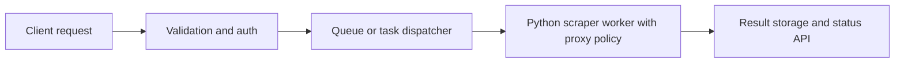

## Building a Python Scraping API Means Turning Scraping Logic into a Controlled Service
A scraping script is useful when one person runs it occasionally. A scraping API is different. Once scraping becomes a service, you are not only extracting data. You are managing inputs, queueing work, protecting infrastructure, handling failures predictably, and giving callers results in a form they can actually depend on.
That is why building a Python scraping API is not just wrapping a scraper in FastAPI or Flask. It is designing a controlled service around scraping workloads.
This guide explains the core architecture of a Python scraping API, when synchronous versus background execution makes sense, how proxy routing fits into service design, and which production safeguards matter most when scraping becomes an endpoint rather than a script. It pairs naturally with [python scraping proxy guide](https://bytesflows.com/blog/python-scraping-proxy), [proxy management for large scrapers](https://bytesflows.com/blog/proxy-management-large-scrapers), and [the ultimate guide to web scraping in 2026](https://bytesflows.com/blog/ultimate-guide-web-scraping-2026).
## What Changes When a Scraper Becomes an API
A scraper script is usually optimized for one operator. A scraping API must work for repeated callers, varied workloads, and failure conditions that happen without human supervision.
That means the API needs to handle:
- input validation
- job orchestration
- timeouts and retries
- result delivery
- quota and rate protection
- observability and debugging
In other words, the scraping code becomes only one layer of the service.
## The Core API Design Question: Inline or Asynchronous?
One of the first decisions is whether requests should be handled directly or turned into background jobs.
### Inline execution
Works best when:
- the scrape is short
- the target is predictable
- the caller needs immediate response
### Background job execution
Works best when:
- the scrape may take time
- browser automation is involved
- retries or proxy rotation may be needed
- the caller can poll or receive webhook-style results
Many production scraping APIs become job-based because real scraping is often too slow or variable for strict request-response assumptions.
## The Core Service Layers
A practical Python scraping API often includes:
- an HTTP layer for request intake
- authentication and quota controls
- a task queue or background execution layer
- scraper workers using HTTP or browser tools
- storage for results and task state
- monitoring and logging
This is what turns scraping into an actual service rather than a code snippet behind an endpoint.
## Proxy Integration Is a Service Concern, Not Only a Scraper Concern
When the API runs scraping on behalf of callers, proxy use needs to be managed centrally.
That includes decisions such as:
- which routes are used for which targets
- whether rotation or sticky identity is required
- how retries change identity on failure
- how route cost and quality are balanced across workloads
This is why proxy settings should usually live in configuration and service policy, not only inside one scraping function.
## Structured Errors Matter More Than Generic Failure
API users need failures they can understand and act on.
A useful scraping API often distinguishes between:
- target blocked or rate-limited
- timeout or slow page
- parse or extraction mismatch
- proxy or network issue
- invalid input or unsupported task
This is far better than returning a vague 500 and leaving the caller blind.
## Rate Limits and Queue Protection Are Product Features
A scraping API can easily become self-destructive without controls.
Important protections include:
- per-client rate limiting
- queue depth control
- per-domain concurrency limits
- timeout rules
- maximum job size or scope policies
These are not only defensive measures. They are part of making the service predictable.
## Production Safety Depends on Observability
Once scraping becomes an API, debugging must work without manual replay every time.
Useful visibility often includes:
- task ID and lifecycle status
- target URL or target class
- duration and timeout outcomes
- error category
- proxy or route class used
- retry count and final outcome
This is what helps you understand whether the problem is the caller, the target, the proxy layer, or the extraction logic.
## A Practical Python Scraping API Model
A useful mental model looks like this:

This shows why a scraping API is really a service architecture, not just a framework route.
## Common Mistakes
### Running long scraping jobs inline by default
That makes the API fragile quickly.
### Hiding all failures behind generic server errors
Callers need structured outcomes.
### Treating proxy configuration as an afterthought
Route quality affects service reliability directly.
### Letting one client or domain consume the whole queue
Uncontrolled usage breaks everyone’s experience.
### Logging too little or too vaguely to debug production behavior
Scraping APIs need strong task visibility.
## Best Practices for Building a Python Scraping API
### Separate request intake from scraping execution early
Most real scraping workloads benefit from task decoupling.
### Centralize proxy and route policy
Do not scatter identity logic across endpoints.
### Return structured task states and error categories
This makes the API much more usable.
### Enforce rate, queue, and per-domain safety controls
Protect the service before volume arrives.
### Treat observability as part of the API design
Not as a later operations add-on.
Helpful support tools include [Proxy Checker](https://bytesflows.com/blog/proxy-checker), [HTTP Header Checker](https://bytesflows.com/blog/http-header-checker), and [Scraping Test](https://bytesflows.com/blog/scraping-test-tool-detect-blocks).
## Conclusion
Building a Python scraping API means turning scraping logic into a controlled service with clear input handling, task management, route policy, structured failures, and production-safe limits. The hardest part is rarely just the scraper. It is making the service reliable when callers, targets, and network conditions are all unpredictable.
The strongest Python scraping APIs separate intake from execution, manage proxy behavior centrally, expose structured task states, and protect themselves with quotas and queue controls. Once those pieces are in place, the API becomes more than a wrapper around scraping code. It becomes a dependable way to expose web data collection as a reusable service.
If you want the strongest next reading path from here, continue with [python scraping proxy guide](https://bytesflows.com/blog/python-scraping-proxy), [proxy management for large scrapers](https://bytesflows.com/blog/proxy-management-large-scrapers), [the ultimate guide to web scraping in 2026](https://bytesflows.com/blog/ultimate-guide-web-scraping-2026), and [playwright web scraping tutorial](https://bytesflows.com/blog/playwright-web-scraping-tutorial).
## Further reading
- [Python scraping proxy guide](https://bytesflows.com/blog/python-scraping-proxy)
- [Proxy management for large scrapers](https://bytesflows.com/blog/proxy-management-large-scrapers)
- [The ultimate guide to web scraping in 2026](https://bytesflows.com/blog/ultimate-guide-web-scraping-2026)
- [Playwright web scraping tutorial](https://bytesflows.com/blog/playwright-web-scraping-tutorial)
- [Best proxies for web scraping](https://bytesflows.com/blog/best-proxies-for-web-scraping)
- [How proxy rotation works](https://bytesflows.com/blog/how-proxy-rotation-works)
- [Building proxy infrastructure for crawlers](https://bytesflows.com/blog/building-proxy-infrastructure-crawlers)
