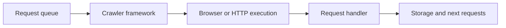

## Crawlee Is Useful When Your Scraper Is Becoming a System, Not Just a Script
A lot of scraping projects start with raw browser automation or a simple HTTP client. That works well at first. But once the project grows, the boilerplate grows with it: queue management, retries, browser lifecycle, storage, proxy routing, and concurrency control. Crawlee is useful because it packages much of that operational work into a framework designed for crawling and scraping workflows.
That is why Crawlee is not just “Playwright with extra features.” It is a system-oriented framework for running scraping workloads with less repetitive infrastructure code.
This guide explains what Crawlee does, when it is worth using, how it relates to Playwright and Puppeteer, and what tradeoffs to expect when adopting it for production scraping. It pairs naturally with [Crawlee web scraping tutorial](https://bytesflows.com/en/blog/crawlee-web-scraping-tutorial), [browser automation for web scraping](https://bytesflows.com/en/blog/browser-automation-web-scraping), and [playwright vs Crawlee for web scraping](https://bytesflows.com/en/blog/playwright-vs-crawlee-comparison).
## What Crawlee Actually Adds
Crawlee helps when a scraping workflow needs more than page automation.
It typically adds structure around:
- request queues
- browser pools
- storage and datasets
- concurrency management
- proxy integration
- crawl-oriented request handling
This makes it especially useful when the work is not a single browser script but a repeatable crawling system.
## Why Crawlee Feels Different from Raw Browser Automation
Raw Playwright or Puppeteer gives you direct browser control. Crawlee gives you a framework around that control.
That means instead of building everything yourself, you start with:
- a crawler model
- a request handler pattern
- framework-managed lifecycle pieces
- integrated support for repeated crawling tasks
This is the main reason teams use Crawlee: less scaffolding for structured scraping workloads.
## Where Crawlee Fits Best
Crawlee is often a strong fit when:
- you are crawling many URLs
- queueing and deduplication matter
- browser automation is needed repeatedly
- storage and request orchestration should be standardized
- you want faster production setup with less custom glue code
It is less necessary when the job is tiny, highly custom, or better served by minimal raw browser code.
## Browser Pools and Lifecycle Management Matter More Than They Sound
One of the practical values of Crawlee is that it helps organize browser usage.
That matters because browser-based scraping quickly creates operational concerns such as:
- how many browsers are open
- when sessions are reused
- how concurrency is controlled
- how repeated tasks are scheduled and isolated
A framework that handles more of this consistently can reduce a lot of production friction.
## Proxy Integration Still Matters in Crawlee
Crawlee helps with browser and crawl orchestration, but it does not remove the need for good traffic identity.
The same issues still matter:
- route quality
- proxy rotation strategy
- whether tasks need sticky continuity
- domain-level concurrency limits
- challenge-aware retry behavior
This is why Crawlee works best when paired with a deliberate proxy strategy rather than treated as self-protecting automation.
Related reading from [best proxies for web scraping](https://bytesflows.com/en/blog/best-proxies-for-web-scraping), [proxy management for large scrapers](https://bytesflows.com/en/blog/proxy-management-large-scrapers), and [playwright proxy setup guide](https://bytesflows.com/en/blog/playwright-proxy-setup) fits directly here.
## When to Prefer Crawlee Over Raw Playwright
Crawlee often makes more sense when:
- the workload is crawl-shaped rather than page-shaped
- you need queues, storage, and request handling repeatedly
- browser orchestration should be standardized
- the team wants less custom infrastructure code
Raw Playwright often makes more sense when:
- the workflow is highly custom
- you need very fine-grained control
- the project is small enough that framework overhead is unnecessary
The choice is often less about capability and more about how much system structure you want the framework to provide.
## Crawlee Is a Productivity Tradeoff
Frameworks save time by giving you defaults and abstractions. They also create constraints.
That means adopting Crawlee is a tradeoff between:
- less boilerplate
- more built-in scraping structure
- faster production patterns
and:
- more abstraction
- less raw minimalism
- the need to fit your workflow into the framework model
For many crawl-heavy projects, that tradeoff is worth it.
## A Practical Crawlee Model
A useful mental model looks like this:

This is what makes Crawlee feel like a scraping framework rather than a browser library.
## Common Mistakes
### Using Crawlee for a tiny script that does not need a framework
That can add unnecessary abstraction.
### Assuming Crawlee replaces proxy and anti-bot design
It organizes execution, but the site still sees traffic identity.
### Ignoring framework fit and adopting it only because it sounds production-ready
Abstraction helps only when it matches the workload.
### Rebuilding Crawlee-like infrastructure manually while also using Crawlee
That duplicates the value you adopted it for.
### Treating the framework as the whole architecture
Storage, proxies, validation, and monitoring still matter.
## Best Practices for Building Scrapers with Crawlee
### Use Crawlee when queueing, browser pools, and handler structure are real needs
That is where it provides the most leverage.
### Let the framework own the pieces it is good at
Do not fight the abstraction unnecessarily.
### Pair Crawlee with deliberate proxy and retry strategy
Operational identity is still a system concern.
### Keep output and crawl scope explicit
Framework convenience does not replace crawl discipline.
### Prefer raw browser code only when the workflow truly benefits from staying minimal
Simplicity is contextual.
Helpful support tools include [Proxy Checker](https://bytesflows.com/en/blog/proxy-checker), [Scraping Test](https://bytesflows.com/en/blog/scraping-test-tool-detect-blocks), and [Proxy Rotator Playground](https://bytesflows.com/en/blog/proxy-rotator).
## Conclusion
Building scrapers with Crawlee makes sense when the project is large enough to need a framework around execution, not just browser automation alone. Its value comes from turning common crawling concerns—queues, browser pools, handlers, and storage—into a more structured development model.
The best use of Crawlee is not as a magical shortcut, but as a way to reduce repetitive scraping infrastructure work where that infrastructure is genuinely needed. When the workload is crawl-heavy and repeatable, Crawlee can speed up production readiness. When the workflow is tiny or highly custom, raw browser code may still be the cleaner answer.
If you want the strongest next reading path from here, continue with [Crawlee web scraping tutorial](https://bytesflows.com/en/blog/crawlee-web-scraping-tutorial), [playwright vs Crawlee for web scraping](https://bytesflows.com/en/blog/playwright-vs-crawlee-comparison), [browser automation for web scraping](https://bytesflows.com/en/blog/browser-automation-web-scraping), and [proxy management for large scrapers](https://bytesflows.com/en/blog/proxy-management-large-scrapers).
## Further reading
- [Crawlee web scraping tutorial](https://bytesflows.com/en/blog/crawlee-web-scraping-tutorial)
- [Playwright vs Crawlee for web scraping](https://bytesflows.com/en/blog/playwright-vs-crawlee-comparison)
- [Browser automation for web scraping](https://bytesflows.com/en/blog/browser-automation-web-scraping)
- [Proxy management for large scrapers](https://bytesflows.com/en/blog/proxy-management-large-scrapers)
- [Playwright web scraping tutorial](https://bytesflows.com/en/blog/playwright-web-scraping-tutorial)
- [Best proxies for web scraping](https://bytesflows.com/en/blog/best-proxies-for-web-scraping)
- [The ultimate guide to web scraping in 2026](https://bytesflows.com/en/blog/ultimate-guide-web-scraping-2026)
