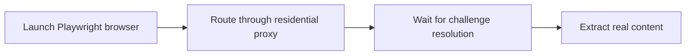

## Bypassing Cloudflare with Playwright Works Best When the Browser, IP, and Session Design Support Each Other
When developers say they want to bypass Cloudflare with Playwright, what they usually want is not a browser script that loads once on a lucky day. They want a repeatable workflow that reaches real content reliably without collapsing into 403s, endless challenge loops, or fragile one-off hacks.
That is why Playwright matters here—but only as part of a larger setup.
This guide explains why Playwright helps on Cloudflare-protected targets, why it still needs strong proxy support, how waiting and session design affect pass rate, and what practical habits make a Playwright-based setup more reliable over repeated runs. It pairs naturally with [playwright proxy configuration guide](https://bytesflows.com/en/blog/playwright-proxy-configuration-guide), [bypass Cloudflare for web scraping](https://bytesflows.com/en/blog/bypass-cloudflare-web-scraping), and [how to avoid detection in Playwright scraping](https://bytesflows.com/en/blog/avoid-detection-playwright-scraping).
## Why Playwright Helps on Cloudflare-Protected Targets
Playwright helps because Cloudflare-protected targets often expect a real browser environment.
A real browser can:
- execute JavaScript challenges
- maintain cookies and browser state
- present a browser-like runtime
- behave more like the client the site expects
This is why Playwright performs much better than simple HTTP clients on many protected targets. It solves the browser-execution problem that request-only tools cannot solve.
## Why Playwright Alone Is Still Not Enough
A real browser on a weak route can still fail.
Cloudflare-sensitive targets often evaluate:
- IP trust
- browser behavior
- session consistency
- navigation pacing
- repeated request patterns
So Playwright is necessary on many protected targets, but it is rarely sufficient by itself. The browser and the traffic identity must support each other.
## Why Residential Proxies Matter with Playwright
Residential proxies often improve Playwright-based Cloudflare scraping because they:
- reduce obvious datacenter-origin suspicion
- improve the session’s starting trust profile
- support more realistic geo behavior
- make repeated browser sessions less fragile
This is why Playwright plus residential routing is often the baseline combination for protected consumer-facing sites.
Related foundations include [datacenter vs residential proxies](https://bytesflows.com/en/blog/datacenter-vs-residential-proxies), [how residential proxies improve scraping success](https://bytesflows.com/en/blog/residential-proxies-improve-scraping), and [best proxies for web scraping](https://bytesflows.com/en/blog/best-proxies-for-web-scraping).
## Waiting Strategy Matters More Than It Looks
A common Playwright mistake is assuming that if `goto()` returns, the challenge is done and the page is ready.
On protected targets, the browser may still be:
- completing a JavaScript challenge
- settling redirects
- establishing cookies
- loading the real content after challenge resolution
That is why waiting strategy is part of access design. You are not only waiting for a selector. You are often waiting for the site to decide the session is acceptable.
## Session Consistency Affects Outcomes
Cloudflare-sensitive targets often behave better when the session makes sense as a coherent browsing unit.
That means thinking about:
- whether to keep the same browser context for a flow
- whether the same identity should survive multiple requests
- whether retries should reuse or replace the session
- whether the locale, viewport, and region fit the proxy
This is why a strong setup is usually more than “launch browser and request page.”
## Retries Need Fresh Identity, Not Just More Attempts
If a Playwright session gets challenged repeatedly, immediately retrying with the same weak route may only repeat failure.
A better retry strategy often means:
- closing the weak session
- starting a fresh browser or context when appropriate
- using a new route or IP
- adding backoff before the next attempt
This keeps the retry loop from becoming a challenge amplifier.
## A Practical Playwright + Cloudflare Model
A useful mental model looks like this:

The key point is that Playwright is doing browser work, but the surrounding identity and timing still determine whether the site allows the session to continue.
## Common Failure Patterns
### Endless “Checking your browser” loop
Often means the session is not convincing enough to clear the challenge fully.
### Immediate 403
Often points to route quality, IP trust, or target strictness that exceeds the current setup.
### Works once, then fails repeatedly
Often means the design is lucky rather than stable—timing, retries, or route reuse may be weak.
### Works locally, fails in production
Often reflects differences in IP trust or environment, not differences in the scraping logic itself.
## Common Mistakes
### Treating Playwright as a one-tool solution
Protected targets usually judge more than the browser API.
### Using weak or datacenter routes on strict targets
Good browser execution does not fully compensate for poor identity.
### Underestimating waiting and session continuity
Protected pages often need more than a simple page load event.
### Retrying the same failing path too aggressively
That creates cost without improving access quality.
### Assuming one passed challenge proves production readiness
Real reliability appears only under repetition.
## Best Practices for Using Playwright Against Cloudflare
### Use Playwright where real browser execution is required
It solves a critical layer of the problem.
### Pair it with residential proxies on stricter targets
Identity quality matters early.
### Wait for real page readiness, not just navigation completion
Challenge resolution can continue after initial load.
### Keep browser settings coherent with the route
Locale, viewport, and region should make sense together.
### Retry with fresh identity when needed
Do not let the retry path reinforce the original failure.
Helpful support tools include [Proxy Checker](https://bytesflows.com/en/blog/proxy-checker), [Scraping Test](https://bytesflows.com/en/blog/scraping-test-tool-detect-blocks), and [Proxy Rotator Playground](https://bytesflows.com/en/blog/proxy-rotator).
## Conclusion
Bypassing Cloudflare with Playwright works best when Playwright is treated as the browser-execution layer inside a broader, coherent access strategy. The real browser solves JavaScript and browser-runtime problems, but route quality, waiting logic, session consistency, and retry design still shape whether the target accepts the session.
In practice, the strongest setup is usually Playwright plus residential routing plus disciplined pacing and challenge-aware retries. That combination does not make Cloudflare trivial, but it makes the workflow much more stable than proxy-only or browser-only approaches.
If you want the strongest next reading path from here, continue with [playwright proxy configuration guide](https://bytesflows.com/en/blog/playwright-proxy-configuration-guide), [bypass Cloudflare for web scraping](https://bytesflows.com/en/blog/bypass-cloudflare-web-scraping), [how to avoid detection in Playwright scraping](https://bytesflows.com/en/blog/avoid-detection-playwright-scraping), and [how residential proxies improve scraping success](https://bytesflows.com/en/blog/residential-proxies-improve-scraping).
## Further reading
- [Playwright proxy configuration guide](https://bytesflows.com/en/blog/playwright-proxy-configuration-guide)
- [Bypass Cloudflare for web scraping](https://bytesflows.com/en/blog/bypass-cloudflare-web-scraping)
- [How to avoid detection in Playwright scraping](https://bytesflows.com/en/blog/avoid-detection-playwright-scraping)
- [How residential proxies improve scraping success](https://bytesflows.com/en/blog/residential-proxies-improve-scraping)
- [Best proxies for web scraping](https://bytesflows.com/en/blog/best-proxies-for-web-scraping)
- [Playwright web scraping tutorial](https://bytesflows.com/en/blog/playwright-web-scraping-tutorial)
- [Common web scraping challenges](https://bytesflows.com/en/blog/common-web-scraping-challenges)
