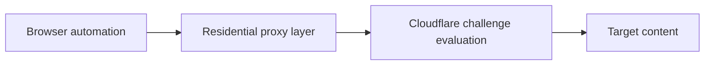

## Cloudflare Scraping Is Hard Because the Site Evaluates the Whole Access Pattern, Not Just the URL
Cloudflare is one of the most common reasons scraping workflows fail even when the target page itself looks ordinary. The problem is not only that Cloudflare blocks bots. It is that it evaluates multiple layers at once: network identity, browser realism, request behavior, and the consistency of the full session.
That is why bypassing Cloudflare for web scraping is rarely about one magic header or one clever delay. It is about making the whole access pattern look plausible enough to pass.
This guide explains what usually matters when scraping Cloudflare-protected sites, why simple HTTP clients often fail, why residential proxies and real browsers matter together, and how to think about retries and pacing without turning the workflow into an expensive failure loop. It pairs naturally with [playwright proxy configuration guide](https://bytesflows.com/blog/playwright-proxy-configuration-guide), [how residential proxies improve scraping success](https://bytesflows.com/blog/residential-proxies-improve-scraping), and [common web scraping challenges](https://bytesflows.com/blog/common-web-scraping-challenges).
## Why Cloudflare Scraping Feels Different
Cloudflare-protected targets often fail in ways that confuse newer scrapers because the server may respond, but not with the real content.
You may see:
- endless “Checking your browser” pages
- 403 responses
- challenge loops
- partial success that collapses at scale
This happens because the system is not just checking whether the request arrived. It is checking whether the request looks like a believable browser session.
## Why Simple HTTP Clients Usually Struggle
The core problem with basic HTTP clients is not only missing JavaScript execution. It is that the entire request stack often looks different from a real browser.
That can include:
- non-browser TLS behavior
- non-browser request signatures
- no JavaScript challenge execution
- weak session realism
This is why `requests` or similar tools often work on easy sites but fail on Cloudflare-protected ones even when you add a proxy.
## Why Real Browser Execution Matters
Browser automation tools such as Playwright matter because they can:
- execute the page’s JavaScript
- present a browser-like runtime environment
- maintain cookies and session state
- behave more like the client Cloudflare expects to see
That does not guarantee success, but it solves an entire class of failures that simple HTTP clients cannot solve by design.
## Why Residential Proxies Matter at the Same Time
A real browser on a weak or obviously datacenter IP can still get challenged quickly.
Residential proxies help because they:
- reduce obvious server-origin suspicion
- improve initial trust on stricter consumer-facing sites
- support geo-consistent browsing
- make repeated browser workflows more viable
That is why Cloudflare scraping often needs both pieces together:
- real browser execution
- stronger traffic identity
Related foundations include [best proxies for web scraping](https://bytesflows.com/blog/best-proxies-for-web-scraping), [datacenter vs residential proxies](https://bytesflows.com/blog/datacenter-vs-residential-proxies), and [playwright web scraping tutorial](https://bytesflows.com/blog/playwright-web-scraping-tutorial).
## Why Pacing Still Matters
Even a good browser on a good IP can still fail if the browsing pattern is too aggressive.
Cloudflare-sensitive workflows often need:
- lower burstiness
- reasonable navigation timing
- session-aware request volume
- reduced concurrency per domain
- better retry spacing
This is why stronger infrastructure improves odds, but does not eliminate the need for disciplined behavior.
## A Practical Cloudflare Access Model
A useful mental model looks like this:

The important point is that access is gated by a combined evaluation. No single layer carries the whole system.
## What Usually Helps Most
For most Cloudflare-protected scraping workflows, the strongest baseline is:
- Playwright or another real browser layer
- residential proxy routing
- coherent browser locale and viewport behavior
- patient waiting for challenge resolution where needed
- retries that switch identity instead of hammering the same path
This is not a guarantee of success on every target, but it is a much stronger starting point than proxy-only or browser-only approaches.
## Common Failure Patterns
### Infinite browser-check loop
Often means identity quality is too weak, browser state is inconsistent, or the challenge is not being satisfied cleanly.
### Immediate 403
Often points to IP trust, route quality, or target strictness that exceeds the current setup.
### Works locally, fails on server
Usually indicates that the local browsing identity is more trusted than the server environment.
### Works sometimes, fails sometimes
Often reflects variable quality across rotating IPs or fragile pacing at the edge of what the target tolerates.
These patterns usually point to system design issues rather than one missing header.
## What Not to Assume
### Do not assume a proxy alone bypasses Cloudflare
A stronger IP without real browser execution still fails often.
### Do not assume Playwright alone solves everything
Weak network identity still matters.
### Do not assume one success means the workflow is stable
Cloudflare-sensitive workflows must be tested under repetition.
### Do not assume retries should reuse the same session immediately
That often just repeats the failure path.
## Best Practices for Cloudflare-Protected Targets
### Use a real browser first
That removes a major class of protocol and runtime mismatch.
### Prefer residential proxies for serious workloads
Cloudflare often treats identity quality as foundational.
### Keep session behavior coherent
Locale, geography, and browser settings should align.
### Retry with new identity, not just more force
A fresh path often teaches you more than repeating the same one.
### Measure pass rate before scaling
Do not scale a workflow that only works intermittently.
Helpful support tools include [Proxy Checker](https://bytesflows.com/blog/proxy-checker), [Scraping Test](https://bytesflows.com/blog/scraping-test-tool-detect-blocks), and [Proxy Rotator Playground](https://bytesflows.com/blog/proxy-rotator).
## Conclusion
Bypassing Cloudflare for web scraping is rarely about defeating one isolated defense. It is about satisfying a broader access evaluation that combines browser behavior, traffic identity, and request pattern credibility.
That is why the most reliable setup is usually a real browser plus residential routing plus disciplined pacing. Those pieces do not make Cloudflare trivial, but they move the workflow from obviously suspicious to plausibly valid. In practice, that is the difference that matters most.
If you want the strongest next reading path from here, continue with [playwright proxy configuration guide](https://bytesflows.com/blog/playwright-proxy-configuration-guide), [how residential proxies improve scraping success](https://bytesflows.com/blog/residential-proxies-improve-scraping), [datacenter vs residential proxies](https://bytesflows.com/blog/datacenter-vs-residential-proxies), and [common web scraping challenges](https://bytesflows.com/blog/common-web-scraping-challenges).
## Further reading
- [Playwright proxy configuration guide](https://bytesflows.com/blog/playwright-proxy-configuration-guide)
- [How residential proxies improve scraping success](https://bytesflows.com/blog/residential-proxies-improve-scraping)
- [Datacenter vs residential proxies](https://bytesflows.com/blog/datacenter-vs-residential-proxies)
- [Common web scraping challenges](https://bytesflows.com/blog/common-web-scraping-challenges)
- [Best proxies for web scraping](https://bytesflows.com/blog/best-proxies-for-web-scraping)
- [Playwright web scraping tutorial](https://bytesflows.com/blog/playwright-web-scraping-tutorial)
- [Playwright web scraping at scale](https://bytesflows.com/blog/playwright-web-scraping-scale)
