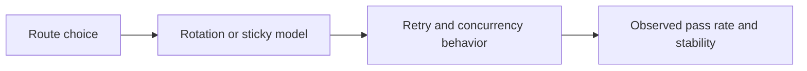

## Proxy Mistakes Usually Break Scrapers Long Before the Parser Fails
A lot of scraping teams assume proxy problems start only when the target becomes very strict. In practice, proxy mistakes show up much earlier. A scraper can have clean selectors, good browser logic, and still fail because the routing layer is weak, misused, or designed around the wrong assumptions. That is why many “scraping problems” are really proxy design problems in disguise.
This guide explains the most common proxy mistakes in scraping, why they create avoidable blocks and instability, and how to design the network layer more deliberately from the beginning. It pairs naturally with [best proxies for web scraping](https://bytesflows.com/blog/best-proxies-for-web-scraping), [proxy rotation strategies](https://bytesflows.com/blog/proxy-rotation-strategies), and [proxy management for large scrapers](https://bytesflows.com/blog/proxy-management-large-scrapers).
## Mistake 1: Choosing Proxy Type by Price Instead of by Target Difficulty
One of the most common mistakes is choosing the cheapest route first and expecting it to scale into difficult targets.
That usually fails because:
- cheap routes often mean lower trust
- many protected sites already distrust datacenter traffic
- the real cost of failure includes retries, engineering time, and lost data quality
Good proxy choice should start from target strictness, not only from bandwidth price.
## Mistake 2: Treating Rotation as Always Good
Teams often hear that rotating proxies reduce blocks, then apply rotation everywhere.
That creates problems when:
- the workflow needs session continuity
- the browser must keep cookies under one identity
- login or multi-step tasks break if the route changes
Rotation helps stateless work. Sticky identity helps continuity-heavy work. Confusing the two is a major source of avoidable failure.
## Mistake 3: Reusing One Identity for Too Long
The opposite mistake is keeping one proxy or one sticky route active far longer than the workflow justifies.
That often leads to:
- concentrated IP pressure
- higher block probability
- route burnout over repeated jobs
- lower pass rate as scaling begins
Even strong routes can become weak when overused.
## Mistake 4: Ignoring ASN and Geo Quality
A proxy can be technically working while still being the wrong route.
Common hidden problems include:
- wrong country exit
- suspicious ASN type
- datacenter-origin traffic sold as higher-trust routing
- geo drift across repeated requests
This is why route validation should include IP, region, and ASN checks rather than only connection success.
## Mistake 5: Retrying Without Changing Identity Logic
Retries often make proxy mistakes worse.
A bad retry pattern looks like:
- immediate repeat on the same weak route
- aggressive retry loops without cooldown
- no distinction between route failure and parser failure
- identity reuse when the target already signaled rejection
Proxy-aware retry design is one of the biggest differences between fragile scrapers and resilient ones.
## Mistake 6: Scaling Concurrency Faster Than the Proxy Layer Can Support
A proxy pool can look healthy at low volume and collapse under real load.
That usually happens when:
- too many workers hit one domain at once
- route diversity is smaller than assumed
- concurrency grows faster than pool quality
- sticky sessions quietly consume available identity capacity
Scaling should follow observed pass rate, not optimism about pool size.
## Mistake 7: Assuming Good Proxies Remove the Need for Good Behavior
A strong route does not make bad traffic invisible.
Poor behavior still shows up through:
- robotic timing
- unrealistic browser behavior
- overaggressive session reuse
- pattern-heavy navigation or retries
Good proxies help most when the rest of the scraper is also behaving plausibly.
## A Practical Proxy-Debugging Model
A useful mental model looks like this:

This shows why proxy mistakes usually come from how several layers interact, not from one setting alone.
## How to Avoid These Mistakes
### Choose proxy type from target difficulty
Trust should match the site, not just the budget.
### Match rotation style to workflow continuity
Stateless tasks and session-heavy tasks need different identity models.
### Validate IP, ASN, geo, and behavior before scaling
A working route can still be the wrong route.
### Make retries route-aware
Do not let the scraper repeat weak identity patterns blindly.
### Increase concurrency only when pass rate stays stable
Pool quality must be proven under repetition.
Helpful companion tools include [Proxy Checker](https://bytesflows.com/blog/proxy-checker), [Proxy Rotator Playground](https://bytesflows.com/blog/proxy-rotator), and [Scraping Test](https://bytesflows.com/blog/scraping-test).
## Conclusion
Common proxy mistakes in scraping usually come from treating proxies as a minor configuration detail instead of as part of the scraper’s core architecture. Wrong route type, bad rotation logic, weak validation, and non-proxy-aware retries can all make a technically correct scraper behave unreliably.
The practical lesson is simple: proxy design deserves the same care as parser logic and browser automation. Once route choice, identity model, retries, and concurrency support each other, many avoidable scraping failures disappear before they start.
## Further reading
- [Best proxies for web scraping](https://bytesflows.com/blog/best-proxies-for-web-scraping)
- [Proxy rotation strategies](https://bytesflows.com/blog/proxy-rotation-strategies)
- [Proxy management for large scrapers](https://bytesflows.com/blog/proxy-management-large-scrapers)
- [Residential proxies](https://bytesflows.com/proxies)
- [Why residential proxies are best for scraping](https://bytesflows.com/blog/why-residential-proxies-best-scraping)
- [How to scrape websites without getting blocked](https://bytesflows.com/blog/scrape-websites-without-getting-blocked)
- [Using proxies with Playwright](https://bytesflows.com/blog/using-proxies-playwright)
