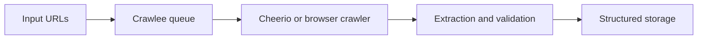

Crawlee has become one of the most practical frameworks for teams that want more structure than ad-hoc scripts but do not want to rebuild crawler infrastructure from scratch.
It is especially useful when a scraping system needs queues, retries, browser automation, and operational control in one place. This guide explains how Crawlee fits modern scraping in 2026 and how to use it without overcomplicating the stack.
This guide pairs well with [Playwright Web Scraping Tutorial: From Basics to Anti-Bot Mastery](https://bytesflows.com/blog/playwright-web-scraping-tutorial), [Scraping Data at Scale](https://bytesflows.com/blog/scraping-data-at-scale), and [Scaling Scrapers with Distributed Systems](https://bytesflows.com/blog/scaling-scrapers-distributed-systems).
## Why Teams Reach for Crawlee
Crawlee is appealing because it solves several problems that appear early in real projects:
- request queueing
- retry handling
- storage coordination
- browser crawler management
- scaling beyond one-off scripts
That makes it a strong middle ground between tiny custom scripts and fully bespoke scraping platforms.
## The Main Crawler Types
### CheerioCrawler
Best when the target is mostly static HTML and you want speed with low overhead.
### PlaywrightCrawler
Best when pages depend on JavaScript, browser execution, or user-like navigation.
### PuppeteerCrawler
Useful for teams maintaining older Puppeteer-heavy systems, though many new projects prefer Playwright.
The real strength is that Crawlee keeps these options under a similar operating model.
## Queues Are a Bigger Deal Than They Look
One of Crawlee's most useful features is the request queue. In practice, queues help teams answer:
- what has already been visited
- what still needs to run
- what failed and should be retried
- how large the backlog is becoming
That is a major operational upgrade over loose URL lists and hand-written retry logic.
## Browser Automation Works Better With Structure
When teams use Playwright or Puppeteer directly, they often end up rebuilding the same orchestration layer repeatedly. Crawlee reduces that burden by wrapping browser crawling in a more controlled execution model.
That helps when projects need:
- repeatable crawl flows
- resource-aware concurrency
- standardized error handling
- easier transition from local testing to production workloads
## Proxy Strategy Still Matters
No framework solves route quality by itself. Crawlee can work cleanly with proxy configuration, but teams still need to think about:
- target sensitivity
- session needs
- route rotation
- block rates
- regional access requirements
A good framework helps with execution. It does not replace good network design.
## Example: Where Crawlee Fits in a Modern Stack

This model is one reason Crawlee is attractive for teams that want a framework rather than another pile of scripts.
## When Crawlee Is a Good Choice
Crawlee is especially useful when:
- one project needs both static and browser-heavy crawling
- retries and queue control matter
- you want operational visibility without building everything from zero
- the system may need to scale over time
It may be less necessary for very small, one-off scripts.
## Common Mistakes
- using browser crawling everywhere when static fetching would do
- assuming Crawlee removes the need for proxy planning
- ignoring queue design and crawl scope
- moving to production without monitoring backlog and failure patterns
- treating framework choice as more important than extraction quality
## Conclusion
Mastering Crawlee in 2026 is really about understanding where it saves engineering time. It gives teams a strong structure for queues, retries, and browser crawling while still leaving room to choose the right extraction approach for each target.
Used well, it becomes a durable foundation for modern scraping rather than just another layer of abstraction.
## Further reading
- [Playwright Web Scraping Tutorial: From Basics to Anti-Bot Mastery](https://bytesflows.com/blog/playwright-web-scraping-tutorial)
- [Scraping Data at Scale](https://bytesflows.com/blog/scraping-data-at-scale)
- [Scaling Scrapers with Distributed Systems](https://bytesflows.com/blog/scaling-scrapers-distributed-systems)
- [The Ultimate Guide to Headless Browser Scraping in 2026](https://bytesflows.com/blog/headless-browser-scraping-guide)
- [Web Scraping at Scale: Best Practices (2026)](https://bytesflows.com/blog/web-scraping-at-scale-best-practices)
