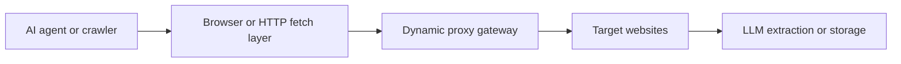

When people talk about “dynamic proxy” in AI applications, they usually mean a proxy layer that changes the exit IP over time—most often through rotating residential infrastructure. That matters because many AI workflows now depend on live web access, repeated data collection, browser automation, and agent-driven browsing.
Without a dynamic proxy layer, those workflows often fail for a simple reason: too much traffic comes from the same identity. The model may be powerful, the extraction logic may be solid, and the pipeline may be well designed, but if every request leaves from one visible IP, scaling breaks quickly.
This guide explains what dynamic proxy means in AI applications, why it matters for web data pipelines, how it fits into LLM and agent systems, and where it becomes essential for production reliability. It pairs naturally with [AI data collection from the web](https://bytesflows.com/blog/ai-data-collection-web), [AI web scraping explained](https://bytesflows.com/blog/ai-web-scraping-explained), and [AI web scraping with agents](https://bytesflows.com/blog/ai-web-scraping-agents).
## What “Dynamic Proxy” Usually Means in Practice
In this context, a dynamic proxy is usually a proxy gateway that can:
- rotate exit IPs across requests or sessions
- assign traffic to different residential or mobile IPs
- support geo-targeting by country, state, or city
- adapt IP usage to different workloads
- reduce repeated pressure on one visible identity
That is different from software concepts like programming-language proxies or internal application abstractions. Here, the term is about network transport and browsing identity.
## Why AI Applications Need Dynamic Proxy Layers
Many AI systems now depend on the web in a live or repeated way.
Examples include:
- collecting training data
- gathering fresh content for RAG pipelines
- powering research agents
- extracting structured fields from websites
- monitoring prices, listings, or competitors
- browsing multiple sites through autonomous or semi-autonomous workflows
All of these create outbound traffic. Once that traffic becomes repetitive, the IP layer becomes part of whether the AI application works at all.
## Dynamic Proxy for AI Training Data Collection
Training data collection is one of the clearest examples.
Large-scale data gathering often means crawling many pages, often across many domains, sometimes over long periods. Without distribution, one IP accumulates too much request density and quickly runs into blocks or degraded access.
Dynamic residential proxies help because they:
- distribute traffic across a larger pool
- reduce obvious datacenter signatures
- improve survival on stricter sites
- support region-aware collection when needed
- let crawlers run longer without burning one small identity set
This is why dynamic proxy infrastructure often sits underneath training-data crawlers even when the actual extraction logic is relatively simple.
## Dynamic Proxy for AI Agents and Browser Workflows
The role becomes even more obvious in agent systems.
AI agents that browse the web do more than fetch a page once. They may:
- navigate across multiple pages
- compare sources
- extract fields
- retry failed tasks
- handle conditional workflows
- browse through a real browser stack
That makes them more capable, but it also creates more visible traffic patterns. A browser-based agent running without proxy distribution often gets blocked faster than teams expect. This is why dynamic proxy layers are a natural companion to systems like [OpenClaw for web scraping and data extraction](https://bytesflows.com/blog/openclaw-web-scraping), [OpenClaw Playwright proxy configuration](https://bytesflows.com/blog/openclaw-playwright-proxy), and [rotating residential proxies for OpenClaw agents](https://bytesflows.com/blog/openclaw-rotating-proxy).
## Dynamic Proxy for RAG and Live Data Systems
RAG pipelines are often discussed as if the hard part is embedding and retrieval. In practice, live web-fed RAG systems also depend on collection reliability.
If the pipeline regularly refreshes external content, a dynamic proxy layer can help by:
- sustaining access across repeated refresh cycles
- reducing per-IP pressure across source domains
- enabling country-aware or localized retrieval
- supporting structured collection from multiple sites
- making refresh jobs more resilient over time
In other words, dynamic proxy support is often part of the ingestion layer, not just a scraping add-on.
## How Dynamic Proxy Fits into the AI Stack
A practical AI data pipeline often looks like this:

This architecture matters because it separates responsibilities clearly:
- the model interprets content
- the fetch layer retrieves it
- the proxy layer handles browsing identity and transport distribution
When teams skip that separation, they often ask the AI layer to compensate for problems that are actually caused by the network layer.
## Why Residential Dynamic Proxy Is Often Preferred
Dynamic proxy can exist in both datacenter and residential forms, but residential rotation is often more effective for stricter targets.
That is because residential traffic:
- looks closer to normal user traffic
- is less obviously tied to server infrastructure
- improves geo realism
- tends to face lower immediate trust penalties on many websites
This is why [residential proxies](https://bytesflows.com/blog/residential-proxies), [best proxies for web scraping](https://bytesflows.com/blog/best-proxies-for-web-scraping), and [why residential proxies are best for scraping](https://bytesflows.com/blog/why-residential-proxies-best-for-scraping-2026) are common reference points for AI-heavy collection systems.
## Dynamic Proxy Is Not Just Rotation
A mistake many teams make is reducing dynamic proxy to “IP changes automatically.” That is only part of the picture.
A good dynamic proxy layer also involves:
- choosing the right session mode
- matching geography to the task
- controlling concurrency and pacing
- preserving stability for session-sensitive flows
- measuring success rate rather than assuming rotation is enough
This is especially important in AI systems, where the temptation is to focus on the model while ignoring whether the model is consistently receiving usable content.
## Common Use Cases
### Training data pipelines
Use dynamic proxy to spread crawl traffic and keep high-volume collection alive longer.
### Agent-based research
Use dynamic proxy to support browser-driven, multi-source tasks without concentrating all activity on one IP.
### Structured extraction with LLMs
Use dynamic proxy under the fetch layer so extraction models consistently receive real target content rather than challenge pages.
### RAG content refresh
Use dynamic proxy when content sources are refreshed regularly and repeated access would otherwise create rate pressure.
### Market intelligence and monitoring
Use dynamic proxy to support repeated data collection from price, catalog, or competitor pages.
## Common Mistakes
### Treating the AI model as the bottleneck when the network layer is failing
If the system keeps seeing blocks, empty pages, or challenge flows, the issue may be transport rather than reasoning.
### Scaling request volume before validating per-IP safety
Dynamic proxy adds room, but it does not make traffic unlimited.
### Ignoring session needs
Some AI applications need rotating behavior, while others need continuity.
### Using dynamic proxy without validation
A configuration that works on an IP-check page may still fail on real targets.
### Overlooking geography
For localized search, pricing, or market data, exit region matters just as much as rotation.
## Best Practices for Dynamic Proxy in AI Applications
### Treat the proxy layer as part of the pipeline
Do not bolt it on after blocking starts. Design for it upfront where scale or sensitivity is expected.
### Match proxy mode to workflow type
Use rotating mode for broad stateless collection. Use sticky behavior when continuity matters.
### Measure real outcomes
Track success rate, latency, challenge rate, and extraction quality.
### Keep browser or fetch realism strong
Dynamic proxy helps the IP layer, but weak client behavior still gets flagged.
### Connect model design with collection design
A powerful extractor is only useful if the collection layer consistently reaches valid content.
## Conclusion
Dynamic proxy in AI applications is not just a technical add-on. It is part of what allows modern AI workflows to interact with the web reliably at scale. Whether the task is training-data collection, agent browsing, live RAG refresh, or structured extraction, the proxy layer often determines whether the system can keep operating once traffic grows.
The best way to think about it is simple: AI models interpret content, but dynamic proxy layers help those models keep reaching the content in the first place. When you combine good proxy strategy with strong fetching, browser realism, and structured extraction, the result is a far more stable AI data pipeline.
If you want the strongest next reading path from here, continue with [AI data collection from the web](https://bytesflows.com/blog/ai-data-collection-web), [AI web scraping explained](https://bytesflows.com/blog/ai-web-scraping-explained), [best proxies for web scraping](https://bytesflows.com/blog/best-proxies-for-web-scraping), and [proxy rotation strategies](https://bytesflows.com/blog/proxy-rotation-strategies).
## Further reading
- [AI data collection from the web](https://bytesflows.com/blog/ai-data-collection-web)
- [AI web scraping explained](https://bytesflows.com/blog/ai-web-scraping-explained)
- [AI web scraping with agents](https://bytesflows.com/blog/ai-web-scraping-agents)
- [Best proxies for web scraping](https://bytesflows.com/blog/best-proxies-for-web-scraping)
- [Residential proxies](https://bytesflows.com/blog/residential-proxies)
- [Proxy rotation strategies](https://bytesflows.com/blog/proxy-rotation-strategies)
- [OpenClaw for web scraping and data extraction](https://bytesflows.com/blog/openclaw-web-scraping)
