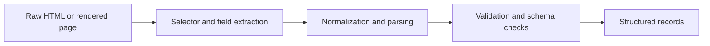

## Structured Data Extraction Is Where Scraping Becomes Useful
Fetching HTML is only the first part of scraping. The real value comes from turning messy page content into fields you can store, validate, and use downstream. That means structured data extraction is not just “find text on the page.” It is the process of translating unstable web markup into stable records.
That is why extracting structured data with Python is really about building reliable field logic, not just choosing a parser.
This guide explains how to think about parser choice, selector strategy, field validation, and dynamic-page extraction so that your Python scraper produces data that remains useful even when page structure shifts. It pairs naturally with [python web scraping tutorial for beginners](https://bytesflows.com/blog/python-web-scraping-tutorial-beginners), [building a Python scraping API](https://bytesflows.com/blog/building-python-scraping-api), and [scraping dynamic websites with Playwright](https://bytesflows.com/blog/scraping-dynamic-websites-playwright).
## What “Structured Data” Means in Scraping
In scraping, structured data usually means extracting page content into predictable fields such as:
- title
- price
- author
- date
- description
- product attributes
The important part is not only finding the value once. It is making the extraction repeatable and usable across many pages.
## Parser Choice Depends on the Page and the Workflow
Python gives you several useful extraction paths.
### BeautifulSoup
Good when:
- you want simplicity
- the HTML is moderate in size
- speed is not the main bottleneck
### lxml
Good when:
- performance matters more
- the HTML is larger or more numerous
- you want faster parsing in production workflows
### Browser locators or rendered extraction
Good when:
- the content is dynamic
- the useful DOM appears only after JavaScript
- the extraction depends on rendered page state
The right parser is the one that matches the actual page behavior.
## Durable Extraction Starts with Durable Selectors
A scraper becomes fragile when the extraction depends on selectors that change with layout tweaks.
More durable selectors often come from:
- stable data attributes
- meaningful semantic structure
- ids that are truly stable
- page patterns that reflect content meaning instead of appearance
Fragile selectors often come from:
- styling classes
- deeply nested positional paths
- exact layout assumptions
This is why extraction quality depends heavily on what signals you trust in the DOM.
## Field Logic Matters as Much as Selector Logic
Good extraction does not stop at finding one node.
You also need to decide:
- what happens when the field is missing
- how to normalize whitespace or formatting
- how to convert price, date, or numeric values
- how to handle optional variants on different pages
A field is reliable only when the extraction logic accounts for imperfect page reality.
## Validation Turns Scraped Text into Usable Data
One of the biggest differences between a toy scraper and a production scraper is validation.
Useful validation often includes:
- required field checks
- type normalization
- sanity bounds
- schema enforcement
- skipping or flagging malformed records
Without validation, a scraper may keep running while the data quietly degrades.
## Dynamic Pages Change the Extraction Layer
Sometimes the HTML response is not the page you actually need.
In those cases:
- the useful data appears after JavaScript runs
- the DOM changes after interaction
- static parsing sees an empty shell or incomplete structure
That is when browser-based extraction becomes necessary. The extraction problem is no longer just parsing. It is also page rendering.
## Extraction Pipelines Need Fallback Logic
A practical Python extraction workflow often benefits from fallback design.
For example:
- try a preferred selector first
- use alternate selectors when layouts vary
- treat missing values explicitly
- record extraction confidence or source pattern when helpful
This makes the system more resilient when the page family is not perfectly uniform.
## A Practical Extraction Model
A useful mental model looks like this:

This shows why extraction is a pipeline, not a single selector call.
## Common Mistakes
### Choosing selectors based on appearance instead of stability
That creates brittle scrapers.
### Assuming a found node means a valid field
Text still needs normalization and validation.
### Ignoring missing or partial values
Real pages are not perfectly uniform.
### Parsing static HTML when the data really needs a browser
The field logic becomes wrong before it starts.
### Treating validation as optional cleanup
It is part of extraction quality itself.
## Best Practices for Extracting Structured Data with Python
### Choose the parser based on actual page behavior
Do not use a browser when static HTML is enough, and do not force static parsing on dynamic pages.
### Prefer selectors tied to content meaning, not styling
Durability matters more than convenience.
### Normalize and validate every important field
Raw text is not yet good data.
### Build extraction logic for imperfect pages, not ideal ones
Missing fields and layout variation are normal.
### Treat dynamic rendering as part of extraction when necessary
The data source may be the rendered DOM, not the response HTML.
Helpful support tools include [HTTP Header Checker](https://bytesflows.com/blog/http-header-checker), [Scraping Test](https://bytesflows.com/blog/scraping-test-tool-detect-blocks), and [Proxy Checker](https://bytesflows.com/blog/proxy-checker).
## Conclusion
Extracting structured data with Python is what turns scraping from page collection into usable information. The hardest part is usually not getting the HTML. It is choosing stable selectors, building robust field logic, and validating that the output still makes sense as the target evolves.
The strongest extraction workflows combine the right parser, durable selectors, careful normalization, and explicit validation. Once those pieces are in place, your scraper becomes much more than a page downloader. It becomes a dependable data transformation pipeline.
If you want the strongest next reading path from here, continue with [python web scraping tutorial for beginners](https://bytesflows.com/blog/python-web-scraping-tutorial-beginners), [building a Python scraping API](https://bytesflows.com/blog/building-python-scraping-api), [scraping dynamic websites with Playwright](https://bytesflows.com/blog/scraping-dynamic-websites-playwright), and [the ultimate guide to web scraping in 2026](https://bytesflows.com/blog/ultimate-guide-web-scraping-2026).
## Further reading
- [Python web scraping tutorial for beginners](https://bytesflows.com/blog/python-web-scraping-tutorial-beginners)
- [Building a Python scraping API](https://bytesflows.com/blog/building-python-scraping-api)
- [Scraping dynamic websites with Playwright](https://bytesflows.com/blog/scraping-dynamic-websites-playwright)
- [The ultimate guide to web scraping in 2026](https://bytesflows.com/blog/ultimate-guide-web-scraping-2026)
- [Best proxies for web scraping](https://bytesflows.com/blog/best-proxies-for-web-scraping)
- [Python scraping proxy guide](https://bytesflows.com/blog/python-scraping-proxy-guide)
- [How to scrape websites without getting blocked](https://bytesflows.com/blog/scrape-websites-without-getting-blocked)
