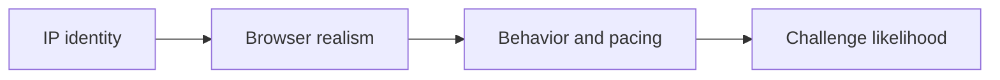

## Handling CAPTCHAs in Scraping Usually Starts with Trigger Reduction, Not Solver Selection
When CAPTCHAs appear in a scraping workflow, the first instinct is often to ask how to solve them automatically. In many cases, that is the wrong first question. CAPTCHAs are usually the visible result of a deeper scoring process: the site has already decided the traffic looks suspicious enough to challenge.
That is why the best CAPTCHA strategy is often to reduce how often they appear at all.
This guide explains how CAPTCHAs fit into modern anti-bot workflows, why they get triggered, and what practical changes reduce CAPTCHA pressure across identity, browser behavior, pacing, and retry logic. It pairs naturally with [bypass Cloudflare for web scraping](https://bytesflows.com/blog/bypass-cloudflare-web-scraping), [how websites detect web scrapers](https://bytesflows.com/blog/how-websites-detect-scrapers), and [avoid IP bans in web scraping](https://bytesflows.com/blog/avoid-ip-bans-web-scraping).
## Why CAPTCHAs Appear in the First Place
A CAPTCHA is rarely the first line of defense. It is usually what appears after the site already has enough evidence to distrust the session.
That evidence may come from:
- weak IP reputation
- suspicious browser fingerprinting
- unrealistic pacing
- challenge failures earlier in the request path
- repeated traffic patterns from the same identity
So when CAPTCHAs spike, the important question is often not “How do I solve them?” but “Why is this session getting challenged so often?”
## Not All CAPTCHA-Like Flows Are the Same
Modern challenge systems can include:
- invisible or passive JavaScript checks
- checkbox or behavioral CAPTCHA systems
- harder puzzle-based challenges
- challenge pages from broader anti-bot platforms
These differ operationally, but they often share the same trigger logic: the session is being judged as risky.
## IP Reputation Is Often the First Lever
A weak traffic identity can push the session toward challenge much earlier.
That is why CAPTCHAs often appear more on:
- datacenter IPs
- overused proxy routes
- cloud-hosted scraping environments
- identities with poor geo credibility
Residential proxies often reduce CAPTCHA pressure because they start from a stronger trust profile, especially on consumer-facing sites.
## Browser Realism Matters Too
Even strong IPs may still get challenged if the browser side of the session looks wrong.
Relevant factors can include:
- automation fingerprints
- inconsistent viewport or locale settings
- unnatural navigation patterns
- weak session continuity
- a simple HTTP client where the site expects a full browser
This is why CAPTCHA-prone targets often need browser automation as part of the solution, not just better proxies.
## Pacing and Rhythm Are Often Underestimated
CAPTCHA systems also respond to behavior.
Typical triggers include:
- bursts of repeated requests
- perfect mechanical timing
- too many parallel sessions on one domain
- retries that immediately hit the same target again
This is why slowing down can sometimes reduce CAPTCHA rate more than changing the parser or even changing the browser library.
## A Practical Prevention Model
A useful way to think about CAPTCHA prevention is:

The point is that CAPTCHA frequency emerges from the whole session pattern, not from one isolated setting.
## When to Consider Solvers
Solvers may still be relevant in some workflows, but they should usually be treated as an escalation step rather than the core strategy.
That is because solver-dependent scraping often adds:
- cost
- latency
- complexity
- fragility if CAPTCHA rate is already high
A scraper that triggers CAPTCHAs constantly is often better improved at the identity and behavior layers before solver use becomes economical.
## Better Retry Design Reduces CAPTCHA Waste
When a challenge appears, retrying the same route immediately can make things worse.
A better retry strategy often means:
- pausing before retry
- switching identity when appropriate
- reusing session continuity only when the session is still trustworthy
- measuring whether a new route actually improves outcomes
Retries should avoid reinforcing the same suspicious pattern.
## Common Mistakes
### Treating CAPTCHAs as a standalone problem
They are usually a symptom of a broader anti-bot judgment.
### Jumping to solvers too early
This often hides the underlying design issue instead of fixing it.
### Using weak IP identity on challenge-heavy targets
Poor reputation makes challenge frequency much worse.
### Ignoring pacing and concurrency
A strong proxy can still be wasted by bad behavior.
### Measuring success on one request instead of repeated sessions
CAPTCHA pressure usually becomes visible over time, not instantly.
## Best Practices for Handling CAPTCHAs
### Start by reducing trigger rate
That usually creates the biggest improvement.
### Use residential proxies on stricter targets
Trust quality matters early.
### Use browser automation where the site expects a real browser session
That removes a whole class of weak-client issues.
### Control pacing and domain concurrency
Behavior still contributes to challenge risk.
### Consider solvers only after the session design is reasonably healthy
Do not build a constant-challenge workflow if you can prevent it.
Helpful support tools include [Proxy Checker](https://bytesflows.com/blog/proxy-checker), [Scraping Test](https://bytesflows.com/blog/scraping-test-tool-detect-blocks), and [Proxy Rotator Playground](https://bytesflows.com/blog/proxy-rotator).
## Conclusion
Handling CAPTCHAs in scraping is usually less about defeating a puzzle and more about reducing how often the system decides you deserve one. Better IP trust, better browser realism, better pacing, and better retry logic usually have more impact than solver-first thinking.
That does not mean CAPTCHAs can always be avoided. It means the healthiest scraping workflow is one where CAPTCHAs are the exception rather than the normal path. Once you treat them as feedback from the target’s anti-bot scoring, you can improve the system in the places that matter most.
If you want the strongest next reading path from here, continue with [bypass Cloudflare for web scraping](https://bytesflows.com/blog/bypass-cloudflare-web-scraping), [how websites detect web scrapers](https://bytesflows.com/blog/how-websites-detect-scrapers), [avoid IP bans in web scraping](https://bytesflows.com/blog/avoid-ip-bans-web-scraping), and [playwright proxy configuration guide](https://bytesflows.com/blog/playwright-proxy-configuration-guide).
## Further reading
- [Bypass Cloudflare for web scraping](https://bytesflows.com/blog/bypass-cloudflare-web-scraping)
- [How websites detect web scrapers](https://bytesflows.com/blog/how-websites-detect-scrapers)
- [Avoid IP bans in web scraping](https://bytesflows.com/blog/avoid-ip-bans-web-scraping)
- [Playwright proxy configuration guide](https://bytesflows.com/blog/playwright-proxy-configuration-guide)
- [Best proxies for web scraping](https://bytesflows.com/blog/best-proxies-for-web-scraping)
- [Residential proxies](https://bytesflows.com/blog/residential-proxies)
- [Common web scraping challenges](https://bytesflows.com/blog/common-web-scraping-challenges)
