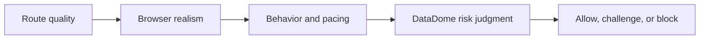

## Handling DataDome Requires More Than One Bypass Trick
DataDome is one of the anti-bot platforms that quickly exposes weak scraping setups because it tends to evaluate several layers at once. A good user-agent alone is not enough. A proxy alone is not enough. A real browser on a weak route is often still not enough. The system works by combining signals and escalating quickly when the session looks suspicious.
That is why “handling DataDome” is usually not about one bypass hack. It is about strengthening the whole session profile.
This guide explains why DataDome is difficult for scrapers, what kinds of signals it typically evaluates, what practical setup changes improve outcomes, and how to think about retries and scaling without turning the workflow into a challenge loop. It pairs naturally with [anti-bot systems explained](https://bytesflows.com/blog/anti-bot-systems-explained), [how to avoid detection in Playwright scraping](https://bytesflows.com/blog/avoid-detection-playwright-scraping), and [browser fingerprinting explained](https://bytesflows.com/blog/browser-fingerprinting-explained).
## Why DataDome Feels Difficult
DataDome is difficult because it often judges both network identity and browser credibility very early.
That means weak setups fail through:
- immediate blocks
- repeated challenge pages
- unstable success rates across routes
- performance that collapses as soon as concurrency rises
This is why a scraper may work briefly at low volume and still be fundamentally unhealthy.
## What DataDome Usually Evaluates
Like other strong anti-bot systems, DataDome often considers multiple layers such as:
- IP reputation and network type
- TLS or protocol behavior
- browser fingerprinting signals
- automation leaks in browser runtime
- behavioral timing and repeated access patterns
The important point is that these layers reinforce each other. One weak layer may be tolerated. Several weak layers together often are not.
## Why Real Browsers Matter Here
DataDome-sensitive targets are often difficult for request-only clients because the site expects a more complete browser session.
A real browser helps because it can:
- execute page logic and challenge flows
- present browser-like runtime behavior
- maintain cookies and session state
- reduce some protocol and runtime mismatches that simple clients cannot solve
This is why Playwright or Puppeteer is often part of the practical baseline on DataDome-protected targets.
## Why Strong Route Quality Still Matters
A real browser on a weak route can still fail quickly.
Residential proxies often improve outcomes because they:
- reduce obvious datacenter-origin suspicion
- make the session identity look more like ordinary consumer traffic
- support region-aware browsing more credibly
- give browser-based sessions a stronger starting point
This is why browser realism and route quality need to work together.
## Fingerprinting and Consistency Matter More Than Randomness
One mistake is trying to randomize too much in the hope of looking less detectable.
In practice, stronger sessions usually come from coherence:
- route and locale that make sense together
- stable viewport and browser context within a session
- believable timing rather than chaotic switching
- clean browser settings without obvious automation mismatch
On stricter targets, inconsistency itself becomes suspicious.
## Behavior Still Shapes Outcomes
Even with strong routing and a real browser, aggressive behavior can still trigger DataDome pressure.
Common problems include:
- too many parallel sessions on one domain
- repeated navigations with little delay
- immediate retries after challenge or block
- highly regular timing patterns
This is why pacing and retry design are still part of the solution.
## Retries Need Fresh Identity, Not Repetition
When a DataDome-protected route fails, retrying the same weak session immediately often just repeats the same bad outcome.
A better retry model often means:
- closing the weak session
- retrying with fresh identity when appropriate
- adding backoff before another attempt
- distinguishing route-quality failure from ordinary timeout or page issues
Retries should reduce suspicion, not compound it.
## A Practical DataDome Model
A useful mental model looks like this:

This helps explain why DataDome bypass is rarely solved by one isolated tweak.
## Common Mistakes
### Using a request-only client on a browser-sensitive target
The runtime layer is often too weak.
### Expecting proxies alone to solve the problem
Weak browser profile still matters.
### Randomizing browser settings too aggressively
Incoherence can make the session stranger, not safer.
### Retrying the same failing route immediately
That often increases challenge pressure.
### Assuming one successful load proves long-term stability
DataDome issues often appear under repetition.
## Best Practices for Handling DataDome
### Start with a real browser on a strong route
That solves the largest early weaknesses.
### Use residential routing when the target is clearly strict
Trust quality matters a lot here.
### Keep browser context coherent
Locale, viewport, and route should support one believable session story.
### Control pacing and per-domain concurrency
Strong identity still fails under excessive pressure.
### Measure pass rate across repeated runs before you scale
Lucky success is not enough.
Helpful support tools include [HTTP Header Checker](https://bytesflows.com/blog/http-header-checker), [Proxy Checker](https://bytesflows.com/blog/proxy-checker), and [Scraping Test](https://bytesflows.com/blog/scraping-test-tool-detect-blocks).
## Conclusion
Handling DataDome bot protection is mostly about strengthening the full session: better route quality, stronger browser realism, coherent context, and less aggressive behavior. The platform is difficult because it judges several weak signals together, which makes one-dimensional fixes unreliable.
The practical lesson is that stable DataDome scraping requires systems thinking. Real browsers matter. Residential routes matter. Consistency matters. Retry discipline matters. Once those layers align, the session stops looking obviously synthetic and becomes much more likely to survive repeated access.
If you want the strongest next reading path from here, continue with [anti-bot systems explained](https://bytesflows.com/blog/anti-bot-systems-explained), [how to avoid detection in Playwright scraping](https://bytesflows.com/blog/avoid-detection-playwright-scraping), [browser fingerprinting explained](https://bytesflows.com/blog/browser-fingerprinting-explained), and [handling CAPTCHAs in scraping](https://bytesflows.com/blog/handling-captchas-in-scraping).
## Further reading
- [Anti-bot systems explained](https://bytesflows.com/blog/anti-bot-systems-explained)
- [How to avoid detection in Playwright scraping](https://bytesflows.com/blog/avoid-detection-playwright-scraping)
- [Browser fingerprinting explained](https://bytesflows.com/blog/browser-fingerprinting-explained)
- [Handling CAPTCHAs in scraping](https://bytesflows.com/blog/handling-captchas-in-scraping)
- [Bypass Cloudflare for web scraping](https://bytesflows.com/blog/bypass-cloudflare-web-scraping)
- [Best proxies for web scraping](https://bytesflows.com/blog/best-proxies-for-web-scraping)
- [How to scrape websites without getting blocked](https://bytesflows.com/blog/scrape-websites-without-getting-blocked)
