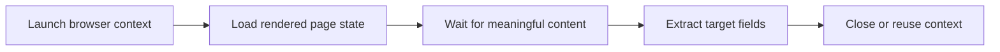

## Headless Browsers Changed What Scraping Can Reach
Many modern websites no longer expose useful data in the first HTML response. JavaScript-heavy pages, interactive flows, and session-dependent interfaces often require a real browser environment to render the page correctly.
That is where headless browser scraping becomes valuable. Instead of pretending a website is static, a headless browser collects the page the way a browser actually experiences it.
This guide pairs well with [Scraping Dynamic Websites with Playwright](https://bytesflows.com/blog/scraping-dynamic-websites-playwright), [Browser Automation for Web Scraping (2026)](https://bytesflows.com/blog/browser-automation-web-scraping), and [Scaling Scraping with Playwright](https://bytesflows.com/blog/scaling-scraping-playwright).
## What “Headless” Really Means
A headless browser is a full browser that runs without a visible graphical window. It still:
- executes JavaScript
- renders DOM changes
- manages cookies and storage
- handles navigation and interaction
- exposes the same browser APIs that many modern sites depend on
The key idea is not invisibility. It is programmability.
## Headless Versus Headed
The difference is not just whether the browser window is visible.
| Mode | Main advantage | Main tradeoff |
| --- | --- | --- |
| Headless | Lower overhead and easier automation at scale | Sometimes easier for anti-bot systems to flag |
| Headed | Better for debugging and visual verification | Higher resource usage |
In practice, teams often debug in headed mode and run production workloads primarily in headless mode.
## Why Playwright Is a Strong Default
Playwright is often the best default for headless scraping because it offers:
- modern browser control
- reliable waits and locators
- multiple browser engines
- strong context isolation
- good support for large automated workflows
For many scraping projects, Playwright provides a cleaner operating model than older browser automation stacks.
## Headless Browsers Need Stealth and Route Quality
A headless browser is not automatically safe from detection. Sites may still inspect:
- browser fingerprints
- session behavior
- TLS and header consistency
- route reputation
- interaction timing
That is why browser realism and route quality need to improve together. Residential proxies, consistent session profiles, and careful pacing often matter as much as the browser choice itself.
## A Practical Headless Scraping Workflow

This workflow is much closer to how dynamic sites actually behave than a request-only model.
## Resource Management Matters at Scale
Headless browsers are heavier than simple HTTP clients, so good workflows should:
- reuse browser processes when sensible
- create isolated contexts instead of a new full browser every time
- close pages cleanly after extraction
- block unnecessary assets when visual fidelity is not required
- monitor CPU and memory instead of assuming the browser layer will scale itself
This is especially important in distributed or high-throughput environments.
## Common Mistakes
- using headless browsers on pages that could be handled with lightweight HTTP requests
- extracting before the page reaches a meaningful rendered state
- treating headless mode as enough without improving route quality
- launching too many full browser processes instead of reusing contexts
- debugging only in production after the page starts failing silently
## Conclusion
Headless browser scraping matters because much of the modern web is no longer static. When the page depends on JavaScript, interaction, and session state, a browser-aware workflow is often the most reliable way to get accurate data.
When Playwright, stronger route quality, and careful resource management are combined well, headless scraping becomes a practical foundation for dynamic web extraction.
## Further reading
- [Scraping Dynamic Websites with Playwright](https://bytesflows.com/blog/scraping-dynamic-websites-playwright)
- [Browser Automation for Web Scraping (2026)](https://bytesflows.com/blog/browser-automation-web-scraping)
- [Scaling Scraping with Playwright](https://bytesflows.com/blog/scaling-scraping-playwright)
- [Best Proxies for Web Scraping](https://bytesflows.com/blog/best-proxies-for-web-scraping)
- [How to Scrape Websites Without Getting Blocked: The 2026 Stealth Playbook](https://bytesflows.com/blog/scrape-websites-without-getting-blocked)
