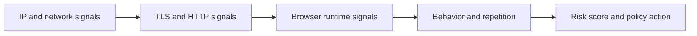

## Bot Detection Systems Work by Scoring Suspicion Across Layers, Not by Catching One Obvious Mistake
A lot of developers imagine bot detection as a blacklist problem: bad user-agent, too many requests, instant block. Modern bot detection systems are usually more nuanced. They gather signals from network identity, protocol behavior, browser environment, and timing, then combine those signals into a risk judgment about whether the session looks automated or believable.
That is why a scraper can fail even when no single mistake looks fatal. Several moderate signals can combine into one strong detection outcome.
This guide explains how bot detection systems work in practice, what layers usually feed the score, how thresholds shape outcomes, and why reducing detection means improving the whole session profile rather than one isolated setting. It pairs naturally with [anti-bot systems explained](https://bytesflows.com/en/blog/anti-bot-systems-explained), [how websites detect web scrapers](https://bytesflows.com/en/blog/how-websites-detect-scrapers), and [browser fingerprinting explained](https://bytesflows.com/en/blog/browser-fingerprinting-explained).
## The Core Idea: Detection Is Usually a Scoring Pipeline
Most modern bot detection systems do not make a decision from one signal alone.
Instead, they often:
- observe multiple layers of the session
- assign risk or confidence to each layer
- combine rule-based and statistical logic
- decide whether to allow, throttle, challenge, or block
This is why the same site may behave differently at different traffic levels or from different environments.
## The Most Common Signal Layers
Bot detection systems often score traffic across several layers.
### IP and network identity
- IP reputation
- ASN or hosting profile
- geography
- request volume from one route
### Protocol and TLS behavior
- TLS handshake characteristics
- browser-like or non-browser-like connection patterns
- protocol behavior that differs from common browsers
### HTTP request profile
- user-agent
- header completeness and consistency
- header ordering or client-hint expectations
### Browser fingerprinting
- canvas and graphics behavior
- browser properties
- viewport and screen characteristics
- runtime automation leaks
### Behavior over time
- timing regularity
- request bursts
- navigation rhythm
- repeated multi-session patterns
Each layer may be imperfect alone. Together, they become much more powerful.
## Rules and Models Often Work Together
Many bot detection systems combine:
- deterministic rules
- statistical heuristics
- machine-learning or probabilistic scoring
For example:
- a datacenter IP may create one penalty
- a non-browser TLS profile may create another
- suspicious runtime traits may increase the score further
The final outcome is often a combined judgment, not just a hand-written rule firing once.
## Thresholds Matter as Much as Signals
The same signals do not always trigger the same action.
Detection systems often apply different thresholds for:
- allow silently
- rate limit or degrade responses
- show a challenge
- block outright
That means a session may look “partly suspicious” without being fully blocked, especially at lower volumes. Scale or repeated behavior can move the same session past a stricter threshold.
## Why Scrapers Often Misdiagnose Detection
A common mistake is trying to explain a block using only the most visible symptom.
For example:
- “It must be the user-agent.”
- “It must be the IP.”
- “It must be request count.”
In reality, the block often comes from the combined score:
- weak route
- weak browser profile
- mechanical timing
- repeated pattern under concurrency
This is why detection feels inconsistent when only one layer is being debugged at a time.
## A Practical Detection Pipeline
A useful mental model looks like this:

This is the shape of the decision pipeline many modern systems approximate.
## What Raises Scores Quickly
Bot detection systems tend to distrust traffic faster when several of these combine:
- datacenter origin
- request-only client on browser-sensitive targets
- default or incoherent headers
- obvious browser automation leaks
- highly regular or bursty timing
- repeated failed challenge behavior
No single factor has to be catastrophic. The score emerges from the combination.
## What Usually Lowers Detection Pressure
Reducing bot-detection risk usually means improving several layers together:
- stronger route quality, often residential on stricter sites
- real browser execution where browser runtime matters
- coherent browser context and locale
- lower burstiness and better pacing
- retries that change identity when route quality is the issue
This is why stable scraping is usually infrastructure plus behavior, not only parser logic.
## Common Mistakes
### Assuming the block came from one visible problem
The real cause is often layered scoring.
### Testing at tiny scale and assuming the workflow is stable
Threshold effects often appear under repetition.
### Fixing headers while ignoring browser runtime
The site may care more about the browser than the request string.
### Using stronger proxies but leaving pacing aggressive
Behavior still contributes to risk.
### Treating challenge pages as the detection system itself
They are often just the visible response to the score.
## Best Practices for Reducing Bot-Detection Risk
### Diagnose by layer, not by guesswork
Know whether the weakness is route, protocol, browser, or behavior.
### Improve multiple weak points together on strict targets
Combined weakness is what usually gets punished.
### Use browser automation when the target clearly expects a browser session
Do not fight runtime-sensitive checks with request-only tools.
### Monitor outcomes under repetition, not one-off success
The score often changes with scale.
### Treat challenge frequency as a signal about system health
Do not only treat it as a nuisance to bypass.
Helpful support tools include [HTTP Header Checker](https://bytesflows.com/en/blog/http-header-checker), [Proxy Checker](https://bytesflows.com/en/blog/proxy-checker), and [Scraping Test](https://bytesflows.com/en/blog/scraping-test-tool-detect-blocks).
## Conclusion
Bot detection systems work by combining many signals into a broader judgment about whether a session looks automated or believable. That is why detection often feels subtle: the system is not only looking for one obvious fingerprint. It is looking for the accumulation of small clues that point in the same direction.
The practical lesson is that reducing detection pressure means improving the whole session: better route quality, better browser realism, coherent headers and locale, saner timing, and smarter retry behavior. Once you understand detection as a scoring pipeline, blocks become easier to diagnose and much less mysterious.
If you want the strongest next reading path from here, continue with [anti-bot systems explained](https://bytesflows.com/en/blog/anti-bot-systems-explained), [how websites detect web scrapers](https://bytesflows.com/en/blog/how-websites-detect-scrapers), [browser fingerprinting explained](https://bytesflows.com/en/blog/browser-fingerprinting-explained), and [how to scrape websites without getting blocked](https://bytesflows.com/en/blog/scrape-websites-without-getting-blocked).
## Further reading
- [Anti-bot systems explained](https://bytesflows.com/en/blog/anti-bot-systems-explained)
- [How websites detect web scrapers](https://bytesflows.com/en/blog/how-websites-detect-scrapers)
- [Browser fingerprinting explained](https://bytesflows.com/en/blog/browser-fingerprinting-explained)
- [How to scrape websites without getting blocked](https://bytesflows.com/en/blog/scrape-websites-without-getting-blocked)
- [Bypass Cloudflare for web scraping](https://bytesflows.com/en/blog/bypass-cloudflare-web-scraping)
- [Best proxies for web scraping](https://bytesflows.com/en/blog/best-proxies-for-web-scraping)
- [Handling CAPTCHAs in scraping](https://bytesflows.com/en/blog/handling-captchas-in-scraping)
