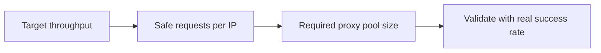

## How Many Proxies Do You Actually Need?
When a scraping project starts failing at scale, most teams blame the parser, the crawler, or the target website. In practice, the real bottleneck is often much simpler: too much request pressure per IP.
A single IP can look fine at 100 requests and start failing badly at 1,000. The code may be identical. What changes is density: how often the same IP appears, how quickly it repeats actions, and how predictable the traffic pattern looks. That is why proxy planning is really a capacity-planning problem.
This guide explains how to estimate the number of proxies you need based on target difficulty, request volume, concurrency, and acceptable success rate. If you are still building the broader foundation, it helps to pair this article with [residential proxies](https://bytesflows.com/blog/residential-proxies), [best proxies for web scraping](https://bytesflows.com/blog/best-proxies-for-web-scraping), and [proxy rotation strategies](https://bytesflows.com/blog/proxy-rotation-strategies).
## The Short Answer
There is no universal number that fits every project. The right proxy count depends on five variables:
- how strict the target is
- how many pages or requests you need per hour
- whether you use rotating or sticky sessions
- how much concurrency you run per worker
- how much block risk you are willing to tolerate
If the target is easy, a relatively small pool can support a surprising amount of traffic. If the target is strict, even moderate volume may require a much larger residential pool and more careful session control.
## The Practical Estimation Model
At a practical level, the question is simple:
<!-- notion block: equation -->
This is not a perfect scientific formula, but it is a strong operational starting point.
The missing piece is the safe request rate per IP. That depends mostly on target difficulty.
### Rough request ranges by target type
- **Easy targets**: 50–200 requests per IP per hour
- **Medium targets**: 10–50 requests per IP per hour
- **Hard targets**: 5–20 requests per IP per hour
- **Very hard or login-sensitive targets**: often 1–10 requests per IP per hour, sometimes lower
These ranges are not guarantees. They are planning ranges. Real limits depend on fingerprint quality, request timing, rendering behavior, and whether the site is monitoring sessions aggressively.
## A Better Way to Think About Proxy Sizing
Instead of asking “How many proxies do I need?”, experienced teams usually ask three smaller questions:
1. How many requests do I need to complete per hour?
1. How much traffic can each IP safely carry?
1. Do I need fresh IPs per request, or stable IPs per session?
Once you answer those, the proxy count becomes much easier to estimate.

## Example Calculation
Suppose you want to scrape 1,000 pages per hour from a medium-difficulty target.
If your tests show that one IP can safely handle about 30 requests per hour, then the estimate is:
<!-- notion block: equation -->
So you should plan for about **34 IPs** as a baseline.
That baseline is not your final answer. In real production systems, you often add safety margin for retries, regional distribution, session failures, and temporary bans. In practice, many teams would round upward rather than downward.
## Decision Table
| Target difficulty | Pages/hour | Safe req/IP/hr | Estimated IPs |
| --- | --- | --- | --- |
| Easy (blogs, news) | 5,000 | 100 | 50 |
| Medium (product catalogs) | 2,000 | 40 | 50 |
| Hard (Amazon, Cloudflare-protected) | 500 | 10 | 50 |
| Very hard (LinkedIn, strict account workflows) | 200 | 5 | 40 |
The important pattern is that proxy demand rises quickly as targets become stricter. You do not always need huge throughput to need a meaningful proxy pool.
## Rotating vs Sticky Sessions
This is where many proxy estimates go wrong.
### Rotating proxies
With rotating residential proxies, each request can be routed through a new IP. In that case, what matters most is provider throughput, request scheduling, and how much concurrency your pool can absorb.
Rotating mode is usually best for:
- broad crawling
- discovery jobs
- large public data collection tasks
- lower-session workloads
### Sticky sessions
With sticky sessions, the same IP is kept for a limited time window. This is often necessary for:
- login flows
- account workflows
- carts or session-bound browsing
- multi-step browser automation
In sticky mode, you need enough IPs to support your concurrent sessions, not just your hourly throughput. This is one reason browser-based scraping can consume proxies faster than simple HTTP scraping. For more on session design, [proxy pools for web scraping](https://bytesflows.com/blog/proxy-pools-web-scraping) and [avoid IP bans in web scraping](https://bytesflows.com/blog/avoid-ip-bans-web-scraping) are useful related reads.
## Concurrency Matters More Than People Expect
A common mistake is to think only in terms of daily or hourly volume. But concurrency often causes the failure first.
Ten thousand requests per day might be safe if traffic is spread well. Five hundred requests in ten minutes from the same small pool can trigger blocks immediately.
### Safe per-IP concurrency guidelines
| Site type | Concurrent requests per IP | Typical delay |
| --- | --- | --- |
| Easy | 2–5 | 1–3 s |
| Medium | 1–2 | 3–5 s |
| Hard | 1 | 5–15 s |
If you need more throughput, the default move should be adding IPs or improving scheduling, not forcing more traffic through each IP.
## A Quick Calculator Script
Use this basic script to estimate the proxy count you need from your throughput target and per-IP limit.
```python
def estimate_ips_needed(pages_per_hour: int, requests_per_ip_per_hour: int) -> int:
    """Estimate proxy count from throughput and safe per-IP rate."""
    return max(1, (pages_per_hour + requests_per_ip_per_hour - 1) // requests_per_ip_per_hour)

# Example: 1,000 pages/hour from a medium target
print(estimate_ips_needed(1000, 30))  # 34

# Example: 500 pages/hour from a hard target
print(estimate_ips_needed(500, 10))   # 50
```
This gives you a baseline. The real number should then be validated against actual block rate and success rate data.
## How to Validate Your Estimate in Production
The best way to size a proxy pool is not to guess perfectly on day one. It is to test methodically.
1. Start with one IP and a very low request rate.
1. Measure success rate, response quality, and challenge frequency.
1. Increase traffic gradually until blocks begin to appear.
1. Set a safe operating rate below that threshold.
1. Multiply that rate by your target throughput to estimate pool size.
1. Add safety margin for retries, burst traffic, and regional segmentation.
This is also the stage where tools such as [Proxy Checker](https://bytesflows.com/blog/proxy-checker), [Proxy Rotator Playground](https://bytesflows.com/blog/proxy-rotator), and [Scraping Test](https://bytesflows.com/blog/scraping-test-tool-detect-blocks) become useful for validating exit IP quality and observing behavior.
## Common Mistakes That Lead to Underestimating Proxy Needs
### 1. Treating all targets as equal
A blog, an e-commerce catalog, and a strict account-driven platform do not tolerate the same traffic pattern.
### 2. Ignoring session stickiness
If a workflow depends on cookies and session continuity, the proxy plan must account for concurrent sessions rather than simple hourly request totals.
### 3. Pushing too much concurrency through one IP
This often causes avoidable rate limits and temporary bans.
### 4. Mixing proxy types carelessly
Datacenter proxies can be fine for easy targets, but harder websites often need residential traffic. If you are deciding between the two, [why residential proxies are best for scraping](https://bytesflows.com/blog/why-residential-proxies-best-for-scraping-2026) is a helpful comparison.
### 5. Not monitoring pool performance
Without success rate, latency, and block-rate data, you cannot tune intelligently.
## When You Need More Than Just More IPs
Sometimes the answer is not “buy more proxies.” If success rate is collapsing, the real issue may be elsewhere:
- browser fingerprints are too weak
- request timing is too aggressive
- headers or sessions look inconsistent
- the target requires browser rendering
- retry logic is amplifying suspicious patterns
That is why proxy planning should always sit inside a larger scraping architecture. Related articles such as [AI web scraping with agents](https://bytesflows.com/blog/ai-web-scraping-agents), [AI data extraction vs traditional scraping](https://bytesflows.com/blog/ai-data-extraction-vs-traditional-scraping), and [scraping data at scale](https://bytesflows.com/blog/scraping-data-at-scale) help frame the broader system design.
## Rule-of-Thumb Sizing by Use Case
Here is a more intuitive way to think about starting pool sizes:
- small testing or dev workflows: start with a minimal pool and validate behavior
- medium catalog scraping: plan for a moderate rotating pool with room for retries
- high-volume public scraping: use larger rotating pools with careful throttling
- login or browser-session automation: size the pool around concurrent sticky sessions
- strict anti-bot targets: assume you will need more IPs, slower pacing, and better validation
These are not exact numbers, but they are a better mental model than assuming one fixed proxy count works everywhere.
## Conclusion
How many proxies you need depends less on a universal benchmark and more on how your workload interacts with the target. Throughput, session design, target strictness, and acceptable block rate all matter.
The practical workflow is simple: estimate based on safe requests per IP, test carefully, then scale with real data. If you do that well, you will spend less on unnecessary capacity and avoid the much bigger cost of unstable scraping.
If you are building a fuller internal reading path, the best next steps are [proxy rotation strategies](https://bytesflows.com/blog/proxy-rotation-strategies), [proxy pools for web scraping](https://bytesflows.com/blog/proxy-pools-web-scraping), [avoid IP bans in web scraping](https://bytesflows.com/blog/avoid-ip-bans-web-scraping), and [best proxies for web scraping](https://bytesflows.com/blog/best-proxies-for-web-scraping).
## Further reading
- [Residential proxies](https://bytesflows.com/blog/residential-proxies)
- [Best proxies for web scraping](https://bytesflows.com/blog/best-proxies-for-web-scraping)
- [Proxy rotation strategies](https://bytesflows.com/blog/proxy-rotation-strategies)
- [Proxy pools for web scraping](https://bytesflows.com/blog/proxy-pools-web-scraping)
- [Avoid IP bans in web scraping](https://bytesflows.com/blog/avoid-ip-bans-web-scraping)
- [Why residential proxies are best for scraping](https://bytesflows.com/blog/why-residential-proxies-best-for-scraping-2026)
- [Scraping data at scale](https://bytesflows.com/blog/scraping-data-at-scale)
