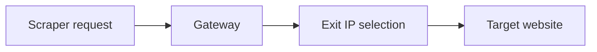

## Proxy Rotation Is Really About How a Scraper Distributes Identity Over Time
When people first hear “proxy rotation,” it can sound like a simple trick: switch IPs often and avoid blocks. In practice, rotation is more important than that. It is the system that determines how your scraper’s traffic identity is distributed across requests, sessions, and targets.
That is why proxy rotation is not just a provider feature. It is part of scraping strategy.
This guide explains how proxy rotation works in practice, how rotating gateways differ from static proxy lists, when to use per-request rotation versus sticky sessions, and why the right rotation mode depends on what kind of workflow you are running. It pairs naturally with [proxy rotation strategies](https://bytesflows.com/en/blog/proxy-rotation-strategies), [web scraping proxy architecture](https://bytesflows.com/en/blog/web-scraping-proxy-architecture), and [how many proxies do you need](https://bytesflows.com/en/blog/how-many-proxies-need-scraping).
## What Proxy Rotation Actually Means
Proxy rotation means your requests do not all leave through the same visible IP address.
Instead, the proxy layer distributes traffic across different exit IPs over time.
Depending on the setup, that may happen:
- on every request
- on every new session
- after a set time window
- after a failure or retry
- according to routing rules at the provider layer
This matters because a website usually scores patterns, not just individual requests. Rotation changes the pattern the website sees.
## Why Rotation Matters in Scraping
Without rotation, repeated traffic concentrates on one identity.
That creates common problems such as:
- rate limits
- IP bans
- CAPTCHA or challenge pages
- session suspicion on stricter targets
- faster deterioration of one visible IP’s reputation
Rotation spreads the pressure more broadly, which usually makes the scraping workload more survivable.
## The Two Main Modes: Per-Request vs Sticky
These two modes solve different problems.
### Per-request rotation
A new IP is assigned frequently, often on each request or each independent call.
Best for:
- broad public scraping
- product pages
- SERP collection
- independent API calls
- workflows where continuity does not matter
### Sticky sessions
The same IP is held for a period of time or for a session identifier.
Best for:
- logins
- multi-step flows
- carts and checkout-like processes
- infinite-scroll pages that depend on continuity
- tasks where cookies and server-side session state matter
This is why the real decision is not “rotate or not.” It is “how much continuity does the workflow need?”
## How a Rotating Gateway Usually Works
Modern proxy providers often give you one gateway endpoint rather than a raw list of IPs.
That means:
- your scraper points to one host:port plus credentials
- the provider decides which exit IP to assign
- the gateway handles rotation internally
- your code does not need to manage individual IPs manually
This is the most common model because it makes rotation operationally simpler while still allowing the provider to manage a larger pool behind the scenes.
## Why Sticky Sessions Exist at All
Some developers assume maximum rotation is always best. That is only true for stateless scraping.
Sticky sessions exist because many websites expect identity continuity during a flow. If your IP changes in the middle of:
- a login process
- a browsing session with cookies
- an infinite-scroll pattern
- a multi-step form
then the site may interpret that as suspicious or break the workflow entirely.
So sticky behavior is not a compromise—it is the correct design for certain task types.
## A Practical Rotation Diagram
A useful way to think about it is:

The important point is that the scraper may be using the same gateway endpoint while the provider changes the visible exit identity behind it.
## Rotation and Session Design Must Match the Task
A good rotation strategy should ask:
- are the requests independent?
- does the site expect the same IP across steps?
- how sensitive is the target to repeated access?
- does the region need to remain stable?
- how expensive is a broken session compared with a blocked IP?
This is why rotation design belongs to architecture, not just to provider setup.
## Why Rotation Alone Is Not Enough
Rotation reduces concentration risk, but it does not solve every anti-bot problem.
You still need to think about:
- pacing
- concurrency
- retry behavior
- browser realism when browsers are used
- whether geo and session behavior look consistent
A fast, aggressive scraper can still fail badly even with a rotating gateway if the overall traffic pattern remains unnatural.
## Common Problems and What They Usually Mean
### All requests appear to use the same IP
You may be using sticky mode or reusing a session in a way that preserves identity.
### Sessions break unexpectedly
The sticky window may be expiring or the workflow may be too long for the assigned session duration.
### Block rate stays high even with rotation
The rate may still be too aggressive, the target may be very strict, or the proxy type may be wrong for the workload.
### Rotation feels random and unstable
The task may need more continuity than full rotation allows.
These are usually strategy mismatches, not just provider failures.
## Common Mistakes
### Assuming more rotation is always better
Too much rotation can break session-dependent workflows.
### Using sticky sessions for broad stateless collection
That can recreate the single-IP concentration problem.
### Ignoring geo consistency
Some targets react badly if the browsing identity jumps regions unrealistically.
### Confusing gateway reuse with IP reuse
The same gateway endpoint does not mean the same exit IP.
### Treating rotation as a substitute for pacing
Identity distribution does not eliminate bad traffic behavior.
## Best Practices for Proxy Rotation
### Match the mode to the workflow
Per-request for independent tasks, sticky for continuity-heavy flows.
### Validate on the real target
A rotation setup is only good if it works on the site you care about.
### Monitor success rate and not just IP change
Rotation quality is about outcome, not only about visible variation.
### Keep pacing realistic
Rotation performs best when combined with good request behavior.
### Revisit the rotation design as the scraper grows
A strategy that works at 100 requests may fail at 100,000.
Helpful support tools include [Proxy Checker](https://bytesflows.com/en/blog/proxy-checker), [Proxy Rotator Playground](https://bytesflows.com/en/blog/proxy-rotator), and [Scraping Test](https://bytesflows.com/en/blog/scraping-test-tool-detect-blocks).
## Conclusion
Proxy rotation works by distributing scraper traffic across different exit identities instead of concentrating it on one visible IP. But the real value is not only technical IP switching—it is aligning identity behavior with the workload.
Per-request rotation is powerful for stateless scraping. Sticky sessions are necessary for workflows that need continuity. The strongest scraping systems choose between them based on what the task actually requires, not on a default assumption that more rotation is always better.
If you want the strongest next reading path from here, continue with [proxy rotation strategies](https://bytesflows.com/en/blog/proxy-rotation-strategies), [web scraping proxy architecture](https://bytesflows.com/en/blog/web-scraping-proxy-architecture), [how many proxies do you need](https://bytesflows.com/en/blog/how-many-proxies-need-scraping), and [best proxies for web scraping](https://bytesflows.com/en/blog/best-proxies-for-web-scraping).
## Further reading
- [Proxy rotation strategies](https://bytesflows.com/en/blog/proxy-rotation-strategies)
- [Web scraping proxy architecture](https://bytesflows.com/en/blog/web-scraping-proxy-architecture)
- [How many proxies do you need](https://bytesflows.com/en/blog/how-many-proxies-need-scraping)
- [Best proxies for web scraping](https://bytesflows.com/en/blog/best-proxies-for-web-scraping)
- [Residential proxies](https://bytesflows.com/en/blog/residential-proxies)
- [Proxy pools for web scraping](https://bytesflows.com/en/blog/proxy-pools-web-scraping)
- [Using proxies with Python scrapers](https://bytesflows.com/en/blog/using-proxies-python-scrapers)
