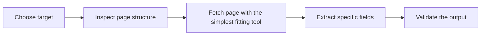

## Your First Web Scraper Should Teach the Right Mental Model, Not Just Produce One Working Script
Many beginner scraping guides focus only on getting a quick win: install a couple of libraries, send a request, print some text, done. That can be useful, but it often teaches the wrong lesson. A first scraper is most valuable when it teaches you how to think about pages, targets, extraction, and when simple tools stop being enough.
That is why building your first web scraper is less about writing one small Python file and more about learning the basic decisions behind scraping work.
This guide explains how to choose a first target, build a simple Python scraper, understand when a page is static versus dynamic, and avoid the most common beginner mistakes that make a first project feel harder than it needs to be. It pairs naturally with [python web scraping tutorial for beginners](https://bytesflows.com/blog/python-web-scraping-tutorial-beginners), [extracting structured data with Python](https://bytesflows.com/blog/extracting-structured-data-python), and [playwright web scraping tutorial](https://bytesflows.com/blog/playwright-web-scraping-tutorial).
## Step 1: Pick a Good First Target
The most important first decision is the website itself.
A good beginner target is usually:
- publicly accessible
- simple in structure
- not heavily protected
- not dependent on login or advanced JavaScript
A bad beginner target is usually:
- strongly anti-bot protected
- highly dynamic
- dependent on authentication
- likely to create empty responses or challenge pages immediately
Your first project should teach scraping basics, not anti-bot warfare.
## Step 2: Understand What the Page Actually Gives You
Before writing code, inspect the page and ask:
- is the content present in the response HTML?
- are the fields visible in stable elements?
- is the page rendered dynamically?
- what exact data do I want to extract?
This habit matters because scraping starts with understanding the target, not with importing libraries.
## Step 3: Start with the Simplest Tool That Fits
For a first scraper, Python plus `requests` and BeautifulSoup is often enough when the page is static.
That is useful because it helps you learn:
- how to fetch a page
- how to inspect HTML
- how to find elements
- how to extract text into usable fields
You do not need a browser first unless the page actually requires one.
## Step 4: Extract Specific Fields, Not Just Random Text
A beginner scraper becomes much more useful when you decide exactly what fields you want.
For example:
- article title
- headline link
- product name
- visible price
This is better than scraping everything vaguely because it teaches structured extraction instead of one-off text grabbing.
## Step 5: Learn the Static vs Dynamic Split Early
One of the most important beginner lessons is that some pages do not deliver their useful content directly in the initial response.
If your script gets:
- empty containers
- placeholder HTML
- missing expected content despite the page looking fine in the browser
then the page may be dynamic and require a browser tool such as Playwright.
Learning this difference early saves a lot of confusion.
## Step 6: Add Basic Politeness and Identity Hygiene
Even a first scraper should avoid obviously bad behavior.
That usually means:
- using a reasonable user-agent
- not sending requests in an aggressive burst
- adding small delays when appropriate
- respecting the fact that websites can rate-limit or block traffic
A first project does not need industrial anti-bot design, but it should still teach that scraping is interaction with someone else’s system.
## Step 7: Verify the Output, Not Just the Code
A scraper is only useful if the data is actually correct.
That means checking:
- did the script extract the right field?
- are the values complete?
- are there missing or repeated records?
- does the output match what you see manually on the page?
This builds the habit of validating results, not just celebrating that the code ran.
## A Practical Beginner Model
A useful mental model looks like this:

This is the core loop of a first useful scraper.
## Common Beginner Mistakes
### Choosing a difficult target first
This often makes scraping feel harder than it really is.
### Starting with browser automation before understanding static pages
That skips important fundamentals.
### Extracting vague text instead of defined fields
The result becomes hard to reuse.
### Ignoring whether the page is dynamic
This leads to confusion about empty results.
### Treating one successful print statement as finished scraping
Output quality still matters.
## Best Practices for a First Web Scraper
### Pick a simple public page for the first project
Learn the basics before choosing harder targets.
### Decide what fields you want before writing selectors
Structured goals make better scrapers.
### Use `requests` and BeautifulSoup first when the page is static
Keep the first project conceptually simple.
### Switch to Playwright only when the page truly needs a browser
Use the heavier tool for the right reason.
### Validate the extracted data against the real page
Correct output matters more than a passing script.
Helpful support tools include [HTTP Header Checker](https://bytesflows.com/blog/http-header-checker), [User-Agent Generator](https://bytesflows.com/blog/user-agent-generator), and [Scraping Test](https://bytesflows.com/blog/scraping-test-tool-detect-blocks).
## Conclusion
Your first web scraper should help you learn the basic structure of scraping: choose a sensible target, inspect the page, extract defined fields, and validate the result. That foundation matters much more than whether the first script feels clever.
The best beginner projects are simple enough to succeed and structured enough to teach the right lessons. Once you understand static versus dynamic pages, field extraction, and basic request hygiene, you have the real foundation needed to move from a first scraper to a serious scraping workflow.
If you want the strongest next reading path from here, continue with [python web scraping tutorial for beginners](https://bytesflows.com/blog/python-web-scraping-tutorial-beginners), [extracting structured data with Python](https://bytesflows.com/blog/extracting-structured-data-python), [playwright web scraping tutorial](https://bytesflows.com/blog/playwright-web-scraping-tutorial), and [how to scrape websites without getting blocked](https://bytesflows.com/blog/scrape-websites-without-getting-blocked).
## Further reading
- [Python web scraping tutorial for beginners](https://bytesflows.com/blog/python-web-scraping-tutorial-beginners)
- [Extracting structured data with Python](https://bytesflows.com/blog/extracting-structured-data-python)
- [Playwright web scraping tutorial](https://bytesflows.com/blog/playwright-web-scraping-tutorial)
- [How to scrape websites without getting blocked](https://bytesflows.com/blog/scrape-websites-without-getting-blocked)
- [Best web scraping tools in 2026](https://bytesflows.com/blog/best-web-scraping-tools)
- [Browser automation for web scraping](https://bytesflows.com/blog/browser-automation-web-scraping)
- [The ultimate guide to web scraping in 2026](https://bytesflows.com/blog/ultimate-guide-web-scraping-2026)
