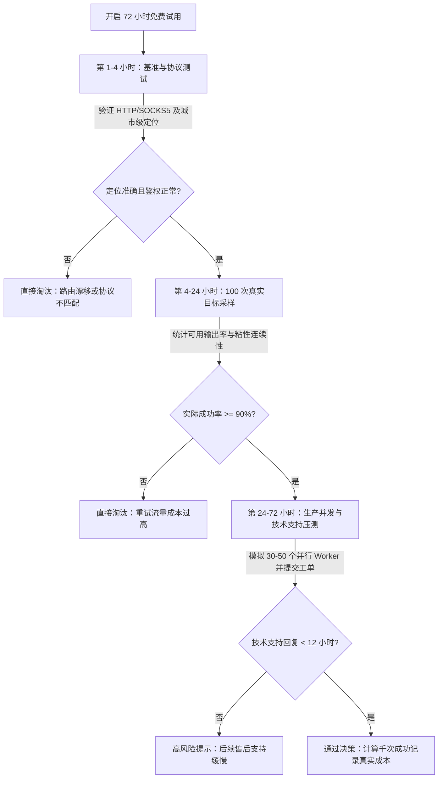

> **工程审核说明：** 本指南由 BytesFlows 代理网络架构团队于 **2026 年 7 月** 维护。测试方法论适用于公开网页数据采集、SEO 监控及 Playwright 浏览器自动化团队。

住宅代理免费试用（Free Trial）最核心的目的是回答一个问题：**这个代理池能否在可预测的成本下，稳定支撑你的真实生产工作流？**

许多团队把免费试用当成“连通性 Demo”：在命令行里用 `curl` 测两三个简单 URL，看到返回了 IP 就以为测试通过。等到一周后把代理接入 Playwright 爬虫或分布式价格监控时，才发现目标国家定位不准、粘性会话（Sticky Session）过早失效、高并发时重试成本飙升，或是遭遇反爬策略时客服需要 48 小时才回复。

在评估 BytesFlows 或任何其他代理服务商前，请参考本文的系统化评估清单，并配合查看 [住宅代理服务](https://bytesflows.com/zh/proxies)、[按量计费透明价格](https://bytesflows.com/zh/pricing) 与 [代理指南资源中心](https://bytesflows.com/zh/resources/proxy-guides)。

---

## 72 小时免费试用决策流程图（Mermaid Tree）

评估不可凭感觉，请严格遵循以下 72 小时分阶段验证流程。任何环节触发红线（No-Go），即停止投入时间：

---

## 试用评估核对评分表（Markdown Scorecard）

不要仅凭记忆评估代理质量，请使用以下矩阵对比表。服务商不仅要技术连通，更必须在商业与运维层面符合团队预算：

| 评估维度 | 衡量指标 | 核心意义 | 健康信号 (Go) | 风险信号 (No-Go) |
| :--- | :--- | :--- | :--- | :--- |
| **可用输出率 (Success Rate)** | 成功解析的记录/页面数 ÷ 总尝试次数 | 比单纯的 HTTP 状态码更能体现真实业务价值 | ≥ 92% 稳定输出 | < 85%，重试消耗大量带宽 |
| **单次结果流量消耗** | 每个成功结果平均消耗的 KB / MB | 决定最终的 GB 带账单总额 | HTML < 200KB / 页面 | 无头浏览器单页消耗 > 5MB 且无优化空间 |
| **地区准确性 (Geo Accuracy)** | IP 归属地与请求的国家/城市/ASN 是否一致 | 错误的地理位置会导致电商价格与 SERP 排名失真 | 99% 命中请求地区 | 频繁出现跨国或跨州漂移 |
| **会话稳定性 (Session Stability)** | 粘性会话在多步操作中保持同一 IP 的时长 | 购物车、登录验证与表单提交必须依赖稳定会话 | 稳定保持 10-30 分钟 | 请求 2-3 次后 IP 意外跳变 |
| **协议适配度 (Protocol Fit)** | 你的技术栈对 HTTP、HTTPS 与 SOCKS5 的兼容 | 避免在爬虫管道中临时重构底层网络组件 | 完美支持 SOCKS5 与 HTTP | 仅支持 HTTP，无 SOCKS5 选项 |
| **重试流量成本 (Retry Overhead)** | 因超时或封禁导致的重试流量占比 | 低单价但重试多的方案，真实综合成本往往更高 | 重试流量增幅 < 5% | 重试额外多消耗 20%+ 带宽 |
| **定价透明度 (Pricing Clarity)** | 试用期用量能否直接推导出生产费用 | 避免“前低后高”的阶梯定价和隐藏门槛 | 纯按量计费，无最低消费 | 强制要求 $500+/月 预存承诺 |
| **支持质量 (Support Quality)** | 遇到反爬或路由封禁时工单的响应与专业度 | 决定了生产环境发生故障时的恢复速度 | < 12 小时提供精准技术回复 | 回复仅为模板话术或 > 24 小时 |

---

## 10 项免费试用核心验收清单

### 1. 验证试用流量足够支撑真实压测
很多服务商只提供 100MB 或 500MB 试用，这对于复杂的 Playwright 自动化测试只是杯水车薪。一个合格的试用评估至少需要 **1 GB** 流量（如 [BytesFlows 免费试用](https://bytesflows.com/zh/register) 提供 1GB），以便在实际目标站上运行至少数百次完整请求。

### 2. 必须用真实目标站测试，而不是 IP 归属地查询站
访问 `ipinfo.io` 或 `httpbin.org` 只能证明代理能连网。你应该直接测试生产环境要抓取的电商商品页、搜索引擎结果页（SERP）或公开数据接口。

### 3. 测试 SOCKS5 与 HTTP/HTTPS 双协议
如果你使用 Puppeteer、Playwright 或 Scrapling 等自动化框架，SOCKS5 协议通常能提供更底层的传输效率与更少的证书泄露风险。请务必在试用期确认 SOCKS5 端口的稳定性。

### 4. 测量 P50 与 P95 尾部延迟
平均延迟（P50）反映正常情况下的速度，而 P95 延迟决定了自动化管道是否会因为超时发生雪崩。请严格记录长尾延迟，并将超时门槛设在合理的区间（建议 12-15 秒）。

### 5. 审查会话连续性（Sticky Sessions）
对于需要保持状态的采集（如先查询列表、再点击进入详情页），必须请求粘性会话并测试其生存周期。在 BytesFlows 中，你可以通过传入会话参数控制 IP 保持时间达 30 分钟。

### 6. 验证城市级与 ASN 级定位
在局部市场竞争监控或广告验证中，国家级定位远远不够。测试通过指定国家代码与城市参数，确认 IP 是否精准落入目标城市区划。

### 7. 模拟高并发连接限制
如果你的生产架构由 50 个以上的异步 Worker 驱动，在试用期间请直接开到生产同等并发度，观察是否会出现 `429 Too Many Requests` 或连接池被服务商强行熔断。

### 8. 计算重试带来的隐藏带宽开销
如果目标站有 10% 的概率返回验证码，你的重试策略就会额外多消耗 10% 甚至更多的带宽。在试用期结束前，一定要用“消耗的总 GB ÷ 成功入库的数据条数”，算出一千条有效数据的真正成本。

### 9. 确认零最低月消费与自动续费陷阱
审视服务商的条款：是真正的按量付费（Pay-as-you-go），还是试用期结束后自动扣取高额捆绑套餐？BytesFlows 坚持无最低消费门槛、不过期不作废的透明模式。

### 10. 压测技术支持的解决能力
在试用第 2 天主动提交一个技术工单（例如询问针对 Cloudflare 403 的头部配置建议），测试客服是客服机器人回复，还是真正懂网络协议的工程师协助。

---

## 总结：如何将试用结果转化为采购汇报

试用结束时，请向团队或财务呈现一份定量报告：
* **目标网站：** `example-retail.com`
* **总尝试次数：** 1,000 次
* **成功获取有效 DOM 数：** 964 次（成功率 96.4%）
* **总消耗带宽：** 185 MB
* **千次有效数据成本：** `0.185 GB × $2.50/GB = $0.4625`

通过这套方法论，你将不再被“千万级 IP 池”的空洞营销吸引，而是基于真实的数据管线产出，做出最稳妥的采购选择。立即前往 [BytesFlows 控制台](https://bytesflows.com/zh/register) 领取 1GB 测试额度，开启你的系统化评估。
