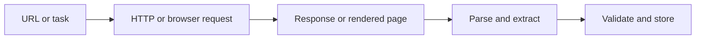

## Web Scraping Works by Turning Web Pages into Structured Inputs for Software
At a high level, web scraping sounds simple: request a page, parse the response, extract the data. That description is accurate, but incomplete. In real workflows, scraping is a chain of steps that starts before the parser and often continues long after the HTML is received.
That is why understanding how web scraping works behind the scenes is useful. It helps explain why some pages scrape easily, why others need browsers or proxies, and why scraping becomes an infrastructure problem once it scales.
This guide walks through the actual mechanics of web scraping, from requests and responses to parsing, browser rendering, retries, proxies, and production pipelines. It pairs naturally with [web scraping architecture explained](https://bytesflows.com/en/blog/web-scraping-architecture-explained), [browser automation for web scraping](https://bytesflows.com/en/blog/browser-automation-web-scraping), and [how proxy rotation works](https://bytesflows.com/en/blog/how-proxy-rotation-works).
## The Core Loop: Request, Receive, Parse, Extract
Most scraping systems revolve around a simple loop:
- send a request
- receive a response
- parse the content
- extract the needed fields
On a basic static page, that may be enough. But modern websites often add more layers: JavaScript rendering, rate limits, fingerprinting, browser checks, and geo-sensitive content.
That is why the basic loop is only the foundation.
## Step 1: Sending the Request
A scraper starts by making an HTTP request to a target URL.
That request can include:
- headers such as `User-Agent` and `Accept-Language`
- cookies or session values
- proxy routing information
- timing and retry behavior controlled by the scraper
This step matters because the site does not only see the URL being requested. It also sees how the request looks and where it appears to come from.
## Headers and Request Identity
Headers help the site interpret the request context.
For scraping, that often means:
- whether the request looks browser-like or tool-like
- which language or locale appears preferred
- whether the client is reusing cookies or state
- whether the request signature feels suspicious
This is one reason beginner scrapers often get blocked: the request technically works, but the identity profile looks obviously automated.
## Step 2: Receiving the Response
Once the site accepts the request, it sends back a response.
That response may be:
- HTML
- JSON
- partial page shell plus client-side rendering hooks
- a block page or challenge page instead of the real content
This is where scraping starts to diverge. The scraper may receive valid content, or it may receive something that only looks like success until you inspect it more carefully.
## Static vs Dynamic Responses
A major difference in scraping is whether the content is:
### Static
The useful data is already present in the initial HTML or JSON response.
### Dynamic
The initial response is incomplete, and the real content appears only after JavaScript runs in a browser.
This distinction is critical because a parser cannot extract content that never arrived in the response in the first place.
## Step 3: Parsing the Content
If the response contains usable content, the scraper parses it into a structure it can navigate.
Common approaches include:
- CSS selectors
- XPath
- direct JSON parsing
- regex for limited use cases
- model-based extraction for variable layouts
The goal is to turn raw page content into machine-usable fields.
## Step 4: Extracting Structured Data
After parsing, the scraper extracts the specific values it needs.
Examples include:
- titles
- prices
- links
- product attributes
- seller names
- article metadata
This is the point where the scraper turns page content into structured output such as JSON, CSV rows, database inserts, or downstream API payloads.
## Why Browsers Sometimes Become Necessary
When the response is only a shell and the real content is rendered client-side, a simple HTTP client is no longer enough.
That is where browser automation tools such as Playwright come in. They:
- load the page like a real browser
- execute JavaScript
- wait for rendered elements
- allow interaction such as scrolling or clicking
- expose the final rendered DOM for extraction
This is why browser automation is a scraping layer, not just a debugging convenience.
## Why Proxies Matter in the Request Path
As scraping volume grows, request identity becomes a limiting factor.
Without proxies, the site may see:
- one IP making repeated requests
- cloud or datacenter origin
- suspiciously concentrated traffic
- wrong geography for the content being requested
Proxies change the visible source of the request, while rotation changes how that identity is distributed over time.
Related background from [best proxies for web scraping](https://bytesflows.com/en/blog/best-proxies-for-web-scraping), [how residential proxies improve scraping success](https://bytesflows.com/en/blog/residential-proxies-improve-scraping), and [web scraping proxy architecture](https://bytesflows.com/en/blog/web-scraping-proxy-architecture) fits directly into this layer.
## What Happens When the Request Fails
Real scraping systems also need to handle failure states such as:
- 403 or 429 responses
- CAPTCHA or challenge pages
- timeouts
- incomplete content
- broken selectors after a site change
That is why robust scraping includes:
- retries
- backoff
- session or IP switching
- monitoring and alerting
- validation of extracted output
A scraper that cannot handle failure is really just a parser with optimistic assumptions.
## How Scraping Works at Scale
At production scale, the scraping loop is usually embedded inside a larger system:
- queues hold pending URLs or tasks
- workers fetch pages
- proxies route traffic identity
- browsers are used only where needed
- extracted data is validated and stored
- monitoring tracks success rate and block rate
This is why large scraping systems look more like distributed pipelines than like single scripts.
## A Practical End-to-End Flow
A useful mental model looks like this:

That is the real lifecycle behind most scraping systems.
## Common Mistakes
### Assuming every page can be scraped with one request and one parser
Modern sites often need more than that.
### Treating the response as valid just because the status code is 200
Challenge pages and partial shells can still return 200.
### Ignoring request identity
How the request looks matters as much as the URL requested.
### Skipping validation after extraction
Bad parsing can quietly create bad data.
### Thinking scale only means “more requests”
Scale also means queues, retries, proxies, browsers, and monitoring.
## Best Practices for Understanding and Building Scrapers
### Start by inspecting the real response
Do not assume the target page behaves like a simple static site.
### Separate fetching from parsing in your mental model
This makes debugging much easier.
### Use browser automation only when the target requires it
Do not pay browser cost on easy pages.
### Treat proxies and retries as part of the request system
Not just as late-stage add-ons.
### Validate extracted data before trusting the pipeline
A successful request is not the same as a successful extraction.
## Conclusion
Web scraping works by turning web responses into structured data, but the real process is broader than “download HTML and parse it.” A scraper sends requests, manages identity, receives sometimes-incomplete content, optionally renders the page in a browser, extracts fields, handles failures, and stores validated output.
Once you understand those layers, many common scraping problems become easier to diagnose. Empty HTML usually means rendering. 403s usually mean identity or rate pressure. Flaky pipelines often mean the system needs better retries, validation, or architecture. That is what makes scraping less mysterious: behind the scenes, it is a sequence of well-defined steps that become more complex only as the web and the workload become more demanding.
If you want the strongest next reading path from here, continue with [web scraping architecture explained](https://bytesflows.com/en/blog/web-scraping-architecture-explained), [browser automation for web scraping](https://bytesflows.com/en/blog/browser-automation-web-scraping), [how proxy rotation works](https://bytesflows.com/en/blog/how-proxy-rotation-works), and [best proxies for web scraping](https://bytesflows.com/en/blog/best-proxies-for-web-scraping).
## Further reading
- [Web scraping architecture explained](https://bytesflows.com/en/blog/web-scraping-architecture-explained)
- [Browser automation for web scraping](https://bytesflows.com/en/blog/browser-automation-web-scraping)
- [How proxy rotation works](https://bytesflows.com/en/blog/how-proxy-rotation-works)
- [Best proxies for web scraping](https://bytesflows.com/en/blog/best-proxies-for-web-scraping)
- [Residential proxies](https://bytesflows.com/en/blog/residential-proxies)
- [Playwright web scraping at scale](https://bytesflows.com/en/blog/playwright-web-scraping-scale)
- [Using LLMs to extract web data](https://bytesflows.com/en/blog/using-llms-extract-web-data)
