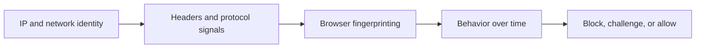

## Websites Detect Web Scrapers by Combining Signals Across Multiple Layers
Many developers imagine scraper detection as a simple blacklist problem: too many requests, bad user-agent, instant block. Modern websites usually do more than that. They combine signals from network identity, request shape, browser behavior, and timing to build an overall judgment about whether the session looks human or automated.
That is why scraping detection often feels mysterious. The scraper may not be failing for one obvious reason—it may be failing because several small signals combine into one strong suspicion score.
This guide explains how websites detect web scrapers in practice, from IP reputation and TLS fingerprints to browser fingerprinting and behavioral analysis. It pairs naturally with [common web scraping challenges](https://bytesflows.com/blog/common-web-scraping-challenges), [bypass Cloudflare for web scraping](https://bytesflows.com/blog/bypass-cloudflare-web-scraping), and [avoid IP bans in web scraping](https://bytesflows.com/blog/avoid-ip-bans-web-scraping).
## Detection Starts Before the Page Even Loads
The website learns a lot before your scraper ever reaches the parser stage.
At the network layer, it can evaluate:
- IP address reputation
- ASN or network type
- region and geography
- request frequency from that identity
- whether the traffic resembles cloud or consumer access
This is why a scraper can fail before the page content itself matters.
## IP Reputation and Network Type
One of the strongest early signals is where the request comes from.
### Datacenter traffic
Often looks higher risk on consumer-facing sites because those ranges are easy to classify and frequently associated with automation.
### Residential traffic
Often gets more cautious treatment because it looks closer to ordinary user traffic.
This is why proxy choice changes detection risk so much even when the request body and parser logic stay the same.
## Rate and Volume Patterns
Even a trusted IP can become suspicious if the traffic pattern is too concentrated.
Websites look for signs such as:
- too many requests in a short period
- coordinated-looking parallel traffic
- repeated access patterns with low variation
- spikes that do not resemble ordinary browsing
This is why pacing and concurrency control matter just as much as IP quality.
## Headers and Request Signatures
The site can also inspect the request itself.
That includes:
- user-agent
- language preferences
- compression support
- header consistency
- sometimes even header order patterns
A request that claims to be Chrome but lacks a coherent browser-like signature becomes easier to distrust.
## TLS and Protocol-Level Signals
Detection is not limited to HTTP headers.
Sites can also use protocol-level behavior such as:
- TLS handshake characteristics
- how the client negotiates the session
- how protocol behavior differs from real browsers
This is one reason simple HTTP clients often fail on stricter targets even when their visible headers look convincing. The browser-like appearance may not hold below the header layer.
## Browser Fingerprinting
Once the session reaches a browser-sensitive target, websites can inspect far more than the raw request.
They may evaluate:
- JavaScript-exposed browser properties
- viewport and screen characteristics
- graphics and rendering signals
- storage, cookies, and session behavior
- automation leaks from headless environments
This is why real browser automation often performs differently from request-only scraping. The site is evaluating the runtime, not just the network.
## Behavioral Detection
Many anti-bot systems also score behavior over time.
That can include:
- timing between actions
- scrolling and navigation patterns
- whether activity looks perfectly mechanical
- whether the browsing sequence makes sense for a human session
A session that is technically valid can still be detected if its rhythm looks too synthetic.
## The Signals Work Together
The most important idea is that these signals usually combine.
A website may tolerate one weak signal. But several weak signals at once—such as:
- datacenter IP
- request-only client
- mismatched headers
- fast repetitive timing
can produce a much stronger block or challenge response than any single issue alone.
This is why scraper detection is best understood as multi-layer scoring.
## A Practical Detection Model
A useful mental model looks like this:

This shows why scraper reliability depends on more than just writing correct extraction code.
## Common Mistakes
### Assuming user-agent changes are enough
They only affect one visible layer.
### Treating detection as purely about request count
Protocol and browser signals matter too.
### Ignoring browser-side leaks on dynamic targets
The site may care more about runtime than raw HTML access.
### Overlooking behavior and pacing
Mechanical rhythm still gets noticed.
### Fixing one layer while leaving several others weak
Detection often comes from combined weakness, not one single flaw.
## Best Practices for Reducing Detection Risk
### Improve IP trust where the target requires it
Residential routing often matters early.
### Keep request identity coherent
Headers, locale, region, and browser behavior should make sense together.
### Use browser automation where browser runtime matters
Do not expect plain HTTP clients to pass browser-level checks on strict targets.
### Control pacing and concurrency
Good infrastructure still fails if the browsing rhythm is unrealistic.
### Diagnose detection by layer
Know whether the problem is network identity, request signature, browser runtime, or behavior.
Helpful support tools include [Proxy Checker](https://bytesflows.com/blog/proxy-checker), [Scraping Test](https://bytesflows.com/blog/scraping-test-tool-detect-blocks), and [Proxy Rotator Playground](https://bytesflows.com/blog/proxy-rotator).
## Conclusion
Websites detect web scrapers by combining multiple signals: IP reputation, request and protocol patterns, browser fingerprinting, and behavioral timing. The result is not usually a single-rule blocklist. It is a broader confidence judgment about whether the session looks believable.
That is why successful scraping is not only about extraction logic. It is about reducing suspicion across every visible layer of the session. Once you understand detection that way, block patterns stop feeling mysterious and start becoming diagnosable system feedback.
If you want the strongest next reading path from here, continue with [common web scraping challenges](https://bytesflows.com/blog/common-web-scraping-challenges), [bypass Cloudflare for web scraping](https://bytesflows.com/blog/bypass-cloudflare-web-scraping), [avoid IP bans in web scraping](https://bytesflows.com/blog/avoid-ip-bans-web-scraping), and [playwright proxy configuration guide](https://bytesflows.com/blog/playwright-proxy-configuration-guide).
## Further reading
- [Common web scraping challenges](https://bytesflows.com/blog/common-web-scraping-challenges)
- [Bypass Cloudflare for web scraping](https://bytesflows.com/blog/bypass-cloudflare-web-scraping)
- [Avoid IP bans in web scraping](https://bytesflows.com/blog/avoid-ip-bans-web-scraping)
- [Playwright proxy configuration guide](https://bytesflows.com/blog/playwright-proxy-configuration-guide)
- [Best proxies for web scraping](https://bytesflows.com/blog/best-proxies-for-web-scraping)
- [Residential proxies](https://bytesflows.com/blog/residential-proxies)
- [Browser automation for web scraping](https://bytesflows.com/blog/browser-automation-web-scraping)
