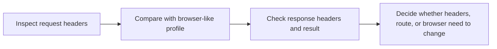

## HTTP Header Checker Helps You Inspect One of the Most Visible Layers of Request Identity
A scraper often fails not because the parser is wrong, but because the request identity looks weak. Default user-agents, missing browser-like headers, inconsistent language signals, or a client profile that does not match its claimed browser can all raise suspicion before the page content even matters.
That is why an HTTP header checker is useful. It shows what your client is really exposing so you can compare request profiles, spot contradictions, and decide whether the problem lives in headers, TLS behavior, route quality, or the broader browser environment.
This page explains what an HTTP header checker helps you inspect, how to interpret those signals, and when header fixes are enough versus when they are not. It pairs naturally with [Random User-Agent Generator](https://bytesflows.com/blog/user-agent-generator), [Scraping Test](https://bytesflows.com/blog/scraping-test), and [Proxy Checker](https://bytesflows.com/blog/proxy-checker).
## What This Tool Helps You Check
Use this checker to inspect:
- request headers
- response headers
- whether the claimed browser identity looks coherent
- whether supporting headers match the user-agent story
- whether TLS-related clues suggest a deeper mismatch than headers alone
This makes the tool useful when a target seems to treat one client differently from another and you want a clearer explanation.
## Why Header Inspection Matters
A lot of scraping workflows fail because the request profile looks obviously synthetic.
Common causes include:
- default library user-agents
- missing browser-like headers
- inconsistent Accept, language, or compression signals
- request profiles that claim Chrome but do not look like Chrome overall
- environments where TLS or protocol behavior undermines otherwise good-looking headers
This tool helps reveal what the target may be seeing at the request layer.
## Headers Are Only One Layer of Identity
One of the most important ideas is that correct-looking headers do not guarantee a correct-looking session.
Targets may also inspect:
- TLS handshake behavior
- browser runtime characteristics
- fingerprinting signals
- JavaScript execution
- request timing and behavior patterns
That is why some requests still get blocked even after the visible headers look much better.
## What to Look For When Comparing Clients
| Signal | Why it matters | Typical question |
| --- | --- | --- |
| **User-Agent** | Sets the most visible browser claim | Does the request still look like a default script? |
| **Supporting headers** | Show whether the browser story is coherent | Do Accept, language, and compression signals make sense together? |
| **Response headers** | Can reveal anti-bot systems, server behavior, or challenge hints | Is the target exposing signs of blocking or challenge logic? |
| **TLS or lower-level clues** | May reveal that the client still does not behave like a real browser | Is the mismatch deeper than HTTP headers alone? |
## When Header Fixes Are Often Enough
Header changes are often enough when:
- the site is lightly protected
- the main problem is a default tool signature
- the target only needs a more believable request surface
In those cases, correcting headers can improve pass rate quickly without needing full browser automation.
## When Header Fixes Are Not Enough
Header fixes often stop being enough when:
- the site runs JavaScript challenges
- the target evaluates browser runtime or fingerprinting
- TLS mismatch matters
- route quality is weak
- better headers still produce challenges or 403 responses
At that point, the problem is usually broader than one header set.
## A Practical Header Debugging Workflow
A useful workflow usually looks like this:

This helps keep header debugging tied to outcome rather than blind tweaking.
## Common Problems This Tool Reveals Early
This tool is particularly useful for spotting:
- default library signatures
- missing Accept or Accept-Language headers
- inconsistent request identity
- environments where browser claims do not match the rest of the request
- cases where changing headers helped less than expected because the real issue is deeper
These are often the first clues in understanding why one client passes and another gets challenged.
## Best Practices
### Test from the same environment you really use
Otherwise the result may not match production behavior.
### Compare a weak client profile against a stronger one
This often reveals which differences actually matter.
### Treat headers as one layer of identity, not the whole system
Do not stop debugging too early.
### Use this tool before scaling a new request setup
Inspection is cheaper than guessing.
### Move to real browser execution when the site clearly expects it
Header correction cannot replace runtime authenticity.
Helpful companion pages include [Random User-Agent Generator](https://bytesflows.com/blog/user-agent-generator), [Scraping Test](https://bytesflows.com/blog/scraping-test), [Proxy Checker](https://bytesflows.com/blog/proxy-checker), and [Browser Fingerprinting Explained](https://bytesflows.com/blog/browser-fingerprinting-explained).
## FAQ
### If my headers look like Chrome, am I safe?
Not necessarily. The target may still care about TLS behavior, browser runtime, or pacing.
### What is the most common header problem?
A default tool signature or a browser claim unsupported by the rest of the request is often the first obvious issue.
### When should I stop tuning headers and switch to browser automation?
When the target still challenges you despite coherent request headers and reasonable route quality.
### Why should I test from the same proxy or server I scrape from?
Because route, environment, and proxy path all affect what the target actually sees.
## Conclusion
An HTTP header checker is useful because it helps you inspect one of the most visible parts of request identity before you guess at the cause of blocking. It can quickly reveal default signatures, inconsistent browser claims, weak supporting headers, and cases where the issue is probably deeper than HTTP alone.
The practical lesson is simple: inspect first, then decide. Once you understand what your client is really sending, it becomes much easier to know whether the next step is better headers, better routes, or a real browser-based setup.
## Further reading
- [Random User-Agent Generator](https://bytesflows.com/blog/user-agent-generator)
- [Scraping Test](https://bytesflows.com/blog/scraping-test)
- [Proxy Checker](https://bytesflows.com/blog/proxy-checker)
- [Browser Fingerprinting Explained](https://bytesflows.com/blog/browser-fingerprinting-explained)
- [How Websites Detect Web Scrapers](https://bytesflows.com/blog/how-websites-detect-scrapers)
- [Bypass Cloudflare for Web Scraping](https://bytesflows.com/blog/bypass-cloudflare-web-scraping)
- [Best proxies for web scraping](https://bytesflows.com/blog/best-proxies-for-web-scraping)
