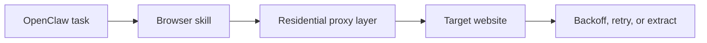

## Blocking Is Usually a System Problem, Not a Single Setting Problem
When OpenClaw scraping starts getting blocked, the first instinct is often to blame one thing: the proxy, the browser, or the target website. In practice, blocking usually comes from the combination of IP reputation, request timing, browser behavior, and repeated workflow patterns.
That is why avoiding blocks is not about one trick. It is about making the browsing workflow look less suspicious across several layers at once.
This guide explains why OpenClaw scraping workflows get blocked, what changes have the biggest impact, and how to reduce block rate with residential proxies, throttling, browser discipline, and better retry behavior. It pairs naturally with [why OpenClaw agents need residential proxies](https://bytesflows.com/blog/openclaw-residential-proxy), [OpenClaw proxy setup](https://bytesflows.com/blog/openclaw-proxy-setup), and [bypassing Cloudflare with OpenClaw and residential proxies](https://bytesflows.com/blog/openclaw-cloudflare-bypass).
## Why OpenClaw Workflows Get Blocked
OpenClaw often uses real browsers through Playwright-based skills, which gives it a stronger baseline than a raw HTTP script on many targets. But a real browser alone does not make the traffic trustworthy.
Sites still evaluate signals such as:
- IP reputation
- request frequency
- browser fingerprinting
- geo consistency
- session continuity
- navigation patterns that look automated
That is why the browser may be technically correct while the overall workflow still gets challenged or blocked.
## The First Problem Is Usually IP Reputation
If OpenClaw is running from a VPS, cloud server, or exposed datacenter IP, that identity can get scored harshly before the browser even has a chance to behave like a normal user.
This is why residential proxies are often the single biggest improvement. They make the browsing origin look more like normal user traffic and reduce the visibility of one server identity making repeated requests.
Related foundations include [residential proxies](https://bytesflows.com/blog/residential-proxies), [best proxies for web scraping](https://bytesflows.com/blog/best-proxies-for-web-scraping), and [rotating residential proxies for OpenClaw agents](https://bytesflows.com/blog/openclaw-rotating-proxy).
## The Second Problem Is Usually Request Density
Even good IPs can get blocked if the workflow is too aggressive.
Common examples include:
- opening too many pages too quickly
- revisiting the same target too often
- running too much concurrency per domain
- retrying immediately after failure
- repeating highly uniform interaction patterns
That is why throttling matters as much as proxies. A strong browsing identity does not help if the workflow still behaves like an obvious bot.
## Browser Realism Still Matters
OpenClaw often works through a real browser, which is a good foundation. But reliability still improves when the workflow stays close to normal browser behavior.
That usually means:
- keeping browser settings close to defaults
- avoiding strange header or JavaScript changes
- not stripping normal browser behavior unnecessarily
- matching session mode to the task
- using browser automation only where it is actually needed
The goal is not to simulate a human perfectly. The goal is to avoid unnecessary signals that make the workflow easier to classify as automation.
## Rotation Helps, but It Is Not a Universal Fix
Rotating residential proxies are powerful because they prevent one IP from carrying all the pressure. But they do not fix every class of block.
Rotation helps most when:
- requests are independent
- the workload is broad and stateless
- repeated access needs distribution
- multiple targets are being visited over time
Rotation helps less when the workflow really needs session continuity. In those cases, sticky sessions may work better than full rotation.
This is why the best question is not “Should I rotate?” but “Does this task need continuity or distribution?”
## Retry Logic Can Make Blocking Worse
One of the most overlooked anti-block issues is retry behavior.
A bad retry strategy often makes the system look more suspicious by:
- repeating failed requests too fast
- hitting the same target again with the same behavior
- amplifying one temporary problem into a larger burst
A better retry approach usually includes:
- backoff delays
- capped retry depth
- switching identity when appropriate
- logging what type of failure occurred
- separating block handling from normal network retries
## A Practical Anti-Block Architecture
A useful way to think about OpenClaw anti-block design is as a layered system.

Each layer matters:
- the browser skill controls interaction
- the proxy layer controls origin identity
- pacing controls traffic density
- retry logic controls recovery behavior
If one layer is weak, the whole workflow becomes easier to flag.
## Common Signs Your Workflow Needs Improvement
You likely need to rework the access layer if you see patterns such as:
- fast 403 or 429 responses
- sudden CAPTCHA after a short run
- one target failing repeatedly while others remain fine
- a browser skill that works manually but breaks under repetition
- success rate collapsing after scaling even though the code still “works”
These are often signs that the transport and pacing layers need improvement before more changes are made to extraction logic.
## Best Practices for Reducing Blocks
### Use residential proxies for repeated or protected workflows
This is often the highest-impact improvement.
### Slow down before adding more concurrency
Pacing often matters more than raw capacity.
### Keep the browser close to default behavior
Avoid unnecessary fingerprint changes unless you have a strong reason.
### Match session mode to the task
Use rotation for stateless workloads and sticky behavior where continuity matters.
### Validate against the real target
A passing IP test is not enough. The actual page behavior matters.
Helpful tools include [Proxy Checker](https://bytesflows.com/blog/proxy-checker), [Scraping Test](https://bytesflows.com/blog/scraping-test-tool-detect-blocks), and [Proxy Rotator Playground](https://bytesflows.com/blog/proxy-rotator).
## Common Mistakes
### Assuming a real browser alone is enough
It helps, but IP and pacing still matter.
### Treating residential proxies as unlimited bandwidth for aggression
Better transport does not eliminate block logic.
### Ignoring geo consistency
Some sites react badly when traffic location changes in unrealistic ways.
### Retrying too fast
This often turns a temporary issue into a pattern.
### Scaling before measuring
Without success-rate and challenge-rate visibility, optimization becomes guesswork.
## When You Still Get Blocked
If a workflow still gets blocked after adding proxies and pacing, the next likely causes are:
- target-specific anti-bot layers
- poor session continuity
- unrealistic browser workflow design
- geo mismatch
- extraction tasks that revisit the same pages too aggressively
This is when related articles like [bypassing Cloudflare with OpenClaw and residential proxies](https://bytesflows.com/blog/openclaw-cloudflare-bypass), [OpenClaw Playwright proxy configuration](https://bytesflows.com/blog/openclaw-playwright-proxy), and [large-scale data collection with OpenClaw and proxies](https://bytesflows.com/blog/openclaw-data-collection-scale) become especially relevant.
## Conclusion
Avoiding blocks when using OpenClaw for scraping is not about finding one secret switch. It is about aligning the browsing workflow across identity, pacing, browser realism, and recovery behavior.
Residential proxies usually improve the transport layer the most. Throttling reduces unnecessary pressure. Better retry logic prevents self-inflicted failures. And keeping the browser workflow realistic makes all of those improvements more effective. When those pieces work together, OpenClaw scraping becomes much more stable and predictable.
If you want the strongest next reading path from here, continue with [why OpenClaw agents need residential proxies](https://bytesflows.com/blog/openclaw-residential-proxy), [OpenClaw proxy setup](https://bytesflows.com/blog/openclaw-proxy-setup), [bypassing Cloudflare with OpenClaw and residential proxies](https://bytesflows.com/blog/openclaw-cloudflare-bypass), and [large-scale data collection with OpenClaw and proxies](https://bytesflows.com/blog/openclaw-data-collection-scale).
## Further reading
- [Why OpenClaw agents need residential proxies](https://bytesflows.com/blog/openclaw-residential-proxy)
- [OpenClaw proxy setup](https://bytesflows.com/blog/openclaw-proxy-setup)
- [Bypassing Cloudflare with OpenClaw and residential proxies](https://bytesflows.com/blog/openclaw-cloudflare-bypass)
- [Large-scale data collection with OpenClaw and proxies](https://bytesflows.com/blog/openclaw-data-collection-scale)
- [Residential proxies](https://bytesflows.com/blog/residential-proxies)
- [Best proxies for web scraping](https://bytesflows.com/blog/best-proxies-for-web-scraping)
- [Rotating residential proxies for OpenClaw agents](https://bytesflows.com/blog/openclaw-rotating-proxy)
