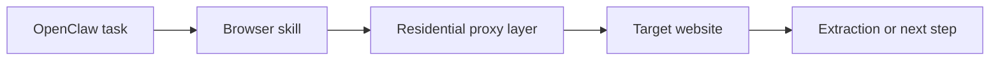

## Browser Automation Is the Engine Behind Most Serious OpenClaw Web Workflows
OpenClaw becomes especially useful when it can do more than fetch text. Its real power often comes from browser automation: opening pages, clicking through flows, waiting for rendered content, extracting data, and handling websites that behave differently in a real browser than in raw HTTP.
But browser automation also exposes the workflow more clearly to the target website. Once a real browser is involved, the site can evaluate not just the content request, but also the identity, session, pacing, and browsing behavior behind it.
This guide explains how browser automation works inside OpenClaw, why residential proxies matter for that layer, and how to think about rotating versus sticky sessions when the agent needs to browse reliably across stricter targets. It pairs naturally with [OpenClaw Playwright proxy configuration](https://bytesflows.com/en/blog/openclaw-playwright-proxy), [OpenClaw proxy setup](https://bytesflows.com/en/blog/openclaw-proxy-setup), and [why OpenClaw agents need residential proxies](https://bytesflows.com/en/blog/openclaw-residential-proxy).
## Why Browser Automation Matters in OpenClaw
Many modern sites do not behave cleanly under basic HTTP fetching.
Browser automation matters when the target:
- renders important content with JavaScript
- requires interaction before the data appears
- uses browser-aware challenge flows
- depends on cookies or client-side state
- behaves differently for real browsers and scripts
This is why OpenClaw browser skills are often built around Playwright or similar tools. The browser gives the agent a more realistic execution layer for web tasks.
## What the Browser Layer Actually Does
In practical terms, a browser-based OpenClaw skill often handles:
- launching Chromium or another engine
- opening the target page
- waiting for rendering or navigation
- interacting with forms, buttons, or filters
- extracting the resulting content
- returning structured output to the agent workflow
This is the layer where browsing stops being abstract and becomes observable by the target site.
## Why Residential Proxies Matter for Browser Automation
A real browser is useful, but it does not solve the network identity problem by itself.
If the browser launches from a VPS or cloud machine, the target often sees a datacenter IP. That can create:
- faster rate limits
- challenge pages
- 403 responses
- geo mismatch
- lower trust on stricter sites
Residential proxies improve this by routing the browser traffic through household or mobile IPs instead of exposing the host machine directly. That creates a more realistic transport identity and gives the browser behavior a better chance to succeed.
Related foundations include [residential proxies](https://bytesflows.com/en/blog/residential-proxies), [best proxies for web scraping](https://bytesflows.com/en/blog/best-proxies-for-web-scraping), and [running OpenClaw on a VPS with residential proxies](https://bytesflows.com/en/blog/openclaw-vps-proxy).
## The Practical Architecture
A useful way to think about browser automation in OpenClaw is this:

This matters because browser automation and proxy transport are two layers of the same reliability system. The browser handles interaction. The proxy handles identity and route quality.
## Where the Proxy Belongs
In OpenClaw, proxy configuration is usually placed where the browser launches, not in the general gateway layer.
That means the key point is typically:
- `chromium.launch(...)`
- a Playwright helper inside the skill
- a shared browser factory used across several skills
This is the place where outbound browsing identity is actually decided.
## Rotating vs Sticky Sessions for Browser Tasks
Not all browser automation tasks want the same proxy behavior.
### Rotating sessions
Best for:
- broad public browsing
- repeated independent page visits
- scraping many unrelated URLs
- stateless collection
### Sticky sessions
Best for:
- logged-in workflows
- multi-step browsing
- form flows or carts
- tasks that depend on continuity across steps
A common mistake is using full rotation for tasks that really need continuity. That can make the workflow less stable even when the IP quality is high.
## Browser Realism Still Matters
Residential proxies improve the origin identity, but the browser still needs to behave in a credible way.
That usually means:
- keeping browser configuration close to normal
- not adding unnecessary fingerprint anomalies
- pacing page loads realistically
- matching session mode to the workflow
- avoiding aggressive concurrency on one target
The goal is not to fake a human perfectly. It is to avoid making the automation unnecessarily easy to classify.
## Common Use Cases
### Web scraping on JavaScript-heavy sites
When the content only becomes visible after the browser runs.
### Research workflows
When the agent needs to browse several pages, compare content, and summarize findings.
### Protected site interaction
When a real browser is necessary just to access the usable page.
### Multi-step navigation
When the task includes filters, pagination, forms, or conditional flows.
### Data extraction plus action
When the workflow must both collect information and make browsing decisions during the run.
## Common Mistakes
### Assuming the browser alone is enough
A real browser helps, but weak IP identity still creates problems.
### Configuring proxies in the wrong place
For scraping workflows, the important proxy is the browser proxy, not just the inbound gateway layer.
### Using rotation where sticky continuity is needed
This can break forms, sessions, or login-dependent tasks.
### Scaling before validating the browsing pattern
A browser that works once may still fail badly under repeated use.
### Overcomplicating the browser setup
Unnecessary customizations can create more fingerprint risk than value.
## Best Practices for OpenClaw Browser Automation
### Use the browser only where it adds value
Do not pay browser cost for tasks that simple HTTP fetching can handle.
### Put residential proxy config at browser launch
That is where the traffic identity is actually chosen.
### Match session behavior to workflow design
Rotating for independent browsing, sticky for continuity-heavy tasks.
### Validate on the real target
The page you care about matters more than a generic test endpoint.
### Measure reliability over time
Track success rate, challenge rate, and latency before scaling up.
Helpful support tools include [Proxy Checker](https://bytesflows.com/en/blog/proxy-checker), [Scraping Test](https://bytesflows.com/en/blog/scraping-test-tool-detect-blocks), and [Proxy Rotator Playground](https://bytesflows.com/en/blog/proxy-rotator).
## Conclusion
OpenClaw browser automation is what makes many serious web workflows possible. It gives the agent a real browser environment for pages that depend on rendering, interaction, or browser-aware behavior.
But a real browser alone is not enough for reliable production use. Once the workflow becomes repeated, remote, or protected, residential proxies, correct session strategy, and careful pacing become part of the same system. When those pieces are aligned, OpenClaw browser automation becomes much more stable, useful, and scalable.
If you want the strongest next reading path from here, continue with [OpenClaw Playwright proxy configuration](https://bytesflows.com/en/blog/openclaw-playwright-proxy), [OpenClaw proxy setup](https://bytesflows.com/en/blog/openclaw-proxy-setup), [why OpenClaw agents need residential proxies](https://bytesflows.com/en/blog/openclaw-residential-proxy), and [avoiding blocks when using OpenClaw for scraping](https://bytesflows.com/en/blog/openclaw-ai-agent-anti-bot).
## Further reading
- [OpenClaw Playwright proxy configuration](https://bytesflows.com/en/blog/openclaw-playwright-proxy)
- [OpenClaw proxy setup](https://bytesflows.com/en/blog/openclaw-proxy-setup)
- [Why OpenClaw agents need residential proxies](https://bytesflows.com/en/blog/openclaw-residential-proxy)
- [Avoiding blocks when using OpenClaw for scraping](https://bytesflows.com/en/blog/openclaw-ai-agent-anti-bot)
- [Residential proxies](https://bytesflows.com/en/blog/residential-proxies)
- [Best proxies for web scraping](https://bytesflows.com/en/blog/best-proxies-for-web-scraping)
- [Running OpenClaw on a VPS with residential proxies](https://bytesflows.com/en/blog/openclaw-vps-proxy)
