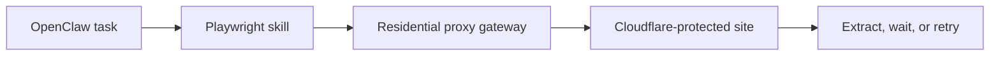

## Cloudflare Is Mostly a Trust Filter, Not Just a JavaScript Gate
When OpenClaw hits a Cloudflare-protected site, the first assumption is often that the browser is not realistic enough. Sometimes that is true. But in many cases, the deeper issue is trust: the request arrives from an identity or behavior pattern that Cloudflare already scores as risky.
That is why solving Cloudflare issues is rarely about one browser setting. It usually means improving several layers at once: the browsing identity, the browser environment, the session design, and the pacing of the workflow.
This guide explains why Cloudflare challenges OpenClaw workflows, how residential proxies change the trust profile, why Playwright still matters, and what changes usually reduce challenge rates in practice. It pairs naturally with [OpenClaw proxy setup](https://bytesflows.com/en/blog/openclaw-proxy-setup), [OpenClaw Playwright proxy configuration](https://bytesflows.com/en/blog/openclaw-playwright-proxy), and [avoiding blocks when using OpenClaw for scraping](https://bytesflows.com/en/blog/openclaw-ai-agent-anti-bot).
## Why Cloudflare Challenges OpenClaw Workflows
Cloudflare evaluates much more than whether JavaScript executes successfully.
Common signals include:
- IP reputation
- browser fingerprint quality
- request pacing
- session continuity
- geo consistency
- repeated navigation patterns
That means OpenClaw can use a real browser and still face challenge pages if the overall workflow looks like automated traffic. A real browser helps, but it does not automatically create trust.
## Why Datacenter Traffic Often Starts at a Disadvantage
If OpenClaw runs from a VPS or cloud environment, its raw outbound traffic usually comes from a datacenter IP. Many Cloudflare-protected sites score those ranges more aggressively than residential traffic.
That is why Cloudflare problems often feel inconsistent: the same workflow may behave differently when run from a local environment, from a VPS, or through different proxy layers. The browser code may be unchanged, but the trust profile is not.
## What Residential Proxies Actually Improve
Residential proxies help because they:
- make the traffic origin look more like consumer browsing
- reduce obvious server-IP exposure
- support more realistic geo positioning
- allow rotating or sticky session strategies
- improve retry chances on stricter targets
This does not mean residential traffic magically defeats every Cloudflare challenge. It means the workflow starts from a more credible browsing identity, which gives the browser behavior a better chance to matter.
Related background from [residential proxies](https://bytesflows.com/en/blog/residential-proxies), [best proxies for web scraping](https://bytesflows.com/en/blog/best-proxies-for-web-scraping), and [why OpenClaw agents need residential proxies](https://bytesflows.com/en/blog/openclaw-residential-proxy) fits directly into this topic.
## Why Playwright Still Matters
Cloudflare-protected targets often require a real browser context because:
- challenge scripts must run
- browser state affects trust scoring
- pages can depend on client-side behavior
- raw HTTP fetches may never reach usable content
This is why Playwright-based skills remain central to OpenClaw workflows on Cloudflare-protected sites. The correct model is not “browser or proxy.” It is “browser plus a better trust profile.”
## A Practical Architecture
A useful Cloudflare-aware workflow often looks like this:

This makes the layered nature of the problem easier to see:
- Playwright handles rendering and interaction
- the proxy layer improves browsing identity
- pacing and session rules control behavior
- retry logic determines whether failures escalate or calm down
## Why Pacing Still Matters Even with Good Proxies
One of the biggest mistakes is assuming residential proxies remove the need for traffic discipline.
They do not.
Cloudflare still reacts to:
- repeated visits too quickly
- concurrency spikes on one target
- retries that happen too fast
- inconsistent session movement
- patterns that look more like automated probes than browsing
That is why pacing is a core part of Cloudflare reliability. Better origin trust helps, but behavior still matters.
## Rotation vs Sticky Sessions
Cloudflare-protected tasks do not all need the same proxy mode.
### Rotating residential proxies
Best for:
- broad stateless browsing
- repeated independent page requests
- discovery-style workflows
### Sticky sessions
Best for:
- multi-step browser tasks
- workflows that depend on continuity
- pages where cookies and identity should persist
Over-rotation in a continuity-heavy flow can make the workflow less believable rather than more believable. This is why session strategy has to match the task, not just the anti-bot goal.
## Common Signs the Workflow Needs Improvement
You likely need to improve the Cloudflare-facing workflow if you see:
- challenge pages appearing quickly after a few successful loads
- better success locally than from server-based environments
- generic pages loading but the real target still failing
- failures increasing sharply when concurrency rises
- loops where challenge pages keep reappearing after retries
These patterns usually indicate that trust, pacing, or session behavior is misaligned.
## Best Practices for OpenClaw on Cloudflare-Protected Targets
### Use a real browser by default
Cloudflare often expects normal browser execution and page behavior.
### Add residential transport early
Do not wait until datacenter trust problems become the baseline.
### Keep browser behavior close to normal
Avoid unnecessary fingerprint or runtime changes unless you know why they help.
### Pace the workflow carefully
Better IPs improve trust, but rushed behavior still breaks the system.
### Validate on the real protected target
A generic IP page is not enough. You need to verify the actual site behavior.
Helpful support tools include [Proxy Checker](https://bytesflows.com/en/blog/proxy-checker), [Scraping Test](https://bytesflows.com/en/blog/scraping-test-tool-detect-blocks), and [Proxy Rotator Playground](https://bytesflows.com/en/blog/proxy-rotator).
## Common Mistakes
### Treating Cloudflare as only a rendering problem
It is also an IP trust and behavior problem.
### Running from a datacenter IP and hoping the browser alone is enough
Often that still leaves the workflow starting from a weak trust score.
### Retrying immediately after a challenge
This can reinforce the suspicious pattern instead of resolving it.
### Ignoring session continuity
Some protected workflows work better with stable identity than constant rotation.
### Scaling too early
Cloudflare often becomes much more hostile when repetition increases.
## When Residential Proxies Are Not Enough Alone
Even with strong residential transport, some targets still require careful handling of:
- browser state
- fingerprint consistency
- pacing
- retry logic
- session design
So the goal is not “one proxy and the challenge disappears.” The goal is to build a workflow Cloudflare is less likely to distrust from the beginning.
## Conclusion
Bypassing Cloudflare with OpenClaw is not really about breaking one challenge screen. It is about improving the overall trust profile of the workflow. Playwright gives the system a real browser environment. Residential proxies improve origin credibility. Pacing and session design reduce behavioral risk.
When those layers are aligned, OpenClaw becomes much more effective on Cloudflare-protected targets and much less dependent on brittle one-off workarounds.
If you want the strongest next reading path from here, continue with [avoiding blocks when using OpenClaw for scraping](https://bytesflows.com/en/blog/openclaw-ai-agent-anti-bot), [OpenClaw proxy setup](https://bytesflows.com/en/blog/openclaw-proxy-setup), [OpenClaw Playwright proxy configuration](https://bytesflows.com/en/blog/openclaw-playwright-proxy), and [large-scale data collection with OpenClaw and proxies](https://bytesflows.com/en/blog/openclaw-data-collection-scale).
## Further reading
- [Avoiding blocks when using OpenClaw for scraping](https://bytesflows.com/en/blog/openclaw-ai-agent-anti-bot)
- [OpenClaw proxy setup](https://bytesflows.com/en/blog/openclaw-proxy-setup)
- [OpenClaw Playwright proxy configuration](https://bytesflows.com/en/blog/openclaw-playwright-proxy)
- [Large-scale data collection with OpenClaw and proxies](https://bytesflows.com/en/blog/openclaw-data-collection-scale)
- [Residential proxies](https://bytesflows.com/en/blog/residential-proxies)
- [Best proxies for web scraping](https://bytesflows.com/en/blog/best-proxies-for-web-scraping)
- [Why OpenClaw agents need residential proxies](https://bytesflows.com/en/blog/openclaw-residential-proxy)
