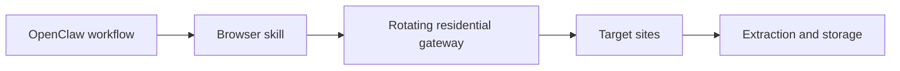

## Scale Breaks Collection Systems at the Traffic Layer Before It Breaks Them Anywhere Else
OpenClaw can coordinate browser-driven workflows that collect data across many pages, many sites, and many repeated runs. That makes it useful for market intelligence, research pipelines, monitoring jobs, and broader web data collection.
But once those workflows grow, the failure pattern changes. The biggest problem is no longer whether the agent can extract the field. It is whether the system can keep reaching the pages at all without collapsing under block rate, rate limits, or unstable session behavior.
This guide explains how to think about large-scale data collection with OpenClaw, why rotating residential proxies matter, how throttling and retries fit into the design, and what operational habits make scale sustainable instead of fragile. It pairs naturally with [OpenClaw proxy setup](https://bytesflows.com/en/blog/openclaw-proxy-setup), [rotating residential proxies for OpenClaw agents](https://bytesflows.com/en/blog/openclaw-rotating-proxy), and [how many proxies do you need](https://bytesflows.com/en/blog/how-many-proxies-need-scraping).
## What “Large-Scale” Really Means
Large-scale does not just mean “a lot of URLs.” It usually means some combination of:
- high request volume
- repeated collection over time
- multiple source domains
- browser-based extraction
- growing concurrency across workers or tasks
This is important because each of those dimensions increases visibility. A system that works perfectly on a small batch may fail badly once it is asked to behave like a continuous collection engine.
## Why OpenClaw Needs Infrastructure Discipline at Scale
OpenClaw is valuable because it can coordinate tasks that include browsing, extraction, and decision-making. But that same flexibility can create heavier traffic patterns than teams expect.
A large-scale OpenClaw workflow may:
- launch many browser sessions
- visit many unrelated targets
- repeat similar actions across long runs
- retry failures automatically
- run from a VPS or cloud environment
All of that makes the transport layer one of the main determinants of whether the workflow stays alive.
## Why Rotating Residential Proxies Matter
At scale, repeated traffic from one visible IP or a small server-bound pool becomes easy to detect.
Rotating residential proxies help because they:
- spread request pressure across a wider pool
- reduce obvious datacenter exposure
- improve survival on stricter sites
- support geo-aware collection when needed
- make long-running collection jobs more resilient
This is why rotating residential infrastructure is often the default recommendation for OpenClaw workflows that are more than casual browsing. Related background from [residential proxies](https://bytesflows.com/en/blog/residential-proxies), [best proxies for web scraping](https://bytesflows.com/en/blog/best-proxies-for-web-scraping), and [why OpenClaw agents need residential proxies](https://bytesflows.com/en/blog/openclaw-residential-proxy) fits directly into this topic.
## The Practical Architecture
A common large-scale pattern looks like this:

This structure matters because it separates concerns clearly:
- OpenClaw coordinates the workflow
- the browser skill executes the task
- the proxy layer handles traffic identity
- the extraction layer turns responses into usable output
When scale problems appear, that separation makes debugging much easier.
## Why Throttling Matters as Much as Proxy Rotation
A major mistake at scale is thinking that adding a rotating proxy layer is enough.
It is not.
Scale depends on both traffic distribution and traffic behavior. Even with strong residential proxies, you still need to think about:
- delay between page loads
- concurrency per domain
- retry pacing
- whether requests are stateless or session-sensitive
- how quickly failed tasks are requeued
If rotation is the identity layer, throttling is the behavior layer. You need both.
## Retries Can Save the Workflow—or Destroy It
Retries are necessary at scale, but bad retry logic creates more problems than it solves.
Good retry behavior should:
- back off after failure
- avoid immediate repeat pressure
- use a fresh session or new path when appropriate
- distinguish between recoverable and unrecoverable failures
- keep failure metrics visible
Without that discipline, the workflow starts amplifying its own suspicious traffic, especially under challenge-heavy conditions.
## Common Large-Scale OpenClaw Use Cases
### Broad public data collection
Collecting many pages across multiple domains for research or analytics.
### Repeated market monitoring
Refreshing prices, listings, or availability across recurring schedules.
### Search and discovery workflows
Running repeated search-based exploration or result extraction.
### Multi-source knowledge ingestion
Gathering content for internal knowledge systems, RAG pipelines, or structured databases.
### Agent-assisted research at volume
Expanding from ad hoc tasks into repeated browsing programs.
Each of these looks slightly different, but they all create repeated access patterns that need traffic discipline.
## Common Scaling Mistakes
### Pushing concurrency before validating per-domain stability
This often turns a healthy pilot into a broken production workflow.
### Ignoring target diversity
Different sites have different anti-bot tolerance. One rate does not fit every domain.
### Treating all failures as identical
Some failures mean retry. Others mean slow down, change session mode, or reduce scope.
### Running from a server IP without proper transport
This is often enough to make scale unreliable before optimization even starts.
### Measuring volume but not quality
A high request count means nothing if success rate and output quality are poor.
## Best Practices for Large-Scale Data Collection
### Start with small stable workloads
Scale should be earned through validation, not assumed at launch.
### Separate domain policies when possible
Different targets often need different pacing, retries, and proxy behavior.
### Use rotating residential proxies for repeated public collection
This reduces concentration risk across long-running jobs.
### Monitor more than request count
Track success rate, latency, challenge rate, and extraction quality.
### Keep browser skills predictable
At scale, small instability in browser execution becomes expensive quickly.
Helpful validation and support tools include [Proxy Checker](https://bytesflows.com/en/blog/proxy-checker), [Scraping Test](https://bytesflows.com/en/blog/scraping-test-tool-detect-blocks), and [Proxy Rotator Playground](https://bytesflows.com/en/blog/proxy-rotator).
## How to Think About Proxy Pool Size
Large-scale collection also raises the question of capacity.
The important variables usually include:
- target strictness
- request frequency
- concurrency level
- whether sessions must stay sticky
- how much failure margin is acceptable
That is why pool sizing is not just a purchasing question. It is part of workload design. For deeper planning, [how many proxies do you need](https://bytesflows.com/en/blog/how-many-proxies-need-scraping) and [proxy rotation strategies](https://bytesflows.com/en/blog/proxy-rotation-strategies) are strong next reads.
## Legal and Operational Boundaries
Scale increases operational risk as well as technical risk.
When running large collection workflows, you should still account for:
- terms of service
- robots.txt and access expectations
- personal data handling
- business risk of repeated automated access
- the difference between public collection and over-aggressive automation
That is why background from [is web scraping legal](https://bytesflows.com/en/blog/is-web-scraping-legal) and [web scraping legal considerations](https://bytesflows.com/en/blog/web-scraping-legal-considerations) remains relevant even when the main focus is infrastructure.
## Conclusion
Large-scale data collection with OpenClaw works best when scale is treated as a systems problem, not just a browser problem. The real challenge is not only getting the data once. It is sustaining access, extraction quality, and workflow stability as the number of pages, domains, and runs grows.
That is why rotating residential proxies, throttling, retries, and clear browser skill design belong in the same conversation. When those layers are designed together, OpenClaw can support large-scale collection without turning every growth step into a block-rate crisis.
If you want the strongest next reading path from here, continue with [rotating residential proxies for OpenClaw agents](https://bytesflows.com/en/blog/openclaw-rotating-proxy), [how many proxies do you need](https://bytesflows.com/en/blog/how-many-proxies-need-scraping), [OpenClaw proxy setup](https://bytesflows.com/en/blog/openclaw-proxy-setup), and [avoiding blocks when using OpenClaw for scraping](https://bytesflows.com/en/blog/openclaw-ai-agent-anti-bot).
## Further reading
- [Rotating residential proxies for OpenClaw agents](https://bytesflows.com/en/blog/openclaw-rotating-proxy)
- [How many proxies do you need](https://bytesflows.com/en/blog/how-many-proxies-need-scraping)
- [OpenClaw proxy setup](https://bytesflows.com/en/blog/openclaw-proxy-setup)
- [Avoiding blocks when using OpenClaw for scraping](https://bytesflows.com/en/blog/openclaw-ai-agent-anti-bot)
- [Residential proxies](https://bytesflows.com/en/blog/residential-proxies)
- [Best proxies for web scraping](https://bytesflows.com/en/blog/best-proxies-for-web-scraping)
- [Proxy rotation strategies](https://bytesflows.com/en/blog/proxy-rotation-strategies)
