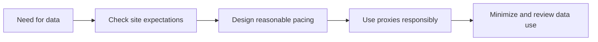

## Ethical Scraping Is About Workflow Design, Not Just Good Intentions
OpenClaw makes web workflows more powerful by combining browsing, extraction, and automation. That power also raises the stakes. Once an agent can access many pages quickly, the difference between useful automation and irresponsible automation is no longer abstract—it shows up in the traffic pattern, the data collected, and the burden placed on the target site.
That is why ethical scraping is not just a statement of intent. It is a design choice.
This guide explains what ethical scraping means in the context of OpenClaw, how robots.txt, throttling, proxy use, and legal boundaries fit together, and why long-term sustainable workflows usually outperform aggressive ones anyway. It pairs naturally with [OpenClaw for web scraping and data extraction](https://bytesflows.com/en/blog/openclaw-web-scraping), [avoiding blocks when using OpenClaw for scraping](https://bytesflows.com/en/blog/openclaw-ai-agent-anti-bot), and [OpenClaw for lead gen, research, and outreach](https://bytesflows.com/en/blog/openclaw-lead-generation-proxy).
## Why Ethics Matters More Once Workflows Scale
A single research task may create very little risk. A repeated or large-scale OpenClaw workflow can create very different consequences.
Ethics matters because scraping choices affect:
- the target site’s infrastructure load
- your legal and contractual risk
- the quality and reputation of your project
- whether the workflow remains sustainable over time
- how personal or sensitive data is handled
A workflow that ignores those questions may still “work” technically for a while, but it becomes harder to justify, harder to maintain, and often more fragile in the long run.
## Start with Access Expectations
Ethical scraping begins with understanding what access the site appears to permit or restrict.
That usually means looking at:
- robots.txt
- terms of service
- visible access policies
- whether the data appears public or access-controlled
- whether the workflow is likely to create unusual load or disruption
This does not always produce a perfect legal answer, but it gives you a much better operational and ethical baseline than pretending every public page is automatically fair game.
## Robots.txt Matters Even When It Is Not the Whole Story
Robots.txt is not the only consideration, but it is an important one.
It helps clarify:
- which paths a crawler is discouraged from using
- whether automated access is being signaled as unwelcome
- whether a site distinguishes between different user agents
In practical terms, checking robots.txt is one of the clearest ways to align scraping behavior with visible site expectations. Related tools and guidance around robots.txt testing fit directly into this step.
## Throttling Is an Ethical Choice as Much as a Technical One
One of the easiest ways to make a workflow unethical is to behave as though the target has infinite tolerance.
Reasonable throttling helps because it:
- reduces server load spikes
- lowers the chance of disrupting the target service
- keeps browsing patterns closer to ordinary use
- decreases the pressure to use increasingly aggressive anti-block tactics
This is why pacing is not just about avoiding rate limits. It is part of respecting the practical limits of the systems you are accessing.
## Proxies Should Be Used to Distribute Reasonable Load, Not to Multiply Abuse
Residential proxies can be used responsibly, and they can also be misused.
Ethical use of proxies usually means:
- distributing reasonable load more safely
- avoiding concentration on one visible IP
- supporting legitimate location-sensitive access
- stabilizing workflows without turning them into aggressive collection systems
Unethical use often looks like:
- using proxies only to overpower visible rate limits
- multiplying already excessive traffic
- treating distributed load as permission to scrape irresponsibly
This is why proxy use has to be evaluated together with pacing, scope, and purpose. Related reading from [residential proxies](https://bytesflows.com/en/blog/residential-proxies), [rotating residential proxies for OpenClaw agents](https://bytesflows.com/en/blog/openclaw-rotating-proxy), and [why OpenClaw agents need residential proxies](https://bytesflows.com/en/blog/openclaw-residential-proxy) is useful here—but always as part of a broader workflow discipline.
## Personal Data Raises the Standard Further
If an OpenClaw workflow collects names, emails, profile details, or other personal data, the ethical bar rises immediately.
At that point, the workflow should consider:
- whether the collection is actually necessary
- whether the data should be minimized
- how it will be stored and secured
- whether legal frameworks like GDPR or similar may apply
- whether the downstream use is proportionate and defensible
Ethical scraping is not only about how the page is accessed. It is also about what happens to the data afterward.
## A Practical Ethical Framework for OpenClaw
A useful way to think about it is this:

This is not a legal checklist. It is an operational framework that helps keep the workflow aligned with sustainability and proportionality.
## Human Review Still Matters
This is especially important in workflows involving:
- lead generation
- outreach drafts
- profile-based research
- monitoring with potential personal data implications
- anything that could affect external people directly
A human in the loop adds judgment where the workflow has consequences beyond pure data collection. It also helps prevent the agent from moving from “assistive” to “over-automated” in ways that create unnecessary risk.
## Common Mistakes
### Treating ethics as only a legal question
Even a technically lawful workflow can still be overly aggressive or irresponsible.
### Using proxies as an excuse for more traffic
Distributed load is not the same as justified load.
### Ignoring robots.txt because it is “not binding enough”
That misses an important signal about site expectations.
### Collecting more personal data than the task needs
This increases both ethical and legal risk.
### Assuming success rate is the only metric that matters
A workflow can be effective and still be badly designed.
## Best Practices for Ethical OpenClaw Scraping
### Check visible site expectations first
That includes robots.txt and access posture.
### Keep request pace conservative
Do not scrape as though the target owes you unlimited throughput.
### Use proxies for stability, not aggression
Responsible distribution is different from multiplied pressure.
### Minimize data collection
Collect only what is actually needed for the task.
### Keep humans involved where judgment or outreach is involved
This is especially important for lead-gen and messaging-related workflows.
Helpful tools for validation and review include [Proxy Checker](https://bytesflows.com/en/blog/proxy-checker), [Scraping Test](https://bytesflows.com/en/blog/scraping-test-tool-detect-blocks), and broader legal or access-reference resources.
## Legal and Policy Considerations
Ethical scraping does not replace legal review. It complements it.
Important considerations still include:
- terms of service
- jurisdiction-specific legal rules
- data protection requirements
- user expectations and privacy norms
- whether official APIs or permissions are available instead
That is why related background from [is web scraping legal](https://bytesflows.com/en/blog/is-web-scraping-legal) and [web scraping legal considerations](https://bytesflows.com/en/blog/web-scraping-legal-considerations) remains essential.
## Conclusion
Ethical scraping with OpenClaw is not about avoiding automation. It is about making automation more responsible. The best workflows check access expectations, move at a reasonable pace, use proxies to stabilize rather than overwhelm, and minimize the data they collect.
That approach is not only more defensible. It is usually more durable. Sustainable workflows tend to survive longer, get blocked less aggressively, and create fewer downstream problems than systems built around extraction at any cost.
If you want the strongest next reading path from here, continue with [avoiding blocks when using OpenClaw for scraping](https://bytesflows.com/en/blog/openclaw-ai-agent-anti-bot), [OpenClaw for lead gen, research, and outreach](https://bytesflows.com/en/blog/openclaw-lead-generation-proxy), [OpenClaw proxy setup](https://bytesflows.com/en/blog/openclaw-proxy-setup), and [why OpenClaw agents need residential proxies](https://bytesflows.com/en/blog/openclaw-residential-proxy).
## Further reading
- [Avoiding blocks when using OpenClaw for scraping](https://bytesflows.com/en/blog/openclaw-ai-agent-anti-bot)
- [OpenClaw for lead gen, research, and outreach](https://bytesflows.com/en/blog/openclaw-lead-generation-proxy)
- [OpenClaw proxy setup](https://bytesflows.com/en/blog/openclaw-proxy-setup)
- [Why OpenClaw agents need residential proxies](https://bytesflows.com/en/blog/openclaw-residential-proxy)
- [Residential proxies](https://bytesflows.com/en/blog/residential-proxies)
- [Is web scraping legal](https://bytesflows.com/en/blog/is-web-scraping-legal)
- [Web scraping legal considerations](https://bytesflows.com/en/blog/web-scraping-legal-considerations)
