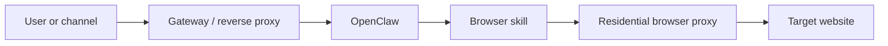

## “Proxy” Means Two Different Things in OpenClaw—and Confusing Them Breaks Scraping Setups
One of the most common mistakes in OpenClaw deployments is treating every mention of “proxy” as if it refers to the same thing. It does not.
In practice, OpenClaw environments often involve two very different proxy concepts:
- the **gateway or reverse proxy** that sits in front of OpenClaw for incoming traffic
- the **browser proxy** that controls outbound web traffic from browser automation
Only one of those helps with scraping, browsing identity, and anti-block reliability. That is the browser proxy.
This guide explains the difference between gateway proxying and browser proxying in OpenClaw, where each one belongs, and why residential proxy configuration for scraping should always live in the browser layer rather than being confused with reverse-proxy infrastructure. It pairs naturally with [OpenClaw proxy setup](https://bytesflows.com/blog/openclaw-proxy-setup), [OpenClaw Playwright proxy configuration](https://bytesflows.com/blog/openclaw-playwright-proxy), and [why OpenClaw agents need residential proxies](https://bytesflows.com/blog/openclaw-residential-proxy).
## The Two Proxy Layers
A simple way to understand the distinction is this:
### Gateway proxy
This is the infrastructure that handles traffic coming into OpenClaw itself.
Examples include:
- Nginx in front of OpenClaw
- Cloudflare Tunnel for inbound access
- a reverse proxy that manages SSL or routing
- trusted proxy headers used by the OpenClaw gateway
This layer is about inbound requests reaching OpenClaw safely.
### Browser proxy
This is the proxy used by the browser launched inside a skill or agent workflow.
Examples include:
- a residential proxy gateway in Playwright launch options
- rotating outbound browser traffic through residential IPs
- controlling geo-targeting or session identity for scraping
This layer is about outbound traffic leaving OpenClaw and reaching target websites.
## Why This Distinction Matters
If your goal is scraping, browsing protected sites, or reducing blocks, the proxy that matters is the browser proxy.
A reverse proxy in front of OpenClaw does not change the IP that target websites see when your browser skill opens pages. It only affects how traffic reaches OpenClaw itself.
This is why some teams believe they “configured a proxy” and still get blocked: the inbound layer was configured, but the outbound browser traffic was still leaving from the raw server IP.
## The Gateway Layer: What It Is For
The gateway layer is useful for:
- HTTPS termination
- request routing
- auth or access control
- trusted headers like `X-Forwarded-*`
- exposing OpenClaw safely behind another service
This is an infrastructure and deployment concern. It matters operationally, especially on VPS or production deployments, but it does not solve scraping identity or outbound anti-bot issues by itself.
## The Browser Layer: What It Is For
The browser layer is where web automation actually happens.
When an OpenClaw skill launches Playwright, that browser is what target sites see. If it is not configured with a proxy, its requests usually come from the machine where OpenClaw is running.
That is why browser proxying is the correct place to configure:
- residential proxies
- geo-targeting for browser tasks
- rotating or sticky session behavior
- outbound browsing identity for scraping workflows
This is the layer that matters for articles like [OpenClaw for web scraping and data extraction](https://bytesflows.com/blog/openclaw-web-scraping), [OpenClaw browser automation with residential proxies](https://bytesflows.com/blog/openclaw-browser-automation-proxy), and [large-scale data collection with OpenClaw and proxies](https://bytesflows.com/blog/openclaw-data-collection-scale).
## Where Residential Proxies Belong
Residential proxies should be configured where the browser is launched.
That usually means code paths such as:
- `chromium.launch(...)`
- a Playwright wrapper inside the skill
- a shared browser helper used by multiple skills
A typical pattern looks like this:
```javascript
const browser = await chromium.launch({
  proxy: {
    server: "http://p1.bytesflows.com:8001",
    username: "user",
    password: "pass"
  }
});
```
That one change affects the browsing identity of the automation workflow. A gateway reverse proxy does not do that.
## A Practical Architecture
A useful way to visualize the difference is this:

This makes the separation very clear:
- inbound traffic reaches OpenClaw through the gateway layer
- outbound traffic reaches target sites through the browser proxy layer
Those are different parts of the system with different purposes.
## Why Teams Mix Them Up
This confusion happens because both are called “proxy,” but they solve different problems.
The gateway proxy solves:
- how OpenClaw is exposed
- how inbound traffic is secured or routed
The browser proxy solves:
- how scraping traffic exits
- what IP identity the target sees
- how browser tasks handle geo and anti-bot pressure
The words sound similar, but operationally they are not interchangeable.
## Common Mistakes
### Configuring only the reverse proxy and assuming scraping is covered
This leaves browser traffic exposed on the raw host IP.
### Looking for a single global proxy setting inside OpenClaw
In most cases, browser proxying lives in skill code, not in one global gateway switch.
### Mixing deployment and traffic-identity concerns
These should be designed separately so they remain debuggable.
### Assuming inbound trusted proxy headers affect outbound browsing
They do not.
### Forgetting that browser traffic is what targets evaluate
Target sites care about the browser session, not how OpenClaw received the original user message.
## Best Practices
### Treat gateway and browser proxying as separate layers
This keeps the system easier to reason about.
### Configure residential transport at browser launch
That is where outbound identity is actually determined.
### Use environment variables for browser proxy credentials
This is safer and easier to manage across deployments.
### Document the separation clearly in multi-skill systems
That prevents future confusion when more agents or browser tasks are added.
### Validate browser traffic on the real target
A correct gateway setup says nothing about outbound browsing reliability.
Helpful support tools include [Proxy Checker](https://bytesflows.com/blog/proxy-checker), [Scraping Test](https://bytesflows.com/blog/scraping-test-tool-detect-blocks), and [Proxy Rotator Playground](https://bytesflows.com/blog/proxy-rotator).
## Conclusion
OpenClaw gateway proxying and browser proxying solve two different problems. Gateway proxies manage how traffic reaches OpenClaw. Browser proxies manage how automated browsing leaves OpenClaw.
If your goal is web scraping, browser automation, geo-targeting, or anti-block reliability, the browser proxy is the layer that matters. That is where residential proxy configuration belongs. Keeping that distinction clear makes OpenClaw deployments easier to build, easier to debug, and much less likely to fail because the wrong proxy layer was configured.
If you want the strongest next reading path from here, continue with [OpenClaw Playwright proxy configuration](https://bytesflows.com/blog/openclaw-playwright-proxy), [OpenClaw browser automation with residential proxies](https://bytesflows.com/blog/openclaw-browser-automation-proxy), [why OpenClaw agents need residential proxies](https://bytesflows.com/blog/openclaw-residential-proxy), and [multi-agent OpenClaw and proxy routing](https://bytesflows.com/blog/openclaw-multi-agent-proxy).
## Further reading
- [OpenClaw Playwright proxy configuration](https://bytesflows.com/blog/openclaw-playwright-proxy)
- [OpenClaw browser automation with residential proxies](https://bytesflows.com/blog/openclaw-browser-automation-proxy)
- [Why OpenClaw agents need residential proxies](https://bytesflows.com/blog/openclaw-residential-proxy)
- [Multi-agent OpenClaw and proxy routing](https://bytesflows.com/blog/openclaw-multi-agent-proxy)
- [OpenClaw proxy setup](https://bytesflows.com/blog/openclaw-proxy-setup)
- [Residential proxies](https://bytesflows.com/blog/residential-proxies)
- [Best proxies for web scraping](https://bytesflows.com/blog/best-proxies-for-web-scraping)
