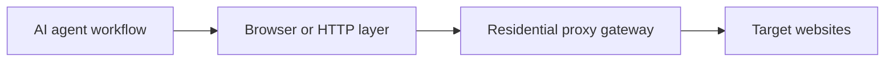

## IP Rotation Matters Because AI Agents Create Repeated Traffic, Not One-Off Traffic
An AI agent like OpenClaw does not just open one page and stop. It often browses several pages, retries failed steps, revisits targets, and repeats similar workflows over time. That is what makes the system useful—but it is also what makes a single-IP setup fail quickly.
If every request leaves from one visible address, the browsing pattern becomes easy to score. Rate limits, CAPTCHA, challenge pages, and session restrictions start appearing long before the workflow reaches meaningful scale.
This guide explains why AI agents need IP rotation, why residential proxy pools are usually the right way to get it, and how to think about rotating versus sticky sessions when the workflow shifts from simple browsing to real operational use. It pairs naturally with [why OpenClaw agents need residential proxies](https://bytesflows.com/en/blog/openclaw-residential-proxy), [rotating residential proxies for OpenClaw agents](https://bytesflows.com/en/blog/openclaw-rotating-proxy), and [how many proxies do you need](https://bytesflows.com/en/blog/how-many-proxies-need-scraping).
## The Real Problem Is Not Just “Too Many Requests”
The problem with a single IP is broader than raw request count.
Websites can react to:
- repeated activity from one identity
- suspicious request timing
- datacenter or VPN IP reputation
- unnatural browsing distribution
- too many pages opened in too little time
- a pattern of retries or automation coming from one address
This is why one browser or one script can look stable in testing and then collapse under real usage. The traffic identity is absorbing all the pressure.
## What IP Rotation Actually Changes
IP rotation spreads browsing activity across different exit IPs instead of concentrating it on one visible address.
In practice, that means:
- one request may leave through one IP
- later requests may leave through different IPs
- repeated browsing becomes less concentrated on a single identity
- long-running workflows become harder to classify based only on one address
This is valuable because the website now sees distribution instead of one repeated source hammering the same targets.
## Why Residential Rotation Is Usually the Better Fit
IP rotation is possible with several proxy types, but residential rotation is often the stronger option for AI-agent workflows.
That is because residential IPs:
- look closer to ordinary user traffic
- avoid obvious datacenter fingerprints
- support geo-targeting more naturally
- often face lower immediate trust penalties on stricter websites
This is why AI-agent workflows frequently use residential proxy gateways rather than bare datacenter rotation when the tasks involve search, browsing, monitoring, or scraping on real websites.
Related background from [residential proxies](https://bytesflows.com/en/blog/residential-proxies), [best proxies for web scraping](https://bytesflows.com/en/blog/best-proxies-for-web-scraping), and [why residential proxies are best for scraping](https://bytesflows.com/en/blog/why-residential-proxies-best-for-scraping-2026) helps frame that choice.
## Why AI Agents Need Rotation More Than Simple Scripts Sometimes Do
A simple script may hit one endpoint and stop. An AI agent often does much more:
- browsing across several pages
- extracting information from changing layouts
- following links conditionally
- retrying when a step fails
- revisiting sources over repeated runs
That makes the workflow more adaptive, but it also makes the traffic footprint broader. The more useful the agent becomes, the more important IP distribution becomes.
## Rotating vs Sticky Sessions
This is where rotation design becomes more practical than theoretical.
### Rotating sessions
Best for:
- broad public browsing
- repeated independent requests
- discovery or collection across many pages
- workflows where continuity is not essential
### Sticky sessions
Best for:
- login-dependent browsing
- multi-step workflows
- form flows or session-sensitive navigation
- tasks where cookies and continuity matter
This is why the right question is not “Should I rotate?” but “Does this workflow need distribution or continuity?”
## A Practical Architecture
A useful way to see the role of rotation is this:

In this model:
- the agent decides what to do
- the browser or fetch layer executes it
- the proxy layer distributes the traffic identity
That separation matters because it shows rotation as infrastructure, not as a trick added after failure begins.
## Why Rotation Is Not Enough by Itself
A common misconception is that once rotation is enabled, the workflow can safely run at any speed.
That is not true.
Rotation helps most when it is combined with:
- sensible pacing
- controlled concurrency
- retry backoff
- stable browser behavior
- session mode matched to the task
In other words, rotation reduces concentration risk. It does not eliminate bad traffic behavior.
## Common Signs You Need Better Rotation Strategy
You likely need IP rotation or better rotation design if you see:
- fast blocks after modest scaling
- challenge pages after repeated browsing
- one IP carrying too much request load
- worse performance from VPS or cloud environments than from local testing
- unstable results once several browser tasks run in sequence
These patterns usually mean the identity layer is too concentrated for the workload.
## Best Practices for AI-Agent IP Rotation
### Use residential rotation for repeated public browsing
This is usually the safest default for broad collection workflows.
### Use sticky sessions only when the task needs continuity
Overusing stickiness can recreate the single-IP problem.
### Keep pacing realistic
Rotation is stronger when requests are still well-behaved.
### Validate on real targets
A rotation setup should be judged by target success rate, not only by whether the IP changes.
### Size the pool to the workload
Rotation quality depends on volume, concurrency, and target strictness.
Helpful validation tools include [Proxy Checker](https://bytesflows.com/en/blog/proxy-checker), [Proxy Rotator Playground](https://bytesflows.com/en/blog/proxy-rotator), and [Scraping Test](https://bytesflows.com/en/blog/scraping-test-tool-detect-blocks).
## Common Mistakes
### Assuming one IP can support “just a bit more” scale
This usually works until it fails all at once.
### Confusing rotation with unlimited throughput
Even a rotating pool can be abused by poor pacing.
### Using rotation where stable sessions are needed
That can break logins and multi-step tasks.
### Ignoring geo needs
Some workflows need the right location as much as they need multiple IPs.
### Treating IP rotation as optional infrastructure
For serious agent browsing, it is often part of the core design.
## Conclusion
AI agents like OpenClaw need IP rotation because their value comes from repeated browsing, not isolated requests. That repeated activity is exactly what makes single-IP workflows fragile.
Residential proxy rotation is usually the most practical answer because it spreads browsing pressure across more credible user-like IPs while supporting geography and scale more effectively than a raw server identity. When combined with good pacing and the right session mode, IP rotation stops being a workaround and becomes part of a stable agent architecture.
If you want the strongest next reading path from here, continue with [rotating residential proxies for OpenClaw agents](https://bytesflows.com/en/blog/openclaw-rotating-proxy), [why OpenClaw agents need residential proxies](https://bytesflows.com/en/blog/openclaw-residential-proxy), [how many proxies do you need](https://bytesflows.com/en/blog/how-many-proxies-need-scraping), and [OpenClaw proxy setup](https://bytesflows.com/en/blog/openclaw-proxy-setup).
## Further reading
- [Rotating residential proxies for OpenClaw agents](https://bytesflows.com/en/blog/openclaw-rotating-proxy)
- [Why OpenClaw agents need residential proxies](https://bytesflows.com/en/blog/openclaw-residential-proxy)
- [How many proxies do you need](https://bytesflows.com/en/blog/how-many-proxies-need-scraping)
- [OpenClaw proxy setup](https://bytesflows.com/en/blog/openclaw-proxy-setup)
- [Residential proxies](https://bytesflows.com/en/blog/residential-proxies)
- [Best proxies for web scraping](https://bytesflows.com/en/blog/best-proxies-for-web-scraping)
- [Proxy rotation strategies](https://bytesflows.com/en/blog/proxy-rotation-strategies)
