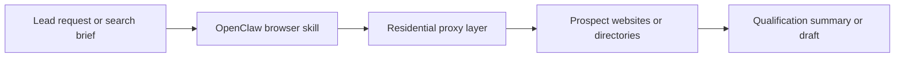

## Lead Generation Workflows Are Usually Research Workflows First
OpenClaw can be useful for lead generation because most lead-gen work starts well before any message is sent. The real job is often research: finding relevant companies, checking websites, qualifying prospects, comparing signals, and drafting a first-pass outreach message or internal note.
That makes OpenClaw a strong fit—not as an unsupervised outreach engine, but as a workflow layer for research, qualification, and draft preparation.
This guide explains how OpenClaw fits into lead generation and outreach-related workflows, when residential proxies matter, why browsing load becomes important quickly, and why a human-in-the-loop approach remains the safest model for real-world usage. It pairs naturally with [OpenClaw for research and drafting with proxies](https://bytesflows.com/en/blog/openclaw-research-automation), [OpenClaw for market intelligence and competitor monitoring](https://bytesflows.com/en/blog/openclaw-market-intelligence), and [OpenClaw proxy setup](https://bytesflows.com/en/blog/openclaw-proxy-setup).
## What OpenClaw Is Actually Good At in Lead Gen
The strongest use of OpenClaw here is not mass sending. It is structured preparation.
That often includes:
- finding and reviewing company sites
- summarizing what a prospect does
- checking fit against simple qualification criteria
- organizing notes into a shortlist
- drafting first-pass outreach copy or internal summaries
This is where OpenClaw creates leverage. It turns browsing, extraction, and summarization into a more usable research workflow.
## Why Proxies Matter in Lead Research
Lead-generation research can create a surprising amount of browsing activity.
A workflow might:
- open many company websites
- review several pages per company
- search across directories or result pages
- revisit sources regularly
- run from a VPS or cloud environment
Once that happens, websites no longer see “one helpful assistant.” They see repeated automated browsing from one identity. That is where residential proxies become useful.
They help by:
- reducing repeated pressure on one visible IP
- making the browsing origin look more like normal user traffic
- supporting broader research across multiple sites
- improving survival on stricter targets or directories
- separating the research workload from the raw server IP
Related foundations include [why OpenClaw agents need residential proxies](https://bytesflows.com/en/blog/openclaw-residential-proxy), [rotating residential proxies for OpenClaw agents](https://bytesflows.com/en/blog/openclaw-rotating-proxy), and [OpenClaw browser automation with residential proxies](https://bytesflows.com/en/blog/openclaw-browser-automation-proxy).
## Why a Human in the Loop Still Matters
OpenClaw can help with outreach preparation, but that does not mean fully automated outreach is the best or safest pattern.
A more reliable model is:
- OpenClaw researches
- OpenClaw summarizes
- OpenClaw drafts
- a human reviews and decides what to send
This matters for several reasons:
- quality control
- tone and accuracy
- anti-spam compliance
- platform and policy risk
- legal and reputational risk around automated outreach
In practice, this model is usually stronger than trying to make the agent act as a hands-free outbound system.
## A Practical Lead-Gen Workflow
A useful architecture often looks like this:

This makes the logic simple:
- OpenClaw handles the workflow
- the browser skill collects the source material
- the proxy layer supports reliable browsing
- the output becomes a shortlist, brief, or draft for review
## When Proxies Are Usually Needed
Residential proxies become the practical choice when:
- the workflow visits many sites per run
- searches or directory queries are repeated often
- research is scheduled or scaled across many prospects
- the system runs from a datacenter or VPS IP
- rate limits, CAPTCHAs, or blocks start appearing
You may not need them for very small, occasional browsing workloads. But once the lead research process becomes repeated or multi-source, transport quality starts to matter more.
## Where Browser Automation Fits
Browser automation matters because lead-gen research often happens on sites that:
- load content dynamically
- require navigation between several pages
- depend on browser state
- show different content across sessions or locations
That is why OpenClaw workflows in this area often rely on browser-based skills rather than simple HTTP fetching. The browser collects the context, and the agent turns that context into usable qualification or drafting output.
## Common Mistakes
### Treating OpenClaw like an auto-sender instead of a research assistant
This creates unnecessary risk and usually lowers output quality.
### Running repeated company research from one raw server IP
This makes blocking much more likely.
### Ignoring compliance and anti-spam concerns
Lead generation is not only a scraping problem. It is also a messaging and policy problem.
### Skipping human review
Draft quality and appropriateness still benefit heavily from human oversight.
### Scaling before validating browsing stability
If the research layer is unstable, the whole pipeline becomes noisy.
## Best Practices for OpenClaw Lead-Gen Workflows
### Use OpenClaw for discovery, qualification, and drafting
This is where it tends to create the most value.
### Keep a human in the loop for sending
That improves both compliance and quality.
### Add residential proxies when browsing becomes repeated or broad
Especially for directories, search, or multi-site research.
### Pace the workflow carefully
Even lead research browsing can trigger blocks if it becomes too aggressive.
### Store only what you need
Focus on the minimum useful signal rather than collecting unnecessary personal data.
Helpful support tools include [Proxy Checker](https://bytesflows.com/en/blog/proxy-checker), [Scraping Test](https://bytesflows.com/en/blog/scraping-test-tool-detect-blocks), and [Proxy Rotator Playground](https://bytesflows.com/en/blog/proxy-rotator).
## Legal and Policy Considerations
Lead-gen research sits inside several risk layers at once:
- site terms of service
- anti-spam rules
- personal data handling
- privacy expectations
- platform policies for outbound messaging
That is why articles such as [is web scraping legal](https://bytesflows.com/en/blog/is-web-scraping-legal) and [web scraping legal considerations](https://bytesflows.com/en/blog/web-scraping-legal-considerations) still matter here, even though the workflow often feels more like sales enablement than classic scraping.
## Conclusion
OpenClaw is most useful for lead generation when it is used as a research and drafting system rather than a blind automation engine. It works well for finding prospects, summarizing companies, organizing qualification signals, and producing drafts that a human can review and refine.
Once those workflows become broader or more repeated, residential proxies and careful pacing become important because the access layer starts to matter as much as the writing layer. When those pieces are aligned, OpenClaw becomes a much more practical tool for lead-research workflows without introducing unnecessary operational or compliance risk.
If you want the strongest next reading path from here, continue with [OpenClaw for research and drafting with proxies](https://bytesflows.com/en/blog/openclaw-research-automation), [OpenClaw proxy setup](https://bytesflows.com/en/blog/openclaw-proxy-setup), [OpenClaw browser automation with residential proxies](https://bytesflows.com/en/blog/openclaw-browser-automation-proxy), and [avoiding blocks when using OpenClaw for scraping](https://bytesflows.com/en/blog/openclaw-ai-agent-anti-bot).
## Further reading
- [OpenClaw for research and drafting with proxies](https://bytesflows.com/en/blog/openclaw-research-automation)
- [OpenClaw proxy setup](https://bytesflows.com/en/blog/openclaw-proxy-setup)
- [OpenClaw browser automation with residential proxies](https://bytesflows.com/en/blog/openclaw-browser-automation-proxy)
- [Avoiding blocks when using OpenClaw for scraping](https://bytesflows.com/en/blog/openclaw-ai-agent-anti-bot)
- [Why OpenClaw agents need residential proxies](https://bytesflows.com/en/blog/openclaw-residential-proxy)
- [Residential proxies](https://bytesflows.com/en/blog/residential-proxies)
- [Best proxies for web scraping](https://bytesflows.com/en/blog/best-proxies-for-web-scraping)
