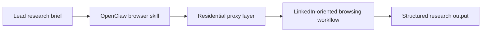

## Why LinkedIn-Focused Agent Workflows Become an Infrastructure Problem Very Quickly
Anyone doing B2B lead research already knows the tension: LinkedIn is one of the most useful sources for role, company, and org-chart signals, but it is also one of the quickest places for automation to attract friction.
That is why LinkedIn-oriented OpenClaw workflows are not just about extraction logic. They are really about infrastructure discipline—browser behavior, session design, IP quality, and pacing.
This case-study style guide explains how a LinkedIn-focused OpenClaw workflow behaves when it moves beyond one-off experiments, why residential proxies become operationally important, and how to think about scale without treating the task as a reckless scraping race. It pairs naturally with [OpenClaw for lead gen, research, and outreach](https://bytesflows.com/blog/openclaw-lead-generation-proxy), [OpenClaw browser automation with residential proxies](https://bytesflows.com/blog/openclaw-browser-automation-proxy), and [avoiding blocks when using OpenClaw for scraping](https://bytesflows.com/blog/openclaw-ai-agent-anti-bot).
## The Problem with a Single-IP LinkedIn Workflow
A LinkedIn-oriented workflow may look simple at first:
- search for relevant people or companies
- open result pages
- review profiles or company context
- extract signals into a structured system
That often works briefly from one server IP or one account. Then the pattern becomes visible.
Typical failure signals include:
- CAPTCHA appearing more often
- warnings about unusual activity
- search restrictions or session friction
- higher logout frequency
- reduced stability across repeated runs
The underlying reason is simple: too much repeated browsing appears to come from one suspicious identity.
## Why Residential Proxies Matter in This Context
Residential proxies are useful here because they change the traffic identity behind the browser workflow.
They help by:
- making the origin look less obviously like a datacenter automation stack
- reducing single-IP concentration across repeated browsing
- supporting geo-aware research when needed
- improving survivability for long-running profile or company workflows
- giving session design more room to work
This is especially important when the system is browsing through real browser automation rather than raw HTTP requests, because the target can evaluate both the browser and the IP context together.
Related background from [why OpenClaw agents need residential proxies](https://bytesflows.com/blog/openclaw-residential-proxy), [rotating residential proxies for OpenClaw agents](https://bytesflows.com/blog/openclaw-rotating-proxy), and [running OpenClaw on a VPS with residential proxies](https://bytesflows.com/blog/openclaw-vps-proxy) fits directly into this kind of workflow.
## A Practical LinkedIn-Oriented OpenClaw Flow
A realistic workflow often looks something like this:
1. an agent receives a research brief
1. it opens search or company-related pages
1. it navigates through relevant profiles or company context
1. it extracts structured signals
1. it stores or summarizes those findings for human review
The important point is that this is not just browsing. It is repeated, structured browsing. That is exactly why the transport layer matters so much.
## Why Session Design Matters as Much as Rotation
LinkedIn-oriented workflows are not a perfect fit for one universal proxy mode.
### Where sticky sessions help
Sticky sessions are often better when the workflow depends on:
- continuity across several pages
- authenticated browsing
- preserving cookies and session state
- multi-step navigation patterns
### Where rotation helps
Rotation is more useful when the workflow is:
- broad and public
- distributed across many independent lookups
- repeated across many separate targets
- meant to avoid concentrating too much pressure on one identity
In other words, session design matters just as much as proxy quality. A strong residential proxy setup can still fail if the workflow uses the wrong session behavior for the task.
## Why Pacing Is Non-Negotiable
The fastest way to make a LinkedIn workflow unstable is to let it behave like a benchmark script.
Useful pacing disciplines include:
- limiting concurrent browser sessions
- spacing out page loads
- avoiding uniform repeated timing
- keeping campaign size under control
- backing off when warning signals increase
This is not only about getting fewer blocks. It is also about protecting the long-term health of the workflow so it can operate repeatedly without collapsing.
## What the Proxy Layer Does—and What It Does Not Do
A residential proxy layer is not magic.
It does help with:
- browsing identity quality
- geo flexibility
- request distribution
- reducing concentrated pressure on one address
It does not automatically solve:
- bad session logic
- unrealistic browser behavior
- excessive concurrency
- poor retry design
- compliance or policy risk
That is why the strongest systems treat proxying as one layer in a broader operational design rather than as a one-step “bypass” switch.
## A Useful Architecture
A practical way to picture this stack is:

This shows the main point clearly: the browser skill and the proxy layer work together. One handles interaction. The other handles browsing identity.
## Common Mistakes
### Treating LinkedIn research as ordinary low-risk browsing
It is usually much more sensitive than generic public content collection.
### Running all traffic through one raw server IP
This concentrates too much activity on one visible identity.
### Using aggressive concurrency to make up for weak throughput
That usually makes the workflow less reliable, not more productive.
### Ignoring human review in lead research workflows
The quality of extracted lead signals still benefits from review and judgment.
### Assuming proxies remove policy risk
They do not. Access expectations and platform policies still matter.
## Best Practices for LinkedIn-Oriented OpenClaw Workflows
### Treat the workflow as infrastructure, not just a script
This mindset leads to better operational choices.
### Use residential transport where repeated browsing is unavoidable
Especially for longer-running lead-research campaigns.
### Match session strategy to the task
Sticky for continuity-heavy flows, rotation for broader distributed browsing.
### Keep pacing conservative
Long-term reliability usually beats short-term speed.
### Keep humans in the review loop
Especially when the downstream use is lead qualification or outreach preparation.
Helpful support tools include [Proxy Checker](https://bytesflows.com/blog/proxy-checker), [Scraping Test](https://bytesflows.com/blog/scraping-test-tool-detect-blocks), and [Proxy Rotator Playground](https://bytesflows.com/blog/proxy-rotator).
## Compliance and Risk Considerations
LinkedIn-oriented workflows deserve extra caution because they often intersect with:
- platform terms and enforcement
- personal data handling
- sales and outreach use cases
- reputational risk if the workflow becomes too aggressive
That is why articles such as [is web scraping legal](https://bytesflows.com/blog/is-web-scraping-legal), [web scraping legal considerations](https://bytesflows.com/blog/web-scraping-legal-considerations), and [ethical scraping with OpenClaw](https://bytesflows.com/blog/openclaw-ethical-scraping) are especially relevant here.
## Conclusion
Running LinkedIn-oriented OpenClaw agents at scale is less about clever selectors and more about disciplined workflow design. The core challenge is managing repeated browser activity in a way that remains stable over time.
Residential proxies help by improving origin identity and distributing load. Sticky versus rotating sessions shape continuity and scale. Pacing keeps the workflow from behaving like an obvious stress test. And human review keeps the business use of the output more grounded and defensible.
If you want the strongest next reading path from here, continue with [OpenClaw for lead gen, research, and outreach](https://bytesflows.com/blog/openclaw-lead-generation-proxy), [OpenClaw browser automation with residential proxies](https://bytesflows.com/blog/openclaw-browser-automation-proxy), [avoiding blocks when using OpenClaw for scraping](https://bytesflows.com/blog/openclaw-ai-agent-anti-bot), and [ethical scraping with OpenClaw](https://bytesflows.com/blog/openclaw-ethical-scraping).
## Further reading
- [OpenClaw for lead gen, research, and outreach](https://bytesflows.com/blog/openclaw-lead-generation-proxy)
- [OpenClaw browser automation with residential proxies](https://bytesflows.com/blog/openclaw-browser-automation-proxy)
- [Avoiding blocks when using OpenClaw for scraping](https://bytesflows.com/blog/openclaw-ai-agent-anti-bot)
- [Ethical scraping with OpenClaw](https://bytesflows.com/blog/openclaw-ethical-scraping)
- [Why OpenClaw agents need residential proxies](https://bytesflows.com/blog/openclaw-residential-proxy)
- [Residential proxies](https://bytesflows.com/blog/residential-proxies)
- [Best proxies for web scraping](https://bytesflows.com/blog/best-proxies-for-web-scraping)
