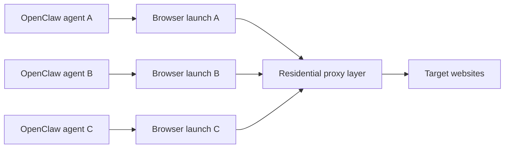

## Multi-Agent Setups Create a New Proxy Problem: Coordination
A single OpenClaw agent can already generate meaningful browsing traffic. Once multiple agents run in parallel, the challenge changes. The question is no longer just “Should this workflow use a proxy?” It becomes “How should several browser-driven workflows share transport identity without creating overlap, overload, or unstable scaling?”
That is why multi-agent OpenClaw environments need more than just a proxy gateway. They need routing discipline.
This guide explains how multi-agent OpenClaw setups interact with residential proxy infrastructure, when one shared gateway is enough, when per-agent configuration makes sense, and how to think about concurrency and identity distribution as the number of agents grows. It pairs naturally with [OpenClaw proxy setup](https://bytesflows.com/blog/openclaw-proxy-setup), [rotating residential proxies for OpenClaw agents](https://bytesflows.com/blog/openclaw-rotating-proxy), and [large-scale data collection with OpenClaw and proxies](https://bytesflows.com/blog/openclaw-data-collection-scale).
## What Multi-Agent Means in Practice
In OpenClaw, a multi-agent setup often means different agents or skills are responsible for different workflows.
For example:
- one agent handles research and drafting
- one handles SERP or search tasks
- one handles competitor or market monitoring
- one handles lead qualification or site review
Each of those agents may launch a browser, and each browser session contributes to the overall traffic footprint.
This matters because websites do not see “separate agents.” They see patterns of requests, identities, locations, and timing.
## Where Proxy Configuration Still Belongs
Even in multi-agent setups, proxy control is usually not global inside OpenClaw itself. It still belongs in the browser launch logic for each skill or agent flow.
That means the important layer is still:
- the Playwright launch call
- a shared browser helper
- a browser factory used by multiple skills
The difference in multi-agent setups is that several launch paths may now exist, and they need to stay coordinated rather than drifting into inconsistent behavior.
## One Shared Gateway vs Per-Agent Proxy Routing
This is the most common design question.
### One shared rotating residential gateway
This is often enough when:
- all agents do similar public browsing
- geo behavior can be shared
- the provider handles good rotation
- total workload fits within the proxy plan capacity
Advantages:
- simpler operational setup
- easier secret management
- easier scaling early on
- consistent transport behavior across skills
### Per-agent proxy configurations
This becomes useful when:
- different agents need different geographies
- one workflow is much more aggressive than another
- one agent needs sticky sessions while another needs full rotation
- you want stronger isolation between task types
Advantages:
- better workload segmentation
- clearer debugging paths
- more control over geo and session strategy
- less chance that one noisy workflow affects all others
## A Practical Architecture
A useful multi-agent pattern looks like this:

This model helps because it makes the coordination problem visible. Several agents may share one routing layer, but each still needs careful control over browser execution and traffic behavior.
## Why Rotation Is Important in Multi-Agent Systems
Without rotation, parallel agents can accidentally concentrate traffic on too few visible identities.
That creates problems such as:
- IP overlap between agents
- repeated requests hitting one target from one address
- concurrency spikes that look unnatural
- challenge rates increasing across unrelated workflows
This is why rotating residential gateways are often the simplest reliable default for multi-agent public browsing. They distribute pressure more safely across the pool.
## Why Throttling Still Needs to Be Per Agent
A shared proxy gateway does not mean behavior is automatically safe.
Each agent should still control:
- request frequency
- per-domain concurrency
- retry timing
- workflow scope
- whether the task is stateless or session-sensitive
This matters because a healthy proxy pool can still be stressed by several agents behaving too aggressively at once.
## When a Shared Gateway Is Usually Enough
A single rotating residential gateway is usually enough when:
- agent workloads are moderate
- tasks are mostly public browsing
- geo needs are similar
- session continuity is not critical
- the total volume is still controlled
For many teams, this is the simplest starting point and the right place to begin before building more segmented routing.
## When Separate Proxy Strategy Makes More Sense
Separate proxy configuration becomes more useful when:
- one agent handles login-sensitive tasks
- one agent must stay in a fixed country or city
- one workflow is much higher volume than the others
- you want to isolate noisy browsing from more delicate workflows
- debugging becomes hard with one shared transport layer
This is often the point where multi-agent routing stops being only an application concern and starts becoming an operations concern.
## Common Mistakes in Multi-Agent Routing
### Assuming one proxy setting solves everything automatically
Coordination still matters even with rotation.
### Letting all agents scale at the same pace
Different workflows tolerate different traffic levels.
### Ignoring total system load
A proxy plan that works for one agent may fail when three or four agents run in parallel.
### Mixing task types without session strategy
Search, login, monitoring, and public scraping do not all want the same identity behavior.
### Hiding proxy logic too deeply in shared helpers
This makes it difficult to understand how each agent is actually browsing.
## Best Practices for Multi-Agent OpenClaw Proxy Routing
### Start with one well-understood shared gateway
Simplicity is useful early, as long as the workload is still manageable.
### Measure combined load, not only per-agent load
What matters is the system-wide traffic footprint.
### Keep per-agent pacing explicit
Do not assume the shared proxy layer will solve bad behavior.
### Split proxy strategy when workflows diverge
If task types become very different, transport strategy should diverge too.
### Validate on real targets under parallel conditions
Parallel browsing often reveals issues that isolated tests miss.
Helpful support tools include [Proxy Checker](https://bytesflows.com/blog/proxy-checker), [Proxy Rotator Playground](https://bytesflows.com/blog/proxy-rotator), and [Scraping Test](https://bytesflows.com/blog/scraping-test-tool-detect-blocks).
## Conclusion
Multi-agent OpenClaw setups create a routing problem as much as a browsing problem. Once several agents operate in parallel, the system needs to manage not just proxy access, but identity distribution, pacing, workload segmentation, and total traffic visibility.
For many teams, one rotating residential gateway is a strong starting point. But as workflows become more varied, splitting proxy behavior by agent or task type often becomes the more stable long-term design. The goal is not maximum complexity. It is controlled parallelism that does not collapse into shared block-rate problems.
If you want the strongest next reading path from here, continue with [OpenClaw proxy setup](https://bytesflows.com/blog/openclaw-proxy-setup), [rotating residential proxies for OpenClaw agents](https://bytesflows.com/blog/openclaw-rotating-proxy), [large-scale data collection with OpenClaw and proxies](https://bytesflows.com/blog/openclaw-data-collection-scale), and [OpenClaw Playwright proxy configuration](https://bytesflows.com/blog/openclaw-playwright-proxy).
## Further reading
- [OpenClaw proxy setup](https://bytesflows.com/blog/openclaw-proxy-setup)
- [Rotating residential proxies for OpenClaw agents](https://bytesflows.com/blog/openclaw-rotating-proxy)
- [Large-scale data collection with OpenClaw and proxies](https://bytesflows.com/blog/openclaw-data-collection-scale)
- [OpenClaw Playwright proxy configuration](https://bytesflows.com/blog/openclaw-playwright-proxy)
- [Residential proxies](https://bytesflows.com/blog/residential-proxies)
- [Best proxies for web scraping](https://bytesflows.com/blog/best-proxies-for-web-scraping)
- [How many proxies do you need](https://bytesflows.com/blog/how-many-proxies-need-scraping)
