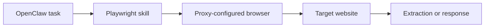

## The Proxy Is Configured in the Browser Layer, Not in OpenClaw Itself
One of the easiest mistakes in OpenClaw setups is looking for a global “proxy setting” inside OpenClaw and assuming that is where browser traffic is controlled. In practice, the important configuration usually lives lower in the stack: inside the Playwright launch logic used by a skill or agent.
That distinction matters because OpenClaw coordinates the workflow, but Playwright controls the browser process that actually sends traffic to the target website. If the browser launches without a proxy, your agent still exposes its origin IP no matter how well the rest of the system is designed.
This guide explains how Playwright proxy configuration works inside OpenClaw, where to place the settings, how rotating and sticky sessions differ, and how to validate the setup before you scale. It pairs naturally with [OpenClaw proxy setup](https://bytesflows.com/en/blog/openclaw-proxy-setup), [OpenClaw for web scraping and data extraction](https://bytesflows.com/en/blog/openclaw-web-scraping), and [why OpenClaw agents need residential proxies](https://bytesflows.com/en/blog/openclaw-residential-proxy).
## Where the Proxy Setting Actually Belongs
OpenClaw usually does not fetch pages directly. A skill launches a browser, most often through Playwright, and that browser handles the request.
So the proxy belongs where the browser is created, typically in code paths such as:
- `chromium.launch(...)`
- `firefox.launch(...)`
- a shared browser factory used by multiple skills
This is the layer that determines how traffic exits the machine. If your goal is to route OpenClaw browsing through residential IPs, this is the setting that matters most.
## The Basic Playwright Pattern
In Node.js, the common pattern looks like this:
```javascript
const { chromium } = require("playwright");

const browser = await chromium.launch({
  headless: true,
  proxy: {
    server: "http://p1.bytesflows.com:8001",
    username: "your-username",
    password: "your-password"
  }
});
```
Once the browser launches with that configuration, browser traffic goes through the proxy gateway. That means page loads, browser requests, and navigation all inherit the same transport layer.
This is the key point: if the browser instance is not launched with the proxy, the rest of the skill cannot “fix” that later.
## Why This Matters for OpenClaw Skills
In an OpenClaw workflow, one skill may handle browser automation while another handles extraction or summarization. Proxy control belongs to the browser skill because that is where network behavior begins.
That is why proxy integration should usually be treated as part of skill design rather than an environment-level afterthought.
A practical architecture looks like this:

## Using Environment Variables Instead of Hardcoding
Hardcoding proxy credentials inside the skill works for a quick test, but it is the wrong pattern for real use.
A cleaner approach is to use environment variables:
```javascript
const browser = await chromium.launch({
  proxy: process.env.PROXY_SERVER
    ? {
        server: process.env.PROXY_SERVER,
        username: process.env.PROXY_USER,
        password: process.env.PROXY_PASS,
      }
    : undefined,
});
```
You can then set those values in the environment where OpenClaw runs:
```bash
export PROXY_SERVER="http://p1.bytesflows.com:8001"
export PROXY_USER="username"
export PROXY_PASS="password"
```
This approach is better because it:
- keeps secrets out of code
- makes environment switching easier
- lets multiple deployments use different gateways cleanly
- reduces accidental credential leaks in repos or logs
## Rotating vs Sticky Sessions in Playwright
This is another common source of confusion.
From Playwright’s perspective, you usually provide one proxy gateway. The provider decides whether that endpoint behaves as a rotating or sticky session.
### Rotating mode
Use this when requests are mostly independent.
Best for:
- public crawling
- search result collection
- discovery workflows
- large-scale browsing where session continuity is not important
### Sticky mode
Use this when the site expects continuity across several steps.
Best for:
- login flows
- account areas
- cart or checkout simulation
- session-sensitive browsing
The important point is that Playwright does not create rotation by itself. It forwards traffic to the configured gateway, and the provider handles how IPs are assigned. Related guides such as [proxy rotation strategies](https://bytesflows.com/en/blog/proxy-rotation-strategies) and [rotating residential proxies for OpenClaw agents](https://bytesflows.com/en/blog/openclaw-rotating-proxy) go deeper on that behavior.
## How to Test That the Proxy Is Really Working
A proxy integration should be validated before you scale or trust the results.
A simple testing process looks like this:
1. launch the OpenClaw task that uses the browser skill
1. open an IP-check page through the browser
1. confirm the visible IP differs from the host machine
1. verify country or geo-targeting if that matters
1. run a real target test, not only a generic IP endpoint
Useful support tools include [Proxy Checker](https://bytesflows.com/en/blog/proxy-checker), [Scraping Test](https://bytesflows.com/en/blog/scraping-test-tool-detect-blocks), and [Proxy Rotator Playground](https://bytesflows.com/en/blog/proxy-rotator).
That last step matters. A configuration can appear valid on a generic IP page while still failing against the actual target because the target evaluates browser behavior more aggressively.
## Common Failure Modes
### The browser launches, but traffic is not proxied
This usually means the proxy block was not applied to the launch call that actually creates the browser instance.
### The proxy works on test pages but fails on real targets
In that case, the problem is often not syntax. It is more likely session behavior, challenge handling, or weak browser realism.
### The session breaks mid-workflow
That often means rotating mode is being used where sticky session behavior is needed.
### CAPTCHA or 403 pages still appear
A working proxy configuration is necessary, but not sufficient. Request pacing, browser fingerprinting, and target difficulty still matter. This is why [avoiding blocks when using OpenClaw for scraping](https://bytesflows.com/en/blog/openclaw-ai-agent-anti-bot) and [bypassing Cloudflare with OpenClaw and residential proxies](https://bytesflows.com/en/blog/openclaw-cloudflare-bypass) remain relevant even after proxy setup is complete.
## Best Practices for OpenClaw + Playwright Proxy Setup
### Keep proxy config close to browser launch
Do not hide it in unrelated settings or assume another layer will inherit it.
### Use environment variables by default
This makes deployment safer and easier to maintain.
### Match session mode to workflow design
Rotating for stateless collection, sticky for multi-step or logged-in flows.
### Validate on real target pages
A passing IP check is helpful, but it is not the same as target success.
### Treat proxy quality and browser behavior as one system
Reliable browsing depends on both network routing and browser realism.
## When This Setup Is Most Useful
OpenClaw Playwright proxy configuration matters most when:
- the workflow uses browser automation regularly
- the target site is sensitive to datacenter IPs
- geo-targeting matters
- the tasks involve repeated browsing or extraction
- the goal is to scale OpenClaw workflows beyond one-off tests
In those cases, proxy setup is not just a performance enhancement. It is part of whether the workflow works at all.
## Conclusion
OpenClaw Playwright proxy configuration is really about controlling the browser’s network path at launch time. The important setting is not in OpenClaw globally but in the Playwright code that creates the browser instance.
Once that is configured correctly, the rest of the workflow—browsing, extraction, and response—can run on top of a more reliable transport layer. For serious OpenClaw usage, especially on protected or large-scale targets, residential proxy support should be treated as a core part of the skill architecture.
If you are building a fuller internal reading path from here, continue with [OpenClaw proxy setup](https://bytesflows.com/en/blog/openclaw-proxy-setup), [why OpenClaw agents need residential proxies](https://bytesflows.com/en/blog/openclaw-residential-proxy), [OpenClaw for web scraping and data extraction](https://bytesflows.com/en/blog/openclaw-web-scraping), and [playwright proxy configuration guide](https://bytesflows.com/en/blog/playwright-proxy-configuration-guide).
## Further reading
- [OpenClaw proxy setup](https://bytesflows.com/en/blog/openclaw-proxy-setup)
- [Why OpenClaw agents need residential proxies](https://bytesflows.com/en/blog/openclaw-residential-proxy)
- [OpenClaw for web scraping and data extraction](https://bytesflows.com/en/blog/openclaw-web-scraping)
- [Rotating residential proxies for OpenClaw agents](https://bytesflows.com/en/blog/openclaw-rotating-proxy)
- [Playwright proxy configuration guide](https://bytesflows.com/en/blog/playwright-proxy-configuration-guide)
- [Best proxies for web scraping](https://bytesflows.com/en/blog/best-proxies-for-web-scraping)
- [Residential proxies](https://bytesflows.com/en/blog/residential-proxies)
