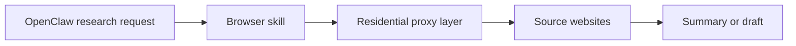

## Research Automation Becomes a Web-Access Problem Faster Than Most People Expect
OpenClaw is well suited to research and drafting because it can browse sources, compare findings, summarize content, and turn that material into a draft in one workflow. That is exactly what makes it valuable.
It is also what creates the first operational problem. Once research workflows move from visiting a few pages to browsing many pages across many sites, the system starts to look like automation from the perspective of the web.
This guide explains how OpenClaw supports research and drafting workflows, when proxies help, how to think about browsing load, and how to keep multi-source research from collapsing into rate limits, challenge pages, or unstable sessions. It pairs naturally with [OpenClaw for web scraping and data extraction](https://bytesflows.com/blog/openclaw-web-scraping), [OpenClaw for market intelligence and competitor monitoring](https://bytesflows.com/blog/openclaw-market-intelligence), and [OpenClaw proxy setup](https://bytesflows.com/blog/openclaw-proxy-setup).
## Why OpenClaw Works Well for Research and Drafting
OpenClaw is useful here because research is rarely a single fixed action.
A typical workflow may include:
- opening several sources
- comparing claims or information
- extracting key details
- summarizing findings
- drafting an email, memo, outline, or brief
This makes OpenClaw stronger than a rigid single-purpose script for many research tasks, especially when the scope changes based on what the workflow finds.
## The Difference Between Light Research and Real Workflow Pressure
Occasional research on two or three pages may work fine without any special transport setup. But once a workflow starts:
- touching many URLs in one run
- revisiting sources regularly
- browsing stricter sites
- running from a VPS or cloud environment
- feeding recurring briefs or summaries
then the browsing layer begins to matter much more.
That is where residential proxies often become useful—not because the research task changed conceptually, but because the access pattern became more visible.
## What Proxies Actually Help With
In research and drafting workflows, residential proxies help by:
- reducing pressure on one visible IP
- improving survivability across multi-source browsing
- supporting geo-specific research when needed
- making repeated access look less obviously server-driven
- helping browser-based skills operate more consistently on stricter targets
This is especially relevant when OpenClaw is running from a server environment or when the workflow is scheduled repeatedly.
## When You Probably Do Not Need Proxies Yet
You may not need residential transport immediately if:
- the research task is occasional
- the target sites are low sensitivity
- the browsing volume is small
- the workflow is run from a normal user environment
- you are not seeing blocks, CAPTCHAs, or country mismatch
This is an important distinction because not every research task needs the full infrastructure stack from day one.
## When Proxies Become the Practical Choice
Residential proxies become the practical choice when:
- the workflow opens many pages in one run
- research happens on a schedule
- the target sites are stricter or more sensitive
- the work depends on specific locations
- the browser is running from a VPS or datacenter IP
- challenge pages or rate limits are already appearing
This is why articles such as [why OpenClaw agents need residential proxies](https://bytesflows.com/blog/openclaw-residential-proxy), [running OpenClaw on a VPS with residential proxies](https://bytesflows.com/blog/openclaw-vps-proxy), and [OpenClaw Playwright proxy configuration](https://bytesflows.com/blog/openclaw-playwright-proxy) connect directly to research workflows, not just scraping-heavy ones.
## A Practical Research Workflow Architecture
A useful pattern often looks like this:

This makes the roles clear:
- OpenClaw coordinates the task
- the browser skill gathers the source material
- the proxy layer supports reliable access
- the summarization or drafting layer turns the material into output
That separation is especially helpful when the workflow starts failing, because it tells you whether the problem is access, extraction, or synthesis.
## Why Throttling Still Matters in Research Workflows
Research feels softer than scraping, so teams sometimes underestimate its browsing footprint. But repeated research jobs can still generate very obvious traffic patterns.
That is why even research-oriented OpenClaw workflows should think about:
- spacing between page loads
- how many sources are opened in one run
- concurrency per domain
- whether a task is stateless or session-sensitive
- how often the workflow repeats over time
Residential proxies improve resilience, but they do not remove the need for pacing.
## Research, Drafting, and Human Review
One of the best uses of OpenClaw is turning source collection into a readable first draft. That can include:
- research briefs
- market summaries
- comparison notes
- internal memos
- first-pass outreach or content drafts
But this also means the quality of the draft depends on the quality of the browsing layer. If access is partial or unstable, the draft may sound complete while actually missing important source coverage. That is why reliable source acquisition matters even when the end goal is a written output rather than a dataset.
## Common Mistakes
### Treating research as too “lightweight” for infrastructure planning
Multi-source research can generate meaningful browsing load very quickly.
### Running scheduled workflows without changing the access layer
The more often the workflow repeats, the more likely one exposed IP becomes a problem.
### Ignoring location-sensitive research
Some sources change by region, so proxy geography can matter.
### Assuming summaries are trustworthy when source access was weak
A clean summary is not proof that the browsing layer worked correctly.
### Over-automating without human review
Drafting workflows often benefit from a human check before the output is acted on or published.
## Best Practices for OpenClaw Research and Drafting
### Start with smaller source sets
Prove the workflow before expanding coverage.
### Add residential proxies when repetition or strictness increases
Do not wait until the research pipeline is already unstable.
### Keep the browser skill explicit and testable
That makes access problems easier to diagnose.
### Treat source quality as part of draft quality
A strong draft starts with strong collection.
### Keep a human in the loop where judgment matters
Especially for final decisions, publishing, or outreach.
Helpful support tools include [Proxy Checker](https://bytesflows.com/blog/proxy-checker), [Scraping Test](https://bytesflows.com/blog/scraping-test-tool-detect-blocks), and [Proxy Rotator Playground](https://bytesflows.com/blog/proxy-rotator).
## Legal and Ethical Considerations
Research workflows still need to respect the same boundaries as other forms of automated browsing:
- terms of service
- robots.txt
- privacy and personal data handling
- reasonable access patterns
This matters especially when research spans many domains or runs repeatedly. Related reading from [is web scraping legal](https://bytesflows.com/blog/is-web-scraping-legal) and [web scraping legal considerations](https://bytesflows.com/blog/web-scraping-legal-considerations) helps frame that risk.
## Conclusion
OpenClaw is a strong tool for research and drafting because it can turn multi-source browsing into usable written output. But once those workflows become repeated, scheduled, or broader in scope, the browsing layer becomes a core part of whether the system keeps working.
That is why residential proxies, careful pacing, and explicit browser skill design matter even for research-oriented automation. When those pieces are in place, OpenClaw can support much richer research workflows without forcing every task back into manual browsing.
If you want the strongest next reading path from here, continue with [OpenClaw for market intelligence and competitor monitoring](https://bytesflows.com/blog/openclaw-market-intelligence), [OpenClaw proxy setup](https://bytesflows.com/blog/openclaw-proxy-setup), [OpenClaw Playwright proxy configuration](https://bytesflows.com/blog/openclaw-playwright-proxy), and [OpenClaw for SERP and search data extraction](https://bytesflows.com/blog/openclaw-serp-scraping).
## Further reading
- [OpenClaw for market intelligence and competitor monitoring](https://bytesflows.com/blog/openclaw-market-intelligence)
- [OpenClaw proxy setup](https://bytesflows.com/blog/openclaw-proxy-setup)
- [OpenClaw Playwright proxy configuration](https://bytesflows.com/blog/openclaw-playwright-proxy)
- [OpenClaw for SERP and search data extraction](https://bytesflows.com/blog/openclaw-serp-scraping)
- [Why OpenClaw agents need residential proxies](https://bytesflows.com/blog/openclaw-residential-proxy)
- [Residential proxies](https://bytesflows.com/blog/residential-proxies)
- [Best proxies for web scraping](https://bytesflows.com/blog/best-proxies-for-web-scraping)
