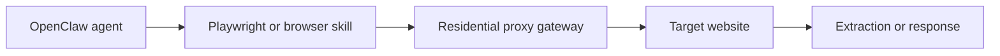

## OpenClaw Agents Run Into the Same Network Problem as Every Other Automation Stack
OpenClaw makes AI agents more useful by letting them browse, extract data, and run web tasks through a conversational workflow. But once those agents start interacting with real websites repeatedly, the same issue appears that breaks many scraping systems: the traffic becomes easy to identify.
That is why residential proxies matter. They do not make OpenClaw smarter. They make OpenClaw’s browser traffic more survivable on the open web.
This guide explains why OpenClaw agents get blocked, why residential IPs are often the right answer, which use cases need them most, and how they fit into a reliable OpenClaw workflow. It connects naturally with [OpenClaw proxy setup](https://bytesflows.com/en/blog/openclaw-proxy-setup), [OpenClaw Playwright proxy configuration](https://bytesflows.com/en/blog/openclaw-playwright-proxy), and [OpenClaw for web scraping and data extraction](https://bytesflows.com/en/blog/openclaw-web-scraping).
## Why OpenClaw Agents Get Blocked in the First Place
Even when an OpenClaw agent uses a real browser through Playwright or Puppeteer, websites still evaluate more than just whether JavaScript is executing.
Common detection signals include:
- IP reputation
- request frequency
- session behavior
- browser fingerprinting
- geo mismatch
- navigation patterns that look automated
If your OpenClaw deployment runs on a VPS or cloud server, it often starts from a datacenter IP. Many websites treat those IP ranges as higher risk than residential traffic. That is why blocks, CAPTCHAs, HTTP 403, or account flags appear much faster than many teams expect.
## What a Residential Proxy Changes
A residential proxy routes traffic through real household or mobile IP addresses rather than exposing the origin server directly.
That changes the trust profile of the traffic in several ways:
- the IP looks more like a normal user connection
- the request does not obviously come from a server range
- geo-targeting becomes easier
- repeated browsing can be distributed across a larger pool
- session behavior becomes more realistic on stricter targets
This does not solve every anti-bot problem, but it solves one of the most important ones: origin identity. On many sites, that is the difference between getting blocked quickly and maintaining stable access long enough for the rest of the workflow to matter.
If you want the broader background, [residential proxies](https://bytesflows.com/en/blog/residential-proxies), [best proxies for web scraping](https://bytesflows.com/en/blog/best-proxies-for-web-scraping), and [why residential proxies are best for scraping](https://bytesflows.com/en/blog/why-residential-proxies-best-for-scraping-2026) build that foundation well.
## Why This Matters More for OpenClaw Than Basic Scripts
OpenClaw is especially likely to benefit from residential proxies because its workflows often combine several higher-risk patterns at once:
- browser automation
- multi-step navigation
- repeated browsing tasks
- extraction from protected sites
- chat-triggered or agent-driven exploration
A simple static script may fetch one page and stop. An OpenClaw agent may browse, click through several steps, wait for content, summarize the page, and then move to another target. That creates more behavioral surface area, so the transport layer needs to be stronger.
## The Key Advantage: Better IP Reputation
IP reputation is one of the first signals many websites use.
A datacenter IP may be blocked before the browser has any chance to look realistic. Residential IPs often get more tolerance because they resemble normal consumer traffic. This is especially important for:
- search engine pages
- e-commerce sites
- price monitoring targets
- social or account-sensitive platforms
- websites protected by strong anti-bot services
That is why OpenClaw agents doing research, extraction, monitoring, or lead-generation workflows often need residential traffic even before the browser layer is fully optimized.
## The Second Advantage: Better Session Stability
Not all OpenClaw workflows are stateless.
Some tasks need the same session to survive across multiple steps, such as:
- logging in
- navigating through account areas
- paging through a protected interface
- collecting data that depends on location or continuity
In those cases, residential proxies help in two ways:
- they provide more realistic session origin
- they allow rotating or sticky behavior depending on the task
That matters because session instability often looks like an automation bug when the real issue is IP or session mismatch.
## The Third Advantage: Geo-Targeting
Many OpenClaw workflows are not only about access—they are about access from the right place.
Residential proxies help when you need:
- country-specific search results
- local commerce content
- regional pricing or availability
- location-based SERP or marketplace data
- browser behavior that matches the user context you are testing
This is one reason residential proxies are often better than a generic datacenter proxy pool. They are not just harder to block; they are also more useful for region-sensitive workflows.
## When OpenClaw Definitely Needs Residential Proxies
There are several cases where residential proxies are usually the right default.
### 1. Large-scale data collection
If the agent hits many pages or domains repeatedly, request pressure per IP rises fast. Residential rotation helps distribute that load more safely.
### 2. SERP or search data extraction
Search engines are highly sensitive to repeated automation from one IP. Residential traffic lowers obvious risk and improves geo realism.
### 3. Login-based workflows
If the task depends on account continuity, residential sticky sessions are often more stable than exposed datacenter traffic.
### 4. Monitoring or recurring browsing
Competitor tracking, price collection, and repeated observation workflows all create repeatable access patterns. Residential rotation helps reduce that visibility.
### 5. Agent-driven browsing on stricter sites
When OpenClaw uses browser automation on protected sites, the IP layer becomes one of the main determinants of whether the browser is even allowed to continue.
## How Residential Proxies Fit Into the OpenClaw Stack
The practical stack usually looks like this:

OpenClaw handles orchestration. The browser skill handles execution. The residential proxy gateway handles transport and IP distribution.
This separation is important because it makes the architecture easier to debug. If the workflow fails, you can ask whether the problem is:
- the agent logic
- the browser skill
- the proxy configuration
- the target’s anti-bot behavior
## Rotating vs Sticky Residential Sessions
OpenClaw workflows do not all need the same proxy mode.
### Rotating residential proxies
Best for:
- public crawling
- discovery tasks
- broad research workflows
- repeated stateless extraction
### Sticky residential sessions
Best for:
- logged-in browsing
- cart or workflow continuity
- account-level actions
- multi-step data collection
A common mistake is treating all OpenClaw traffic as rotating by default. That works for stateless tasks, but it can break tasks that rely on cookies, continuity, or session memory.
## Common Signs You Need Residential Proxies
You likely need residential proxies if you see one or more of these patterns:
- the workflow works locally but fails at scale
- the site serves CAPTCHA or 403 pages quickly
- results vary by location and your current IP is in the wrong region
- a browser-based skill still gets blocked even though the browser itself works
- login or session flows break unpredictably
These are usually signals that the transport layer needs improvement before more changes are made at the agent level.
## Best Practices for OpenClaw + Residential Proxies
### Start with the right use case
Do not add residential proxies blindly to every workflow. Use them where risk, scale, or location sensitivity justifies the cost.
### Match session mode to task design
Rotating for discovery and public browsing. Sticky for continuity-heavy tasks.
### Control request pacing
Even residential traffic can get blocked if concurrency is too aggressive or behavior is too repetitive.
### Validate before scaling
Use real target tests, not only generic IP checks. Tools like [Proxy Checker](https://bytesflows.com/en/blog/proxy-checker), [Scraping Test](https://bytesflows.com/en/blog/scraping-test-tool-detect-blocks), and [Proxy Rotator Playground](https://bytesflows.com/en/blog/proxy-rotator) help here.
### Treat browser realism and proxy quality as one system
Good IPs alone do not fix weak browser behavior, and realistic browsers alone do not fix bad IP reputation.
## When Residential Proxies Are Not Enough by Themselves
Residential proxies improve reliability, but they do not remove the need for:
- realistic browser fingerprints
- pacing control
- challenge handling
- strong skill design
- output validation
If OpenClaw workflows still fail after proxy integration, the next issues are usually session logic, browser behavior, or workflow structure. That is why [avoiding blocks when using OpenClaw for scraping](https://bytesflows.com/en/blog/openclaw-ai-agent-anti-bot), [bypassing Cloudflare with OpenClaw and residential proxies](https://bytesflows.com/en/blog/openclaw-cloudflare-bypass), and [OpenClaw Playwright proxy configuration](https://bytesflows.com/en/blog/openclaw-playwright-proxy) remain important companion pieces.
## Conclusion
OpenClaw agents need residential proxies when browser automation alone is not enough to survive real-world anti-bot systems. The main benefits are better IP reputation, more realistic session behavior, safer traffic distribution, and stronger geo-targeting.
For simple one-off tasks, you may not need them immediately. But for agent-driven browsing, repeated extraction, login-sensitive workflows, or protected sites, residential proxies often become a core part of whether the workflow succeeds at all.
If you are building a stronger internal reading path from here, continue with [OpenClaw proxy setup](https://bytesflows.com/en/blog/openclaw-proxy-setup), [OpenClaw Playwright proxy configuration](https://bytesflows.com/en/blog/openclaw-playwright-proxy), [OpenClaw for web scraping and data extraction](https://bytesflows.com/en/blog/openclaw-web-scraping), and [rotating residential proxies for OpenClaw agents](https://bytesflows.com/en/blog/openclaw-rotating-proxy).
## Further reading
- [OpenClaw proxy setup](https://bytesflows.com/en/blog/openclaw-proxy-setup)
- [OpenClaw Playwright proxy configuration](https://bytesflows.com/en/blog/openclaw-playwright-proxy)
- [OpenClaw for web scraping and data extraction](https://bytesflows.com/en/blog/openclaw-web-scraping)
- [Rotating residential proxies for OpenClaw agents](https://bytesflows.com/en/blog/openclaw-rotating-proxy)
- [Residential proxies](https://bytesflows.com/en/blog/residential-proxies)
- [Best proxies for web scraping](https://bytesflows.com/en/blog/best-proxies-for-web-scraping)
- [Why residential proxies are best for scraping](https://bytesflows.com/en/blog/why-residential-proxies-best-for-scraping-2026)
